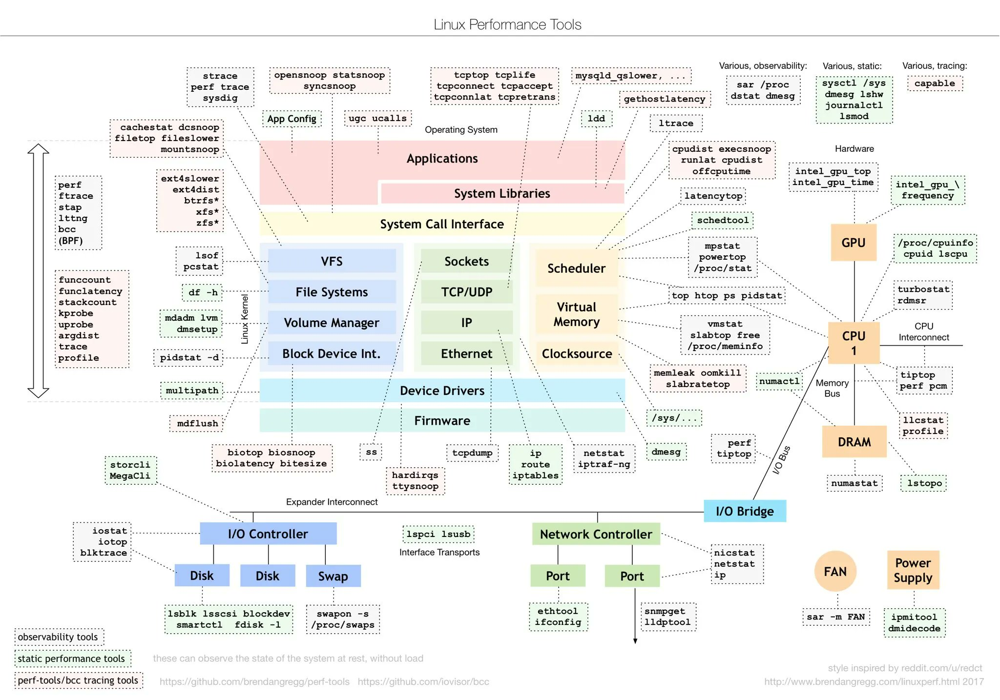

## 50-userful-linux-command

| 1.dmesg | 2.dd             | 3.tcpdump  | 4.ss           | 5.top                | 6.du                 |
| ------- | ---------------- | ---------- | -------------- | -------------------- | -------------------- |
| 7.iperf | 8.find           | 9.awk      | 10.sed         | 11.grep              | 12.route             |
| 13.ip   | 14.lsof/fuser    | 15.netstat | 16.rpm         | 17.dpkg              | 18.diff              |
| 19.ps   | 20.kill          | 21.unset   | 22.EOF >>      | 23.特殊符号: % $ # & | 24.until             |
| 25.cut  | 26.vmstat/mpstat | 27.free    | 28.curl & wget | 29.iptables          | 30.nmap              |
| 31.jq   | 32.sort          | 33.strace  | 34.uptime      | 35.iostat            | 36.sysctl/modelprobe |
| 37.sar  | 38.brctl         | 39.bridge  |                |                      |                      |

#### top50

##### 1.dmesg

命令用于显示开机信息

##### 2.dd


##### 3.tcpdump

```bash
#经过eth0  主机 192.168.0.22
tcpdump -i eth0 (src / dst) host 192.168.0.22

#经过eth0 目的端口 1234
tcpdump -i eth0 dst port 1234

#经过eth0 所有udp协议的包
tcpdump -i eth0 udp

#本地环路数据包
tcpdump -i lo udp

#抓取所有经过1234端口的UDP网络数据
tcpdump udp port 1234

#抓取所有经过eth0 SYN类型数据包
tcpdump -i eth0 'tcp[tcpflags]=tcp-syn' 

#所有经过eth0 的dns数据包
tcpdump -i eth0 udp dst port 53

tcpdump tcp -i eth0 -t -s 0 -c 100 and dst port !22 and src net 192.168.1.0/24 -w /opt/tmp.cap
#tcp: ip icmp arp rarp tcp udp icmp 这些参数都要放到第一个参数位置，用来过滤数据报的类型
#-i: 指定网卡
#-s: -s 0 可以抓到完整的数据包 默认抓取68字节
#-c: -c 100  只抓取100个数据包
#dst port !22: 不抓目标端口22
#src net 192.168.1.0/24: 数据包源ip范围 
#-w: 保存成文件 方便wireshark分析
```

tcpdump -D 列出所有网卡

tcpdump -c 抓取多少条报文

tcpdump --time-stamp-precision 指定捕获时的时间精度 默认毫秒 可选纳秒 nano

tcpdump -s 指定每条报文的最大字节数 默认262144字节

• -e 显示数据链路层头部
• -q 不显示传输层信息
• -v 显示网络层头部更多的信息，如 TTL、id 等
• -n 显示 IP 地址、数字端口代替 hostname 等
• -S TCP 信息以绝对序列号替代相对序列号
• -A 以 ASCII 方式显示报文内容，适用 HTTP 分析
• -x 以 16 进制方式显示报文内容，不显示数据链路层
• -xx 以 16 进制方式显示报文内容，显示数据链路层
• -X 同时以 16 进制及 ACII 方式显示报文内容，不显示数据链路层
• -XX 同时以 16 进制及 ACII 方式显示报文内容，显示数据链路层


##### 4.ss

###### 5.top

```bash
top - 18:36:42 up 3 days, 18:03, 1 user, load average: 3.40, 2.25, 2.08
Tasks: 218 total, 4 running, 217 sleeping, 0 stopped, 0 zombie
%Cpu: 41.6 us, 42.2 sy, 0.0 ni, 0.0 id, 0.0 wa, 0.0 hi, 0.0 si, 16.2 st
#top - 18:36:42 up 3 days, 18:03, 1 user, load average: 3.40, 2.25, 2.08：这显示了当前时间、系统已经运行的天数和小时、当前登录的用户数，以及过去1分钟、5分钟和15分钟的平均负载

#Tasks: 218 total, 4 running, 217 sleeping, 0 stopped, 0 zombie：显示了系统中的任务状态。总共218个任务，其中4个正在运行，217个处于休眠状态，没有任务被停止或变成僵尸进程

#%Cpu: 41.6 us, 42.2 sy, 0.0 ni, 0.0 id, 0.0 wa, 0.0 hi, 0.0 si, 16.2 st：
# us表示用户空间使用的CPU时间
# sy表示系统使用的时间    
# ni (nice)：表示用户进程在 nice 模式下使用的 CPU 时间百分比
# id (idle)：表示CPU处于空闲状态的时间百分比，没有执行任何任务 
# hi (hardware interrupts)：表示由硬件中断引起的CPU时间百分比 
# wa (wait)：表示CPU等待输入/输出完成的时间百分比。在这段时间里，CPU实际上是空闲的，它只是等待磁盘I/O或其他I/O操作完成 
# si (software interrupts)：表示由软件中断引起的CPU时间百分比 
# st CPU stealing
```


##### 15.netstat

- `-r` 列出所有路由规则

- `-a` （all）: 显示所有活动连接和监听端口。
- `-n` （numeric）: 显示地址和端口号以数字形式，而不是尝试解析为名字。
- `-p` （program）: 显示创建每个连接或监听端口的程序的PID和名称。

如果在使用 `netstat` 命令时不包括 `-a` 参数，命令将不会显示所有的活动连接。默认情况下，`netstat` 会显示建立的 TCP 连接，但是**不会显示处于监听状态的端口**

```shell
[root@tgq205 ~]# netstat  | grep tcp
tcp        0      0 tgq205:46592            10.244.1.193:http       TIME_WAIT
tcp        0      0 localhost:54956         localhost:39514         ESTABLISHED
tcp        0      0 localhost:39514         localhost:54956         ESTABLISHED
tcp        0      0 tgq205:52548            tgq204:sun-sr-https     ESTABLISHED
tcp        0      0 tgq205:52546            tgq204:sun-sr-https     ESTABLISHED
tcp        0      0 tgq205:44634            10.244.1.194:http       TIME_WAIT
tcp        0      0 tgq205:ssh              192.168.11:nettgain-nms ESTABLISHED
tcp        0     48 tgq205:ssh              192.168.11.191:drmsmc   ESTABLISHED
tcp        0      0 tgq205:57044            10.1.0.1:https          ESTABLISHED
tcp6       0      0 tgq205:10250            tgq206:57354            ESTABLISHED
tcp6       0      0 tgq205:10250            tgq204:50786            ESTABLISHED

[root@tgq205 ~]# netstat  -a | grep tcp
tcp        0      0 localhost:39616         0.0.0.0:*               LISTEN
tcp        0      0 0.0.0.0:31111           0.0.0.0:*               LISTEN

tcp        0      0 localhost:39514         0.0.0.0:*               LISTEN
tcp        0      0 0.0.0.0:31902           0.0.0.0:*               LISTEN
tcp        0      0 0.0.0.0:31070           0.0.0.0:*               LISTEN
tcp        0      0 tgq205:46620            10.244.1.193:http       TIME_WAIT
tcp        0      0 localhost:54956         localhost:39514         ESTABLISHED
tcp        0      0 localhost:39514         localhost:54956         ESTABLISHED
tcp        0      0 tgq205:52548            tgq204:sun-sr-https     ESTABLISHED
tcp        0      0 tgq205:44662            10.244.1.194:http       TIME_WAIT
tcp        0      0 tgq205:52546            tgq204:sun-sr-https     ESTABLISHED
tcp        0      0 tgq205:ssh              192.168.11:nettgain-nms ESTABLISHED
tcp        0     48 tgq205:ssh              192.168.11.191:drmsmc   ESTABLISHED
tcp        0      0 tgq205:57044            10.1.0.1:https          ESTABLISHED
tcp6       0      0 [::]:10250              [::]:*                  LISTEN
tcp6       0      0 [::]:10256              [::]:*                  LISTEN
tcp6       0      0 [::]:ssh                [::]:*                  LISTEN
tcp6       0      0 tgq205:10250            tgq206:57354            ESTABLISHED
tcp6       0      0 tgq205:10250            tgq204:50786            ESTABLISHED
```

- `-t`: 显示TCP连接。
- `-u`: 显示UDP连接。
- `-l`: 仅显示处于监听状态的套接字。
- `-s`: 显示每个协议的统计数据。
- `-r`: 显示路由表。
- `-i`: 显示网络接口列表。
- `-e`: 显示扩展信息，如错误统计。
- `-c`: 持续输出网络状态信息（每隔一秒刷新一次）。
- `-o`: 显示每个连接的定时器信息（如TCP连接的重试次数）。
- `-g`: 显示多播组成员资格信息。


```shell
[root@tgq205 ~]# netstat -tapn
Active Internet connections (servers and established)
Proto Recv-Q Send-Q Local Address           Foreign Address         State       PID/Program name
tcp        0      0 127.0.0.1:39616         0.0.0.0:*               LISTEN      1693/containerd

tcp        0      0 0.0.0.0:22              0.0.0.0:*               LISTEN      1671/sshd
tcp        0      0 127.0.0.1:25            0.0.0.0:*               LISTEN      2211/master
 3245/kube-proxy
tcp        0      0 127.0.0.1:54956         127.0.0.1:39514         ESTABLISHED 1901/kubelet
tcp        0      0 127.0.0.1:39514         127.0.0.1:54956         ESTABLISHED 1901/kubelet
tcp        0      0 10.244.1.1:45044        10.244.1.194:80         TIME_WAIT   -
tcp        0      0 192.168.8.205:52548     192.168.8.204:6443      ESTABLISHED 3245/kube-proxy
61689/sshd: root@pt
tcp        0      0 192.168.8.205:57044     10.1.0.1:443            ESTABLISHED 6031/flanneld
tcp6       0      0 :::22                   :::*                    LISTEN      1671/sshd
tcp6       0      0 192.168.8.205:10250     192.168.8.206:57354     ESTABLISHED 1901/kubelet
tcp6       0      0 192.168.8.205:10250     192.168.8.204:50786     ESTABLISHED 1901/kubelet
```

1. **-t (TCP)**: 这个选项告诉 `netstat` 只显示TCP连接。TCP（传输控制协议）是一种常用的网络协议，用于在互联网上建立可靠的连接。
2. **-a (all)**: 显示所有活动的和非活动的套接字（socket）。默认情况下，`netstat` 只显示活动的套接字。
3. **-p (program)**: 显示哪个进程正在使用哪个套接字。这对于确定哪个应用程序正在监听哪个端口或建立了哪些连接非常有用。
4. **-n (numeric)**: 以数字形式显示地址和端口号，而不是尝试解析成名称。这可以加快显示速度，并有助于避免在解析名称时可能遇到的问题。

当运行 `netstat -tapn` 时，您会得到类似这样的输出：

- 本地地址（Local Address）和端口号，显示您的系统上哪些服务正在监听。
- 远程地址（Foreign Address）和端口号，显示与您的系统建立连接的外部系统。
- 连接状态（如 LISTEN, ESTABLISHED 等）。
- 使用该套接字的进程ID和名称。

```bash
[root@tgq205 ~]# netstat  -i
Kernel Interface table
Iface             MTU    RX-OK RX-ERR RX-DRP RX-OVR    TX-OK TX-ERR TX-DRP TX-OVR Flg
cni0             1450    20441      0      0 0         23155      0      0      0 BMRU
docker0          1500        0      0      0 0             0      0      0      0 BMU
em1              1500   222399      0  17683 0         42516      0      0      0 BMRU
em2              1500        0      0      0 0             0      0      0      0 BMU
em3              1500        0      0      0 0             0      0      0      0 BMU
em4              1500        0      0      0 0             0      0      0      0 BMU
```

您运行的 `netstat -i` 命令提供了有关系统上网络接口的信息。让我们解析您收到的输出：

1. **Iface（接口）**：此列显示网络接口的名称，例如 `em1`、`em2`、`docker0` 等。

2. **MTU（最大传输单元）**：这表示网络协议能够传输的最大数据包大小。小于此限制的数据包将完整传输，而大于此限制的数据包将被分段。

3. **RX-OK（接收正常）**：接口上无错误接收到的数据包数量。

4. **RX-ERR（接收错误）**：接收到的带有错误的数据包数量。这包括CRC（循环冗余校验）错误、帧对齐错误等。

5. **RX-DRP（接收丢包）**：被丢弃的接收数据包数量。这可能由于多种原因，如缓冲区溢出、数据包损坏或其他网络问题。

6. **RX-OVR（接收溢出）**：表示接收硬件由于缺乏缓冲空间而无法处理接收数据的次数。

7. **TX-OK（发送正常）**：接口上无错误传输的数据包数量。

8. **TX-ERR（发送错误）**：传输的带有错误的数据包数量。

9. **TX-DRP（发送丢包）**：被丢弃的传输数据包数量。

10. **TX-OVR（发送溢出）**：显示发送硬件由于缺乏系统资源而无法发送数据的次数。

11. **Flg（标志）**：此列显示接口的状态标志。您输出中的标志如下：
    - **B**：广播 - 该接口支持广播。
    - **M**：组播 - 该接口支持组播。
    - **R**：运行中 - 该接口正在运行。
    - **U**：启动 - 该接口已启动。

例如，在您的输出中，`em1` 接口成功接收了 222,399 个数据包，没有错误，但丢弃了 17,683 个数据包（RX-DRP）。它还成功发送了 42,516 个数据包。状态标志表明它支持广播和组播，并且正在运行且已启动。


###### 

```bash
netstat -i  #显示主机每个网络接口的配置和状态，还有相关的流量计数。 == ifconfig -a

#输出
[root@vm-24-2-centos ~]# netstat -i
Kernel Interface table
Iface             MTU    RX-OK RX-ERR RX-DRP RX-OVR    TX-OK TX-ERR TX-DRP TX-OVR Flg
docker0          1500   128146      0      0 0        149557      0      0      0 BMU
eth0             1500 95990375      0      0 0      90107679      0      0      0 BMRU
lo              65536  3660818      0      0 0       3660818      0      0      0 LRU

MTU: Maximum Transmission Unit 
RX-OK: 接收到的有效数据包的数量
RX-ERR: 接收时出现错误的数据包数量
RX-DRP: 被丢弃的接收数据包数量。这些数据包由于某种原因（例如缓冲区溢出）而没有被处理。
RX-OVR: 接收溢出的数据包数量。这些是由于接口硬件错误导致的数据包错误。
TX-OK: 成功发送的数据包数量。
TX-ER: 发送时出现错误的数据包数量。
TX-DRP: 被丢弃的发送数据包数量。
TX-OVR: 发送溢出的数据包数量。
Flg: 这是网络接口的标志，代表该接口的当前状态 
B: 广播，表示该接口支持发送/接收广播包。
M: 多播，表示该接口支持发送/接收多播数据包。
R: 运行，表示该接口正在运行并且已激活。
U: Up，表示接口是活动的，或者说是“启动”的。
L: Loopback，表示这是一个循环回接口。
```


##### 16.rpm

```shell
#常用参数
-ivh #安装显示安装进度 --install --verbose --hash
-ivh --relocate /=/opt/test test.rpm #指定安装目录 
-Uvh #升级软件包 --Update
-qa | grep httpd  #搜索软件包 --all
-ql httpd  #搜索所有文件安装目录 --list
-q git #查找git是否安装
-e #删除一个软件包 --erase
-i --install 
-v --verbose #provide more detailed info
-h --hash 
-e --erase
--test #安装测试实际不安装
--nodeps #忽略软件依赖关系，强行安装
--force #忽略软件包及文件的冲突
```

###### 

###### 20kill

```bash
#kill默认发送TERM信号
#格式
kill [-signal] pid
signal表示要发送信号的编号或符号名称 pid为-1会把这个信号广播给除了init以外的所有进程
#各种signal作用
-HUP -1
作用: 通常用于重新加载配置文件或重新启动进程

-INT -2
中断进程 类似于Ctrl-C

-QUIT -3
用于请求进程退出 类似于Crtl+\，可以在捕获QUIT信号时执行一些特定的清理操作，然后终止进程

-KILL -9
强制终止进程 不能被忽略 阻塞 捕获

-BUS -7
表示硬件错误 通常是无效的内存访问或者数据对齐错误
```


###### 25cut

```bash
cut -d<分隔符> -f<字段号> <文件名>
```

###### 26vmstat

```bash
procs -----------memory---------- ---swap-- -----io---- -system-- ------cpu-----
 r  b   swpd   free   buff  cache   si   so    bi    bo   in   cs us sy id wa st
 1  0      0 308372 361572 28510556    0    0     0     7    0    0  1  0 99  0  0
```

**procs** 

- `r`: 运行和等待CPU时间片的进程数
- `b`: 在等待I/O操作的进程数

**memory**

- `swpd`: 使用的虚拟内存量（单位KB
- `free`: 空闲的物理内存量（单位KB） 
- `buff`: 用作缓冲的物理内存量（单位KB） 
- `cache`: 用作缓存的物理内存量（单位KB)

**swap**

- `si`: 每秒从磁盘交换进来的内存量（单位KB）
- `so`: 每秒交换到磁盘的内存量（单位KB）

**io**

- `bi`: 从块设备（如硬盘）读取的块数
- `bo`: 写入块设备的块数

**system**

- `in`: 每秒的中断次数，包括时钟中断 
- `cs`: 每秒的上下文切换次数 

**cpu**

- `us`: 用户时间。CPU花费在用户模式代码（例如应用程序）上的时间百分比
- `sy`: 系统时间。CPU花费在内核模式代码上的时间百分比
- `id`: 空闲时间。CPU空闲并且没有未挂起的磁盘I/O的时间百分比
- `wa`: 等待I/O的时间百分比
- `st`: 从虚拟机偷取的时间百分比（仅当运行在虚拟机上时适用）


#### others

##### 权限相关

###### chown (设置文件所有者和文件关联组)

```shell
#将当前目录所有文件与子目录的拥有者设置成user，组设置成group
chown -R user:group .
chown :512 /home/test
```

###### chmod (控制用户对文件的权限的命令)

```bash
- or d //File Type
rwx(owner:u) rwx(group:g) rwx(other user:o) //read write execute
421 //RWX
754: RWX R-X R--
u 表示该文件的拥有者，g 表示与该文件的拥有者属于同一个群体(group)者，o 表示其他以外的人，a 表示这三者皆是
+ 表示增加权限、- 表示取消权限、= 表示唯一设定权限 
```

| number | rwx  | binary |
| :----: | :--: | :----: |
|   7    | rwx  |  111   |
|   6    | rw-  |  110   |
|   5    | r-x  |  101   |
|   4    | r--  |  100   |
|   3    | -wx  |  011   |
|   2    | -w-  |  010   |
|   1    | --x  |  001   |
|   0    | ---  |  000   |

```shell
demo:
#设置所有人皆可读取
chmod ugo+r file
#设置所有人可写
chmod a+w file
#拥有者和组用户可写，其他人不可写
chmod ug+w,o-w file
#当前目录和子目录设置所有人可读
chmod -R a+r *
#读写执行权限
chmod 777 file
```

| chmod a-r file      | 删除所有用户执行权限                             |
| ------------------- | ------------------------------------------------ |
| chmod +rwx file     | 给file的用户增加读写执行权限                     |
| chmod u=rw,go= file | 给file用户设置了读写，其他和组其他用户设置0权限  |
| chmod 644 file      | 对file用户和组用户设置读写，为其他用户设置读权限 |

###### chgrp(change group)

```shell
chgrp -R bin dir //改变dir目录以及子目录和文件组为bin
chgrp --reference=file1 file2 //改变file2组和file1一样
```


## linux系统管理技术手册

### 2.脚本与shell

Shell 常用脚本30例:  https://zhuanlan.zhihu.com/p/526263882

#### 01.概念

```bash
#管道和重定向
< 是和STDIN联系起来
> >> 重定向到STDOUT >替换文件的现有内容 >>追加
| #代表管道
#符号
&& #前一条命令退出码为0时，才会执行下一条命令
|| #前一条命令不成功(非0退出码)，才能执行后面的命令

#变量
"saved ${rev}th version" #带{} 可以区别出变量的边界
#用来在用户登陆时设置环境变量的那些命令，都应该放在 ~/.profile或者~/.bash_profile两个文件中
#单引号和双引号区别在于变量可以进行替换
#左引号(撇号)和双引号类似
echo "this are `wc -l< /etc/passwd`" #输出： this are 21

#cut
-d 限定符
-f 输出包括哪些域
#sort
-b 忽略开头空白
-f 排序不区分大小写
-k 指定构造排序关键字的列
-n 按数值排序
-r 逆序
-t 设定域分隔符
-u 去重
#uniq
-c：在输出中显示每行的重复次数。
-d：只显示重复的行。
-u：只显示不重复的行。
-f N：忽略前 N 个字段（以空格或制表符分隔）的内容。
-s N：跳过前 N 个字符后开始比较。
-i：忽略大小写进行比较。
#tee
find /tmp/ -name test.txt | tee core #输出同时还保存到文件，tee相当与水管的'三通'
```

#### 02.bash

```bash
read #命令行读入 
read user_name

echo vs printf # printf可以使用制表符、换行等
printf "\taa\n"

命令行参数
$1代表第一个参数 $0代表脚本本身 $#表示参数的个数 $*保存了所有参数 $#和$*都不包括$0 $?表示上次执行的命令退出的状态
```

###### 变量作用域

```shell
#变量作用域
function localizer {
    echo "==> In function localizer a start as '$a'"
    local a
    echo "==> after local decl , a is '$a'"
    a="localizer version"
    echo "==> leaving localizer a is '$a'"
}

a="test"
echo "before a is '$a'"
localizer
echo "after a is '$a'"
#####output########
before a is 'test'
==> In function localizer a start as 'test'
==> after local decl , a is ''
==> leaving localizer a is 'localizer version'
after a is 'test'
```

###### 控制流程

```shell
#控制流程
if [ $base -eq 1 ] && [ $dm -eq 1 ]; then
    install
elif [ $base -ne 1 ] && [ $dm -eq 1 ]; then
    install2
elif [ $base -eq 1 ] && [ $dm -ne 1 ]; then
    install4
else 
    echo 'haha'
fi
```

###### 比较运算符

| 字符串 |    数值     |
| :----: | :---------: |
| x = y  |   x -eq y   |
| x != y |   x -ne y   |
| x < y  |   x -lt y   |
| x <= y |   x -le y   |
| x > y  |   x -gt y   |
| x >= y |   x -ge y   |
|  -n x  | 表示x不为空 |
|  -z x  |   x 为空    |

###### 测试文件和比较文件的运算符

| 运算符  |       为真，如果       |
| :-----: | :--------------------: |
| -d file |   file存在并且是目录   |
| -e file |        file存在        |
| -f file | file存在并且是普通文件 |
| -r file |    用户有file读权限    |
| -s file |   file存在并且不为空   |
| -w file |    用户有file写权限    |

###### case

```shell
read -p "input: " num
case $num in
    1) echo "one";;
    *) echo "oter";;
esac
```

###### 数值运算

```bash
a=1
b=$((2))
c=$a+$b 
d=$(($a+$b))
echo $c 
echo $d 
##output###
1+2
3
```

###### 数组

```shell
example=(aa "bb cc" dd)
echo ${example[0]}
echo ${#example[*]}
example[3]='ee'
echo ${example[*]}
###output###
aa
3
aa bb cc dd ee
```

###### regular expression

``` bash
正则表达式一种用来匹配字符串模式的工具，在文本处理、搜索、替换等场景十分有用

#基本字符
普通字符 `apple` ==> "apple"
`.`  匹配任意单个字符，除了换行符
`\`  用于转义特殊字符，使其失去特殊含义

#字符类
`[abc]` 匹配字符a、b或者c中任意一个
`[0-9]` 匹配任意一个数字
`[^a]`  匹配除了字符a之外的任意字符

#重复次数
`*`      匹配前面的模式0次或者多次
`+`      1次或者多次
`?`      0次或者1次
`{n}`    恰好n次
`{n,}`   至少n次
`{n,m}`  至少n次，但不超过m次

#边界匹配
`^`    匹配字符串开头
`$`    结尾
`\b`   匹配单词的边界

#特殊字符
`|`   分隔多个模式，表示“或”的关系
`()`  用于分组表达式，可以对多个元素进行整体操作

#习题
匹配所有的邮箱地址
[a-zA-Z0-9]+@[a-zA-Z0-9]+\.[a-zA-Z]+
匹配所有的手机号码（假设手机号为11位数字，可以考虑不同国家的格式）
`\b\d{11}\b`
匹配一个字符串，要求它只能包含字母和数字，且长度为6到12位
`^[0-9a-zA-Z]{6,12}$`
提取一个 HTML 文件中的所有链接（<a> 标签的 href 属性值）

将一个文本中的所有日期（例如：2023-08-09）格式转换为美国日期格式（08/09/2023）
`(\d{4})-(\d{2})-(\d{2})`
匹配重复出现的单词（例如：apple apple）
\b(\w+)\s+\1\b   \w+ 匹配一个或多个字母、数字或下划线字符（单词字符）  \s+：这部分匹配一个或多个空白字符（空格、制表符、换行等） \1 这是一个反向引用，引用了前面括号中捕获的内容。在这里，它引用的是第一个捕获组，也就是前面的 (\w+) 匹配到的单词
从一个代码文件中提取所有的函数名（以 function 关键字开头）
function\s+(\w+)\s*\(
匹配一个句子的结尾标点符号（句号、问号、感叹号）
`[.?!]$`
```

| 符号 |              匹配或者作用              |
| :--: | :------------------------------------: |
|  .   |                任何字符                |
|  $   |             匹配一行的结尾             |
|  ^   |                  开头                  |
|  \w  | 匹配任何“单词”字符（[A-Za-z0-9_]等价） |
|  \s  |      任何空白字符([\f\t\n\r]等价)      |
|  \d  |          任何数字([0-9]等价)           |
|  \|  |  匹配该符号左边或者右边元素的任意一个  |
|  ？  |        匹配前面的元素0个或者1个        |
|  *   |              0个或者多个               |
|  +   |              1个或者多个               |

### 5.进程控制

###### 进程的内核保存数据

```bash
#进程的地址空间映射
#进程的当前状态 (睡眠、停止、可运行)
#进程执行的优先级
#进程已用资源的信息
#进程已打开的文件和网络端口的信息
#进程的信号掩码(一个记录，确定要封锁哪些信号)
#进程的属主
```

PID和PPID

```
PID 进程ID
PPID 父进程PID
```

###### UID和EUID

```bash
UID 是创建者的用户标识号，复制了父进程的UID号。通常，只允许创建者(属主)和超级用户对进程进行操作
EUID (effective UID) 用来确定进程在任何给定的时刻对哪些资源和文件具有访问权限。UID和EUID一样的，例外情况是setuid程序
```

###### 进程状态


|      status       |                           meaning                            |
| :---------------: | :----------------------------------------------------------: |
|        New        |      when process has just been created(initial state)       |
|       Ready       | the process is waiting to be assigned the processor by the short term scheduler |
|  Ready Suspended  | The processes in ready suspended state are in secondary memory. |
|      Running      | The process is said to be in running state when the process instructions are being executed by the processor. |
|      Blocked      | The process is in blocked state if it is waiting for some event to  occur. This event may be I/O as the I/O events are executed in the main  memory and don't require the processor. After the event is complete, the process again goes to ready state. |
| Blocked Suspended |             This is similar to ready suspended.              |
|    Terminated     | The process is terminated once it finishes its execution. In the  terminated state, the process is removed from main memory and its  process control block is also deleted. |

### 6.文件系统

###### mount

```bash
mount filesystem mountpoint 
fuser -c [挂载点] #fuser -c mountpoint prints the PID of every process that’s using a
file or directory on that filesystem
ps up "87787 11201"  #the quotation marks force the shell to pass the list of PIDs to ps as a single argument.
```

###### 目录信息

```bash
/lib or /lib64 # shared library file and a few other oddments,such as c preprocessor
/usr/lib       #others have moved these items into /usr/lib
/usr           #where most standard but not system critical programs, along with other booty such as on-line manuals and most librarys 
/var           # houses spools dir, log file, acounting info, others
```

###### file types

```perl
1. **普通文件 (Regular files)**:
    - 这是最常见的文件类型，通常包含文本、程序或数据。例如：文本文件、图像文件或二进制数据文件等。
    - 例如：`/etc/passwd` (存储用户账户信息的文本文件)

2. **目录 (Directories)**:
    - 这是一种特殊的文件，它包含了其他文件和目录的引用。
    - 例如：`/home/` (用户的家目录)

3. **字符设备文件 (Character device files)**:
    - 它代表设备，并且数据是字符流形式的。键盘和鼠标就是字符设备的例子。
    - 例如：`/dev/tty1` (代表第一个终端)

4. **块设备文件 (Block device files)**:
    - 与字符设备文件类似，但它们通常与设备进行块数据交换，如硬盘。
    - 例如：`/dev/sda1` (代表第一块硬盘的第一个分区)

5. **本地域套接字 (Local domain sockets)**:
    - 用于进程间通信的特殊文件类型。两个在同一台机器上的进程可以使用它进行数据交换。
    - 例如：某些数据库服务使用本地套接字与其客户端进行通信。

6. **命名管道 (Named pipes / FIFOs)**:
    - 这是一种特殊的文件，允许两个进程进行通信。一个进程向管道写数据，而另一个进程从管道读数据。
    - 例如：你可以创建一个名为`my_pipe`的FIFO，并用它在两个程序之间传输数据。

7. **符号链接 (Symbolic links)**:
    - 这是一个特殊的文件，它实际上是指向另一个文件的指针。你可以将其视为快捷方式或别名。
    - 例如：如果你有一个文件`/home/user/original.txt`并创建了一个符号链接`/home/user/link_to_original.txt`，那么这个链接就会指向原始文件。
```

|       File type       | Symbol |     Created by     |  Removed by  |
| :-------------------: | :----: | :----------------: | :----------: |
|     Regular file      |   -    |   editors,cp,etc   |      rm      |
|       Directory       |   d    |       mkdir        | rmdir, rm -r |
| Character device file |   c    |       mknod        |      rm      |
|   Block device file   |   b    |       mknod        |      rm      |
|  Loacl domain socket  |   s    | socket system call |      rm      |
|      Named pipe       |   p    |       mknod        |      rm      |
|     Symbolic link     |   l    |       ln -s        |      rm      |

###### good habit

```bash
rm -i #confirm before rm a file
```

### 13.驱动内核

```bash
#filename是要创建的设备文件的名称，type是字符设备的"c"或块设备的"b"，而major和minor则是主要和次要的设备号
mknod filename type major minor
```

/sys的子目录

| 目录     | 它包含的内容                               |
| -------- | ------------------------------------------ |
| block    | 关于块设备的信息，如硬盘                   |
| bus      | 内核知道的总线：PCI-E、SCSI、USB等         |
| class    | 根据设备的功能类型组织的树状结构           |
| dev      | 设备信息在字符和块设备之间分割             |
| devices  | 所有已发现设备的祖先正确表示               |
| firmware | 针对平台特定子系统（如ACPI）的接口         |
| fs       | 内核所知的一些（但不是所有）文件系统的目录 |
| kernel   | 内核内部，如缓存和虚拟内存状态             |
| module   | 由内核加载的动态模块                       |
| power    | 关于系统电源状态的一些细节；大部分未使用   |

Here is the translation of the provided table:

**/proc/sys中的文件，用于某些可调内核参数**
| 文件                           | 功能描述                                                     |
| ------------------------------ | ------------------------------------------------------------ |
| cdrom/autoclose                | 挂载时自动关闭CD-ROM                                         |
| cdrom/autoeject                | 卸载时自动弹出CD-ROM                                         |
| fs/file-max                    | 设置打开文件的最大数量                                       |
| kernel/ctrl-alt-del            | 在<Control-Alt-Delete>上重启；可能增加非安全控制台的安全性   |
| kernel/panic                   | 内核恐慌后等待重启的秒数：0 = 循环或无限挂起                 |
| kernel/panic_on_oops           | 遇到oops或bug后，决定内核的行为：1 = 总是恐慌                |
| kernel/printk_ratelimit        | 设置内核消息之间的最小秒数                                   |
| kernel/printk_ratelimit_burst  | 在实际执行printk速率限制之前，设置连续消息的数量             |
| kernel/shmmax                  | 设置共享内存的最大数量                                       |
| net/ip*/conf/default/rp_filter | 启用IP源路由验证a                                            |
| net/ip*/icmp_echo_ignore_all   | 设置为1时忽略ICMP ping b                                     |
| net/ip*/ip_forward             | 设置为1时允许IP转发c                                         |
| net/ip*/ip_local_port_range    | 在连接设置期间设置本地端口范围d                              |
| net/ip*/tcp_syncookies         | 保护免受SYN洪水攻击；如果您怀疑有拒绝服务（DoS）攻击，就打开它 |
| tcp_fin_timeout                | 设置等待最后一个TCP FIN包的秒数e                             |
| vm/overcommit_memory           | 控制内存过度提交行为，即，当物理内存不足以处理VM分配请求时，内核的反应如何 |
| vm/overcommit_ratio            | 定义在过度提交时将使用多少物理内存（以百分比表示）           |

a. 这种反欺骗机制使内核丢弃从“不可能”的路径接收到的数据包。
b. 相关变量icmp_echo_ignore_broadcasts忽略广播ICMP ping。将此值设置为1几乎总是一个好主意。
c. 只有在您明确打算将Linux盒子用作网络路由器时才将此值设置为1。
d. 在发起许多出站连接的服务器上，将此范围增加到1024–65000。
e. 尝试在高流量服务器上将此值设置得较低（约20）以提高性能。

```bash
lsmod #lsmod is a trivial program which nicely formats the contents of the /proc/modules, showing what kernel modules are currently loaded
```

### 15.路由选择

这一章单独学

### 18.NFS

### 21.网络管理与调试

tcpdump

wireshark

### 29.性能测试

| File            | Contents                          |
| --------------- | --------------------------------- |
| /proc/cpuinfo   | CPU type and description          |
| /proc/meminfo   | Memory size and usage             |
| /proc/diskstats | Disk devices and usage statistics |

`load average: which represents the average number of runnable processes.It gives you a good idea of how many pieces the CPU pie is being divided into`


### c vs cpp

```bash
C 和 C++ 之间在语法上有很多细微的区别，下面列举了其中一些显著的不同：

1. **注释**:
   - C：只支持 `/* */` 格式。
   - C++：除了支持 `/* */`，还支持 `//` 格式的行注释。

2. **数据类型**:
   - C++ 增加了 `bool`、`string`、`wchar_t` 等数据类型。

3. **变量声明**：
   - C：变量必须在一个块或函数的开始部分之前声明。
   - C++：可以在需要时的任何地方声明变量。

4. **函数声明**：
   - C：如果没有明确返回类型，函数会默认返回 `int`。
   - C++：必须明确指定函数的返回类型。

5. **新的关键字**：
   - C++ 引入了如 `class`、`new`、`delete`、`public`、`private`、`protected`、`this`、`virtual`、`namespace`、`template` 等关键字。

6. **类与对象**：
   - C++ 支持面向对象的编程，引入了类和对象的概念。

7. **函数重载**：
   - C：不支持函数重载。
   - C++：支持函数重载，即可以有多个同名函数，但参数不同。

8. **运算符重载**：
   - C++ 允许运算符重载，而 C 不支持。

9. **命名空间**：
   - C++ 有命名空间的概念，例如 `std`。这允许我们创建分隔的符号空间，使代码组织更加清晰。

10. **输入/输出操作**：
   - C：使用 `printf()` 和 `scanf()`。
   - C++：可以使用 `cin` 和 `cout`，并且支持流操作。

11. **内存分配**：
   - C：使用 `malloc()` 和 `free()`。
   - C++：使用 `new` 和 `delete`。

12. **异常处理**：
   - C：不支持异常处理。
   - C++：支持通过 `try`、`catch` 和 `throw` 进行异常处理。

13. **模板**：
   - C：不支持。
   - C++：支持函数和类模板。

14. **类型转换**：
   - C：使用强制类型转换。
   - C++：除了强制类型转换，还有 `static_cast`、`dynamic_cast`、`const_cast` 和 `reinterpret_cast`。

15. **内联函数**：
   - C：使用 `inline` 关键字可以在 C99 标准中定义内联函数。
   - C++：内联函数更为普遍，并可以直接在类定义中提供。

这只是两者之间语法差异的粗略概览，还有许多其他细节和差异。尽管如此，C++ 是与 C 兼容的，意味着大多数有效的 C 程序也是有效的 C++ 程序（但并不总是如此）。
```




这张图展示了Linux性能工具的全景。它涵盖了从应用程序、系统库、系统调用、到硬件等多个层面。我将为你概括每个工具的基本用途：

1. **System Call Interface**:
   - `strace`: 跟踪系统调用和信号。
   - `perf`: Linux性能观察、分析和调试工具。
   - `ltrace`: 跟踪用户空间函数调用。

2. **Applications**:
   - `opensnoop`, `statsnoop`, `syncsnoop`, etc.: 用于观察文件打开、状态和同步操作。

3. **File Systems**:
   - `ext4slower`, `ext4dist`, etc.: 观察EXT4文件系统的慢操作。
   - `xfs*`: XFS文件系统的相关工具。

4. **Volume Manager**:
   - `df`, `mdadm`, `dmsetup`, etc.: 观察和管理磁盘和存储卷。

5. **Block Device Interface**:
   - `biotop`, `biosnoop`, etc.: 观察和分析块设备I/O。

6. **Device Drivers**:
   - `ss`, `tcpdump`, `iptables`, etc.: 用于网络和设备驱动的分析。

7. **System Libraries**:
   - `gethostlatency`, `cudastat`, `dmesg`, etc.: 观察和分析与系统库相关的性能。

8. **Schedulers**:
   - `schedtool`, `mpstat`, `top`, etc.: 观察和管理任务调度。

9. **Virtual Memory**:
   - `slabtop`, `vmstat`, etc.: 分析虚拟内存使用情况。

10. **Hardware**:
   - `intel_gpu_top`, `intel_gpu_frequency`, etc.: 观察和管理硬件性能，特别是GPU。

11. **Others**:
   - `iostat`, `netstat`, `ip`, `ethool`, etc.: 这些是多种用途的工具，包括磁盘I/O、网络状态和接口设置。

此外，图中的注释提到了工具的来源和类型，如`observability tools` (可观察性工具)、`static performance tools` (静态性能工具) 和 `perf-tools/bcc tracing tools` (基于BCC的追踪工具)。

这只是每个工具的简要概述。为了更深入地理解每个工具的功能和用法，建议查阅相应的手册页或其他文档。
