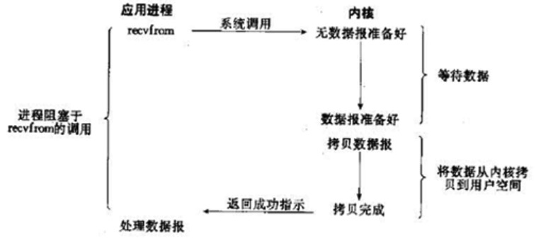
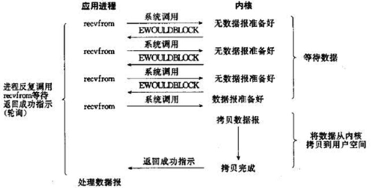
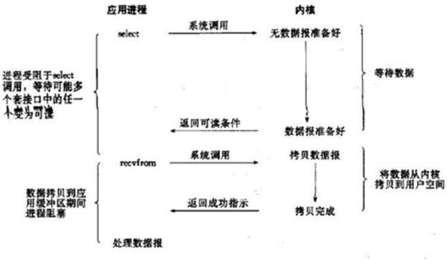
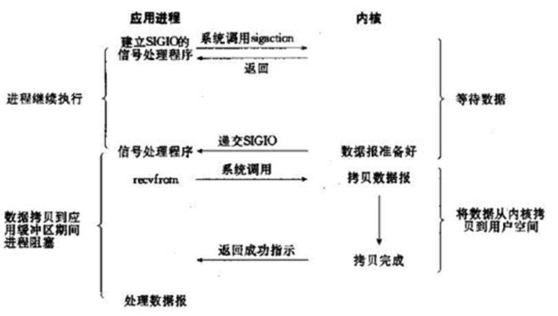
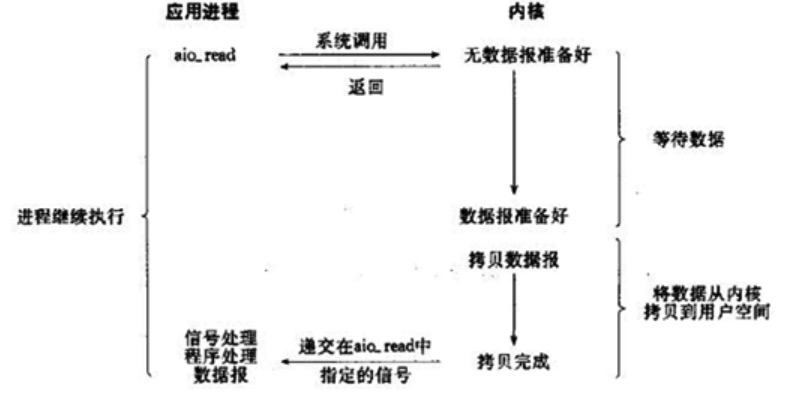

## IO分类

- 阻塞IO模型
- 非阻塞IO模型
- IO复用模型
- 信号驱动的IO模型
- 异步IO模型

前4种为同步IO操作，只有异步IO模型时异步IO操作

### 阻塞IO

进程发起IO系统调用，进程被阻塞，转到内核空间处理，整个IO处理完毕后返回进程

1.典型应用：阻塞socket

2.特点：

- 进程阻塞挂起不消耗cpu资源，及时响应每个操作
- 实现难度低，开发应用较容易
- 适合并发量小的网络应用开发

不适用并发量大的应用；因为一个请求IO会阻塞进程，所以，得为每个请求分配一个处理进程

### 非阻塞IO模型

进程发起IO系统调用后，如果内核缓冲区没有数据，需要到IO设备中读取，进程返回一个错误而不会被阻塞；进程发起IO系统调用后，如果内核缓冲区有数据，内核就会把数据返回进程。

对于阻塞IO模型来说，内核数据没准备好需要进程阻塞的时候，就返回一个错误，以使得进程不被阻塞。

1. 典型应用：socket非阻塞（设置nonblock）
2. 特点：
   1. 进程轮询调用，消耗cpu资源；
   2. 实现难度低、开发应用相对阻塞IO模型较难
   3. 适用并发量较小，且不需要及时响应的网络应用开发

### IO复用模型

多个进程IO可以注册到一个复用器（select）中，select会监听所有注册进来的IO，如果select监听的Io在内核缓冲区都没有可读数据，select调用进程会被阻塞。而当任一IO在内核缓冲区有可读数据时，select调用就会返回。

而后select调用进程可以自己或者通知另外的进程（注册进程）来再次发起读IO，读取内核中准备好的数据。

典型应用：select poll epoll 

特点：

- 专一进程解决多个进程IO的阻塞问题，性能好，reactor模式
- 适用于高并发服务应用

select poll epoll

- linux中IO复用的实现方式主要是这三种
- select： 注册IO 阻塞扫描 监听的IO最大连接数不能多余FD_SIZE
- poll： 原理和select相似 没有数量限制 但IO数量大扫描线性性能下降
- epoll：事件驱动不阻塞，mmap实现内核与用户空间的消息传递，数量很大

### 信号驱动IO模型

当进程发起一个IO操作，会向内核注册一个信号处理函数，然后进程返回不阻塞；当内核数据就绪时会发送一个信号给进程，进程便在信号处理函数中调用IO读取数据

特点：回调机制

### 异步IO模型

进程发起一个IO操作，进程返回不阻塞。但也不能返回结果。内核把整个IO处理完成后，会通知进程结果。如果IO操作成功则进程直接获取到数据

特点：

- 不阻塞 数据一步到位 Proactor模式

  