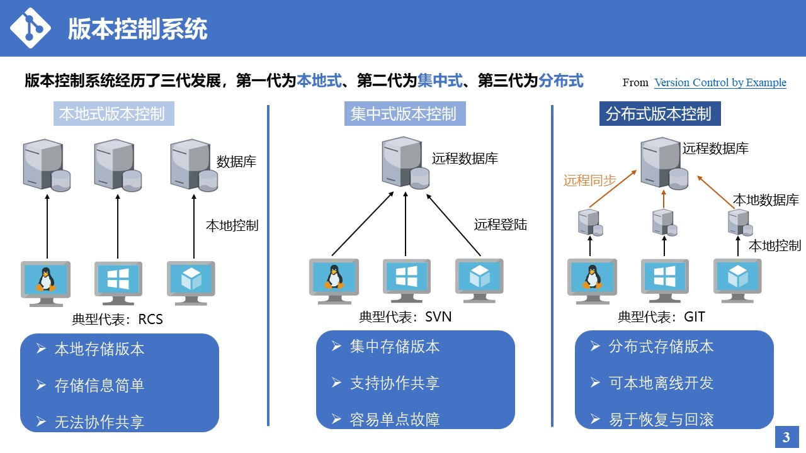
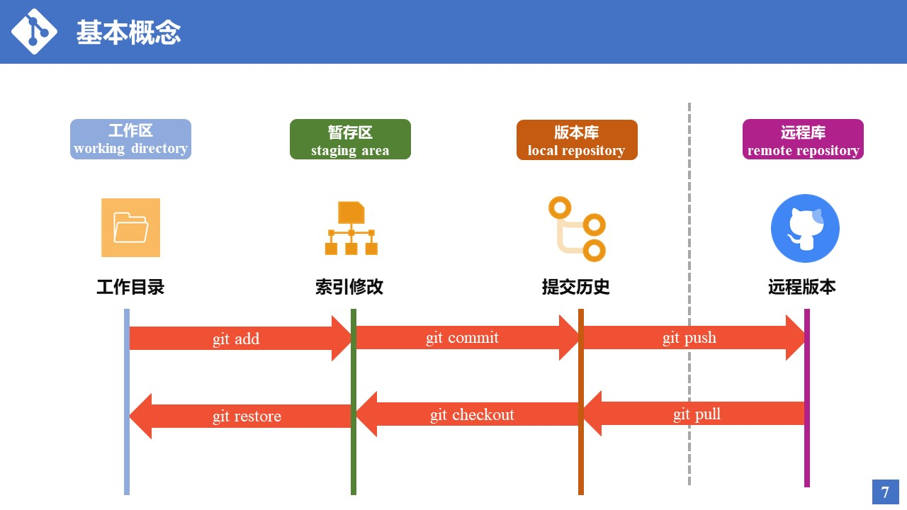
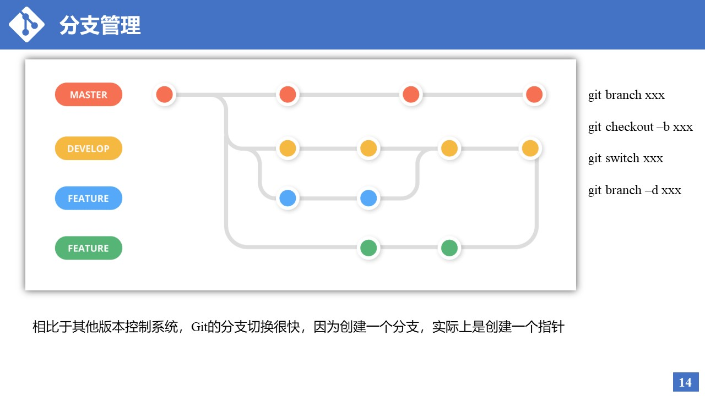
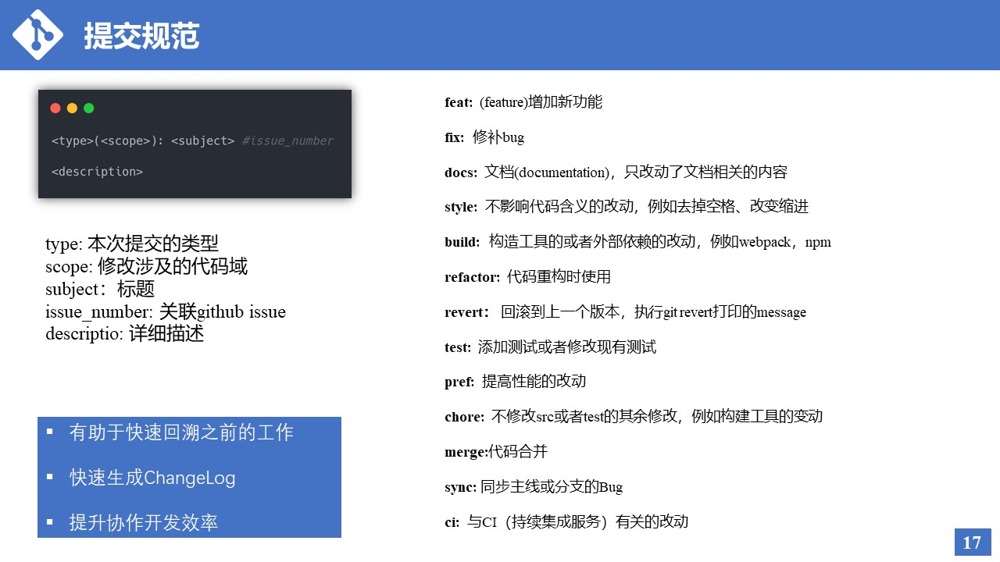
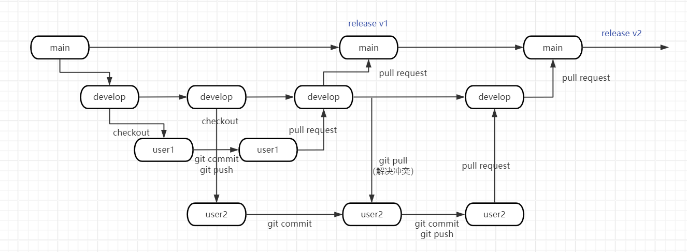

### git多人协作

#### 版本控制系统(version control system)

一种记录文件内容变化的系统

总结为一句话就是：随着时间的推移，使用版本控制系统记录项目的迭代过程

- 本地式版本控制系统：典型代表 `RCS`
- 集中式版本控制系统：典型代表 `SVN`
- 分布式版本控制系统：典型代表 `GIT`



`Git` 的存储区域有工作去、暂存区、版本库和远程库四个概念




- **工作区（Working Directory）**: 用户进行文件编辑的地方
- **暂存区（Staging Area/Index）**: 准备区域，用于存放即将被提交到版本库的文件更改 
- **版本库（Local Repository）**:  本地计算机上的一个数据库，用于存储所有已提交的更改和历史版本 
- **远程库（Remote Repository）**: 远程库是托管在网络上的版本库，例如在GitHub或GitLab上 



建议提交 `commit` 的时候遵循统一的格式规范



开发过程



- 

1. 从develop 新建分支：git branch develop user1 （git checkout -b test3 test2）
2. 切换分支：git checkout user1
3. 推送user1分支到远端的origin/user1:  git push origin user1

- 

1. git checkout develop: 切换到develop
2. git pull： 拉取其他人的最新更新 （用fetch也可以）
3. git checkout user: 切换到自己的分支
4. git rebase develop: 更新代码
5. 开发
6. git add  、 git commit 
7. git push user1
8. 向develop发起pull request

git推荐课程(https://time.geekbang.org/course/intro/100021601?utm_campaign=geektime_search&utm_content=geektime_search&utm_medium=geektime_search&utm_source=geektime_search&utm_term=geektime_search&tab=catalog)


python项目目录结构

```bash
my_python_project/
│
├── mypackage/
│   ├── __init__.py
│   ├── module1.py
│   ├── module2.py
│   └── ...
│
├── tests/
│   ├── __init__.py
│   ├── test_module1.py
│   ├── test_module2.py
│   └── ...
│
├── docs/
│   └── ...
│
├── examples/
│   └── ...
│
├── setup.py
├── README.md
├── LICENSE
└── .gitignore
```


