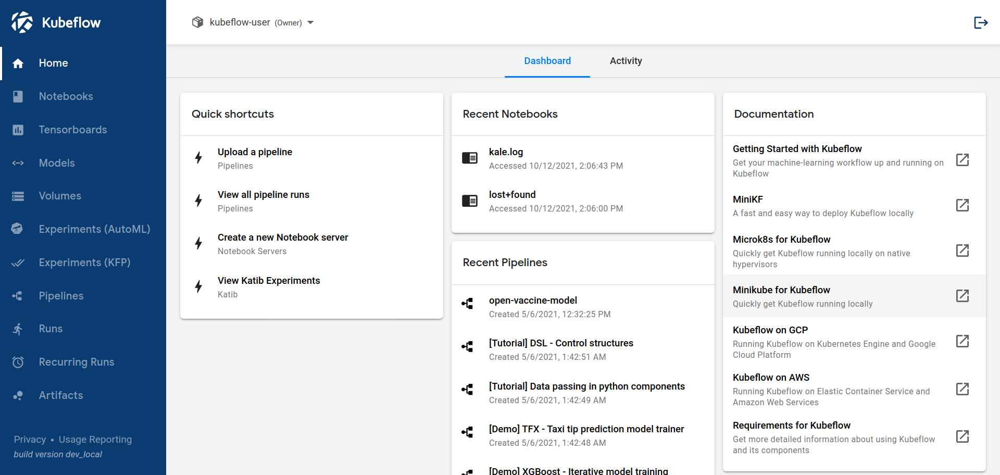

### 架构

（本文翻译kubeflow官网）

Kubeflow是为那些想要建立和实验机器学习管道的数据科学家提供的平台。Kubeflow也适用于那些希望将机器学习系统部署到各种环境中进行开发、测试和生产级服务的ML工程师和运维团队。

#### 概念综述

Kubeflow是Kubernetes的ML工具箱

下图显示了Kubeflow作为一个平台，在Kubernetes之上编排你的机器学习系统的组件。

 

Kubeflow是建立在Kubernetes之上的系统，用于部署、扩展和管理复杂系统。

使用Kubeflow的配置页面，你可以指定工作流所需的ML工具。然后，你可以将工作流部署到各种云、本地和企业内部的平台，用于实验和生产。

#### ML工作流程

当你开发和部署一个ML系统时，ML工作流程通常由几个阶段组成。开发一个ML系统是一个反复的过程。你需要评估ML工作流程各个阶段的输出，并在必要时对模型和参数进行修改，以确保模型不断产生你需要的结果。

为了简单起见，下图依次显示了工作流程的各个阶段。工作流程末端的箭头指向回流，以表明该过程的迭代性质。

更详细地看一下这些阶段：

- 在实验阶段，你根据最初的假设开发你的模型，并反复测试和更新模型，以产生你所寻找的结果：
  - 确定你要用机器学习系统解决的问题
  - 收集分析你需要的数据用于模型训练
  - 选择模型框架和算法，编码初始的模型
  - 验证你的数据和你训练的模型
  - 调整模型的超参数，以确保最有效的处理和最准确的结果。
- 在生产阶段，你执行下面的步骤部署了一个系统：
  - 将数据转换成你的训练系统需要的格式。为了确保你的模型在训练和预测过程中表现一致，转换过程在实验和生产阶段必须是相同的
  - 训练模型
  - 将模型用于在线预测或在batch mode下运行
  - 监测模型的性能，并将结果反馈给你的流程，以调整或重新训练模型

#### kubeflow组件在ML工作流中对应的位置

下图将Kubeflow添加到工作流中，显示了在每个阶段哪些Kubeflow组件是有用的

要了解更多信息，请阅读以下关于Kubeflow组件的指南

- Kubeflow包括用于启动和管理Jupyter notebook的服务。使用notebook进行交互式数据科学和ML工作流程的实验。
- kubeflow pipeline是一个基于docker container 用于创建、部署、管理多个ML工作流步骤的平台
- Kubeflow提供了几个组件，你可以用来在多个平台上建立你的ML训练、超参数调整和服务工作负载

#### 一个具体的ML工作流程的例子

下图显示了一个具体的ML工作流程的简单例子，你可以用它来训练和服务一个在MNIST数据集上训练的模型。

#### Kubeflow web 页面

本节介绍了你可以用来与Kubeflow互动，并在Kubeflow上构建和运行你的ML工作流的web页面

UI提供了一个中央仪表板，你可以用它来访问Kubeflow部署的组件

#### Kubeflow APIs and SDKs

Kubeflow的各种组件提供了API和Python SDK。参见以下几组参考文档。

- https://www.kubeflow.org/docs/components/pipelines/reference/
- https://www.kubeflow.org/docs/external-add-ons/fairing/reference/

**参考文章：https://www.kubeflow.org/docs/started/architecture/**