### 1. http

http://www.aspxfans.com:8080/news/index.asp?boardID=5&ID=24618&page=1#name

从上面的URL可以看出，一个完整的URL包括以下几部分：

1. 协议部分：该URL的协议部分为“http：”，这代表网页使用的是HTTP协议。在Internet中可以使用多种协议，如HTTP，FTP等等本例中使用的是HTTP协议。在"HTTP"后面的“//”为分隔符
2. 域名部分：该URL的域名部分为“www.aspxfans.com”。一个URL中，也可以使用IP地址作为域名使用
3. 端口部分：跟在域名后面的是端口，域名和端口之间使用“:”作为分隔符。端口不是一个URL必须的部分，如果省略端口部分，将采用默认端口
4. 虚拟目录部分：从域名后的第一个“/”开始到最后一个“/”为止，是虚拟目录部分。虚拟目录也不是一个URL必须的部分。本例中的虚拟目录是“/news/”
5. 文件名部分：从域名后的最后一个“/”开始到“？”为止，是文件名部分，如果没有“?”,则是从域名后的最后一个“/”开始到“#”为止，是文件部分，如果没有“？”和“#”，那么从域名后的最后一个“/”开始到结束，都是文件名部分。本例中的文件名是“index.asp”。文件名部分也不是一个URL必须的部分，如果省略该部分，则使用默认的文件名

6. 锚部分：从“#”开始到最后，都是锚部分。本例中的锚部分是“name”。锚部分也不是一个URL必须的部分
7. 参数部分：从“？”开始到“#”为止之间的部分为参数部分，又称搜索部分、查询部分。本例中的参数部分为“boardID=5&ID=24618&page=1”。参数可以允许有多个参数，参数与参数之间用“&”作为分隔符。

### linux收发包

- 网卡驱动：网卡需要有驱动才能工作，驱动是加载到内核中的模块，负责衔接网卡和内核的网络模块，驱动在加载的时候将自己注册进网络模块，当相应的网卡收到数据包时，网络模块会调用相应的驱动程序处理数据。

```
                   +-----+
                   |     |                            Memroy
+--------+   1     |     |  2  DMA     +--------+--------+--------+--------+
| Packet |-------->| NIC |------------>| Packet | Packet | Packet | ...... |
+--------+         |     |             +--------+--------+--------+--------+
                   |     |<--------+
                   +-----+         |
                      |            +---------------+
                      |                            |
                    3 | Raise IRQ                  | Disable IRQ
                      |                          5 |
                      |                            |
                      ↓                            |
                   +-----+                   +------------+
                   |     |  Run IRQ handler  |            |
                   | CPU |------------------>| NIC Driver |
                   |     |       4           |            |
                   +-----+                   +------------+
                                                   |
                                                6  | Raise soft IRQ
                                                   |
                                                   ↓
```

过程：

1. 数据包从外面的网络进入物理网卡。如果目的地址不是该网卡，且该网卡没有开启混杂模式，该包会被网卡丢弃。
2. 网卡将数据包通过[DMA](https://link.segmentfault.com/?enc=45Y22GjWqnHHVt7N4713Sg%3D%3D.RTcovGyeqreqo7PEKrivSG7rR7vrhmj3zEmILuM1SkkzN8z%2B2%2FFIVNKW1VcLddtI06eQlBNQD5wpNYSTMhncvg%3D%3D)的方式写入到指定的内存地址，该地址由网卡驱动分配并初始化。注： 老的网卡可能不支持DMA，不过新的网卡一般都支持。
3. 网卡通过硬件中断（IRQ）通知CPU，告诉它有数据来了
4. CPU根据中断表，调用已经注册的中断函数，这个中断函数会调到驱动程序（NIC Driver）中相应的函数
5. 驱动先禁用网卡的中断，表示驱动程序已经知道内存中有数据了，告诉网卡下次再收到数据包直接写内存就可以了，不要再通知CPU了，这样可以提高效率，避免CPU不停的被中断。
6. 启动软中断。这步结束后，硬件中断处理函数就结束返回了。由于硬中断处理程序执行的过程中不能被中断，所以如果它执行时间过长，会导致CPU没法响应其它硬件的中断，于是内核引入软中断，这样可以将硬中断处理函数中耗时的部分移到软中断处理函数里面来慢慢处理。

##### 文章：https://segmentfault.com/a/1190000008836467

##### 文章：https://blog.packagecloud.io/eng/2016/10/11/monitoring-tuning-linux-networking-stack-receiving-data-illustrated/

##### 文章：https://blog.packagecloud.io/eng/2016/06/22/monitoring-tuning-linux-networking-stack-receiving-data/


### k8 网络协议解析

#### 基础知识

##### route

```shell
Destination     Gateway         Genmask         Flags Metric Ref    Use Iface
0.0.0.0         192.168.8.1     0.0.0.0         UG    100    0        0 em1
10.244.0.0      10.244.0.0      255.255.255.0   UG    0      0        0 flannel.1
10.244.1.0      0.0.0.0         255.255.255.0   U     0      0        0 cni0
10.244.2.0      10.244.2.0      255.255.255.0   UG    0      0        0 flannel.1
172.17.0.0      0.0.0.0         255.255.0.0     U     0      0        0 docker0
192.168.8.0     0.0.0.0         255.255.252.0   U     100    0        0 em1
```

在路由表的输出中，每一行都包含了以下几个字段：

1. **Destination**（目标地址）：表示数据包要到达的目标地址或目标网络的IP地址。这个字段指定了数据包的最终目的地。
2. **Gateway**（网关）：指定了数据包应该经过哪个路由网关来到达目标地址。网关通常是一个路由器或者中间设备，它负责将数据包从本地网络发送到目标网络。
3. **Genmask**（子网掩码）：子网掩码指定了目标地址或目标网络的范围。它用于确定哪些地址属于同一目标网络。通常以CIDR（Classless Inter-Domain Routing）格式表示，例如，255.255.255.0 或 /24。
4. **Flags**（标志）：这是一个描述路由属性的字段，通常包括以下标志：
   - **U**（Up）：表示路由是活动的，可以使用。
   - **G**（Gateway）：表示这是一个网关路由，需要将数据包发送到指定的网关以进行转发。
   - **H**（Host）：表示这是一个主机路由，目标是一个具体的主机而不是一个网络。
   - **D**（Dynamic）：表示路由是动态生成的，通常由路由协议（如BGP、OSPF等）生成。
   - **C**（Cache）：表示路由是从缓存中获取的。
5. **Metric**（跃点）：跃点值用于确定路由的优先级。较低的跃点值通常表示较高的优先级，数据包将选择具有最低跃点值的路由。
6. **Ref**（参考次数）：表示有多少个路由表项引用了这个路由。这对于确定哪些路由是活动的非常有用。
7. **Use**（使用次数）：表示有多少个数据包已经通过这个路由表项进行了路由。
8. **Iface**（接口）：指定了数据包将通过哪个网络接口发送。这是一个与路由表项相关联的网络接口的名称。


```shell
Destination     Gateway         Genmask         Flags Metric Ref    Use Iface
10.244.1.0      0.0.0.0         255.255.255.0   U     0      0        0 cni0
```

- **Destination**（目标地址）：`10.244.1.0` 表示这是一个目标网络的IP地址。这个目标网络的IP地址范围是 `10.244.1.0` 到 `10.244.1.255`，使用了子网掩码 `255.255.255.0`，表示这是一个/24子网。
- **Gateway**（网关）：`0.0.0.0` 表示没有明确的网关，通常表示这个目标网络是本地网络（直连网络）。这意味着数据包将直接发送到目标网络上的主机，而不需要经过中间网关。
- **Genmask**（子网掩码）：`255.255.255.0` 是目标网络的子网掩码，它指定了目标网络的范围。
- **Flags**（标志）：`U` 表示这是一个直连路由（Connected），这意味着数据包将直接发送到目标网络上的主机，而不需要经过网关。
- **Metric**（跃点）：`0` 表示这个路由的跃点值。跃点用于确定路由的优先级，较低的跃点值通常表示较高的优先级。

这一行表示一个直连路由，将数据包发送到目标网络 `10.244.1.0/24`，并且数据包将直接发送到这个网络上的主机，而不需要经过网关。该路由项使用了网络接口 `cni0` 来进行数据包的发送和接收。


```shell
Destination     Gateway         Genmask         Flags Metric Ref    Use Iface
192.168.8.0     0.0.0.0         255.255.252.0   U     100    0        0 em1
```


这行路由规则表示的是一个在 Linux 系统下配置的静态路由。我们可以逐部分地解释它：

1. **目的网络地址 (192.168.8.0)**: 这是目标网络的 IP 地址。在这个例子中，192.168.8.0 表示一个私有（本地）网络地址。
2. **网关地址 (0.0.0.0)**: 这个字段指示用于到达目的地的网关。0.0.0.0 表示没有特定网关，即直接路由到目的网络。
3. **子网掩码 (255.255.252.0)**: 这是网络掩码，用于确定 IP 地址中哪部分是网络地址，哪部分是主机地址。在这个例子中，255.255.252.0 表示子网掩码，允许网络地址从 192.168.8.0 到 192.168.11.255。

这行路由规则意味着所有发往 192.168.8.0/22（即从 192.168.8.0 到 192.168.11.255）网络的数据包都将直接通过 em1 接口发送，不需要经过任何网关。

```shell
Destination     Gateway         Genmask         Flags Metric Ref    Use Iface
10.244.2.0      10.244.2.0      255.255.255.0   UG    0      0        0 flannel.1
```

1. **目的网络地址 (10.244.2.0)**: 这是目标网络的 IP 地址。10.244.2.0 是一个私有（本地）网络地址。
2. **网关地址 (10.244.2.0)**: 这个字段指示用于到达目的地的网关。这里的网关地址和目的网络地址相同，这在某些特殊配置中是可能的，特别是在虚拟网络或特定类型的 VPN 配置中。
3. **子网掩码 (255.255.255.0)**: 这是网络掩码，用于确定 IP 地址中的网络和主机部分。255.255.255.0 表示子网掩码，允许网络地址为 10.244.2.0 到 10.244.2.255。

这条路由规则表示所有发往 10.244.2.0/24 网络的数据包应该通过虚拟接口 "flannel.1" 传输，并且即使目的地和网关地址相同，也需要通过一个网关来路由这些数据包。这种配置通常见于虚拟化环境或复杂的网络设置中。

##### iptables

###### nat经过的链


###### 概念

规则存储在内核空间的信息 包过滤表中，这些规则分别指定了源地址、目的地址、传输协议（如TCP、UDP、ICMP）和服务类型（如HTTP、FTP和SMTP）等

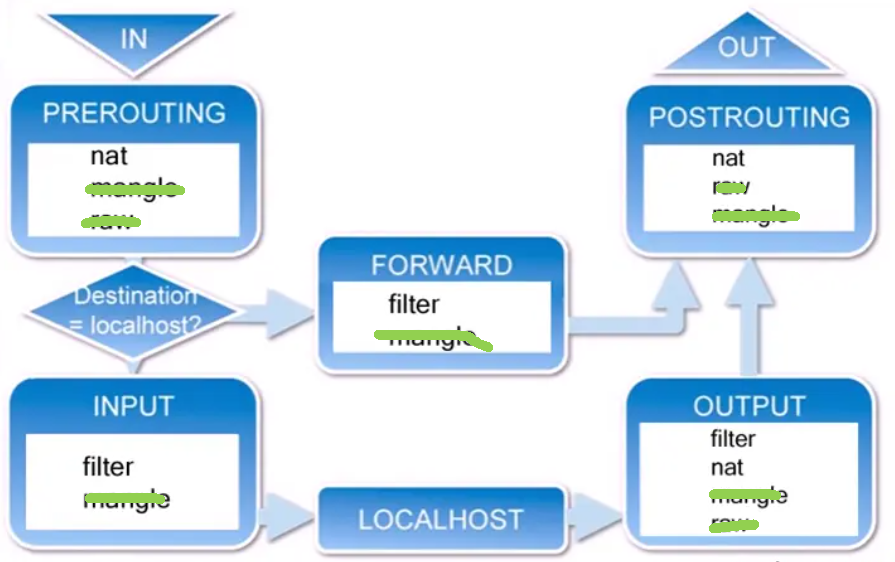

raw和mangle在k8s网络中很少用到，为了方便记忆，只给出每个链中的常用表

|    chain    |    table    |
| :---------: | :---------: |
| prerouting  |     nat     |
|   forward   |   filter    |
|    input    |   filter    |
|   output    | filter, nat |
| postrouting |     nat     |

###### 命令用法

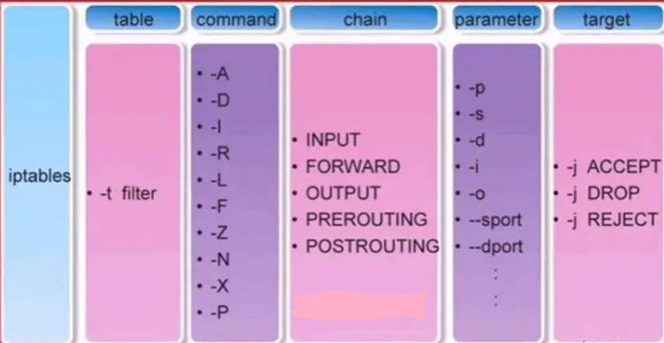

**查询**

**Command**：这一列展示了`iptables`可用的命令选项，它们用于定义要对规则集（或单个规则）执行的操作：

- `-A`：Append，将规则添加到链的末尾。
- `-D`：Delete，删除一个指定的规则。
- `-I`：Insert，在指定的位置插入一条规则。
- `-R`：Replace，替换一个指定的规则。
- `-L`：List，列出链中的所有规则。
- `-F`：Flush，删除链中的所有规则。
- `-Z`：Zero，将链中所有规则的计数器归零。
- `-N`：New chain，创建一个新的链。
- `-X`：Delete chain，删除一个非内置的链。
- `-P`：Policy，为链设置默认策略。

**Parameter**：参数用于进一步定义规则的匹配条件，可以指定源地址、目的地址、协议类型等：

- `-p`：Protocol，指定匹配的协议，如tcp、udp、icmp等。
- `-s`：Source，指定源IP地址。
- `-d`：Destination，指定目的IP地址。
- `-i`：In-interface，指定进入网络接口。
- `-o`：Out-interface，指定出去的网络接口。
- `--sport`：Source port，指定源端口。
- `--dport`：Destination port，指定目的端口。

**创建**

好的，我会对每个示例进行详细解释，包括每个参数的作用：

匹配模块

1. **`state`**:
   - 示例：`iptables -A INPUT -m state --state ESTABLISHED,RELATED -j ACCEPT`
   - 解释：
     - `-A INPUT`：在`INPUT`链上追加一条规则。
     - `-m state`：使用`state`模块，它可以根据连接的状态来匹配数据包。
     - `--state ESTABLISHED,RELATED`：只匹配状态为`ESTABLISHED`（已建立的连接）或`RELATED`（与已有连接相关联的数据包）的数据包。
     - `-j ACCEPT`：匹配的数据包将被接受。

2. **`tcp`/`udp`**:
   - 示例：`iptables -A INPUT -p tcp --dport 22 -j ACCEPT`
   - 解释：
     - `-A INPUT`：在`INPUT`链上追加一条规则。
     - `-p tcp`：指定匹配TCP协议。
     - `--dport 22`：匹配目的端口为22的数据包。
     - `-j ACCEPT`：匹配的数据包将被接受。

3. **`icmp`**:
   - 示例：`iptables -A INPUT -p icmp --icmp-type echo-request -j DROP`
   - 解释：
     - `-A INPUT`：在`INPUT`链上追加一条规则。
     - `-p icmp`：指定匹配ICMP协议。
     - `--icmp-type echo-request`：匹配ICMP类型为回显请求（即ping请求）的数据包。
     - `-j DROP`：匹配的数据包将被丢弃。

4. **`owner`**:
   - 示例：`iptables -A OUTPUT -m owner --uid-owner 1000 -j REJECT`
   - 解释：
     - `-A OUTPUT`：在`OUTPUT`链上追加一条规则。
     - `-m owner`：使用`owner`模块，它可以根据数据包的拥有者来匹配数据包。
     - `--uid-owner 1000`：匹配由用户ID为1000的用户生成的数据包。
     - `-j REJECT`：匹配的数据包将被拒绝。

5. **`recent`**:
   - 示例：`iptables -A INPUT -m recent --name portscan --rcheck --seconds 60 -j DROP`
   - 解释：
     - `-A INPUT`：在`INPUT`链上追加一条规则。
     - `-m recent`：使用`recent`模块，它可以用来动态地追踪最近看到的IP地址。
     - `--name portscan`：为这个追踪创建一个名为`portscan`的列表。
     - `--rcheck`：检查源地址是否在`portscan`列表中。
     - `--seconds 60`：如果源地址在过去60秒内已出现在列表中，则匹配。
     - `-j DROP`：匹配的数据包将被丢弃。

6. **`limit`**:
   - 示例：`iptables -A INPUT -p icmp -m limit --limit 1/s -j ACCEPT`
   - 解释：
     - `-A INPUT`：在`INPUT`链上追加一条规则。
     - `-p icmp`：指定匹配ICMP协议。
     - `-m limit`：使用`limit`模块，它可以限制匹配规则的频率。
     - `--limit 1/s`：每秒只匹配一个数据包。
     - `-j ACCEPT`：匹配的数据包将被接受。

7. **`multiport`**:
   - 示例：`iptables -A INPUT -p tcp -m multiport --dports 22,80,443 -j ACCEPT`
   - 解释：
     - `-A INPUT`：在`INPUT`链上追加一条规则。
     - `-p tcp`：指定匹配TCP协议。
     - `-m multiport`：使用`multiport`模块，它可以匹配多个

端口。
     - `--dports 22,80,443`：匹配目的端口为22、80或443的数据包。
     - `-j ACCEPT`：匹配的数据包将被接受。

8. **`comment`**:
   - 示例：`iptables -A INPUT -p tcp --dport 22 -j ACCEPT -m comment --comment "Allow SSH"`
   - 解释：
     - `-A INPUT`：在`INPUT`链上追加一条规则。
     - `-p tcp`：指定匹配TCP协议。
     - `--dport 22`：匹配目的端口为22的数据包。
     - `-j ACCEPT`：匹配的数据包将被接受。
     - `-m comment`：使用`comment`模块，它允许在规则中添加注释。
     - `--comment "Allow SSH"`：为规则添加注释，说明其目的。

9. **`conntrack`**:
   - 示例：`iptables -A FORWARD -m conntrack --ctstate NEW -j ACCEPT`
   - 解释：
     - `-A FORWARD`：在`FORWARD`链上追加一条规则。
     - `-m conntrack`：使用`conntrack`模块，它可以根据连接跟踪信息来匹配数据包。
     - `--ctstate NEW`：匹配新建立的连接的数据包。
     - `-j ACCEPT`：匹配的数据包将被接受。

10. **`string`**:
    - 示例：`iptables -A INPUT -m string --algo bm --string "badcontent" -j DROP`
    - 解释：
      - `-A INPUT`：在`INPUT`链上追加一条规则。
      - `-m string`：使用`string`模块，它可以匹配数据包内容中的特定字符串。
      - `--algo bm`：指定使用Boyer-Moore算法进行字符串匹配。
      - `--string "badcontent"`：匹配包含字符串"badcontent"的数据包。
      - `-j DROP`：匹配的数据包将被丢弃。

目标模块

1. `ACCEPT`:
   - 示例：`iptables -A INPUT -p tcp --dport 80 -j ACCEPT`
   - 解释：
     - `-A INPUT`：在`INPUT`链上追加一条规则。
     - `-p tcp`：指定匹配TCP协议。
     - `--dport 80`：匹配目的端口为80的数据包。
     - `-j ACCEPT`：匹配的数据包将被接受。

2. `DROP`:
   - 示例：`iptables -A INPUT -s 192.168.1.1 -j DROP`
   - 解释：
     - `-A INPUT`：在`INPUT`链上追加一条规则。
     - `-s 192.168.1.1`：匹配来源于特定IP（192.168.1.1）的数据包。
     - `-j DROP`：匹配的数据包将被丢弃。

3. `REJECT`:
   - 示例：`iptables -A INPUT -p tcp --dport 23 -j REJECT`
   - 解释：
     - `-A INPUT`：在`INPUT`链上追加一条规则。
     - `-p tcp`：指定匹配TCP协议。
     - `--dport 23`：匹配目的端口为23的数据包。
     - `-j REJECT`：匹配的数据包将被拒绝，并向发送方发送错误响应。

4. `LOG`:
   - 示例：`iptables -A INPUT -p tcp --dport 80 -j LOG --log-prefix "HTTP traffic: "`
   - 解释：
     - `-A INPUT`：在`INPUT`链上追加一条规则。
     - `-p tcp`：指定匹配TCP协议。
     - `--dport 80`：匹配目的端口为80的数据包。
     - `-j LOG`：记录匹配的数据包信息。
     - `--log-prefix "HTTP traffic: "`：在日志消息前添加前

**删除**

1. 按规则规格删除

如果您知道要删除的规则的完整细节，可以直接指定这些细节来删除规则。这是最精确的方法。

- 示例：`iptables -D INPUT -p icmp --icmp-type echo-request -j DROP`
- 解释：这条命令会删除`INPUT`链中所有精确匹配该规则的实例。

2. 按规则编号删除

每条规则在链中都有一个编号。您可以先列出链中的所有规则，查看每条规则的编号，然后根据编号来删除规则。

- 列出规则及其编号：`iptables -L INPUT --line-numbers`
- 删除特定编号的规则：`iptables -D INPUT [规则编号]`
- 示例：如果要删除的规则是第3条，使用`iptables -D INPUT 3`。

3. 清空整个链

如果您想删除某个链中的所有规则，可以使用`flush`命令来清空整个链。

- 示例：`iptables -F INPUT`
- 解释：这条命令会删除`INPUT`链中的所有规则。

4. 删除自定义链

如果您创建了一个自定义链，并且想要删除它，需要先清空链中的所有规则，然后删除链。

- 清空链中的规则：`iptables -F [自定义链名]`
- 删除链：`iptables -X [自定义链名]`
- 示例：如果链名为`MYCHAIN`，使用`iptables -F MYCHAIN`然后`iptables -X MYCHAIN`。

5. 重置到默认状态

如果您想要重置`iptables`到默认状态，可以使用`flush`命令清空所有内置链，然后重新设置默认策略。

- 清空所有链：`iptables -F`
- 重置默认策略：`iptables -P INPUT ACCEPT; iptables -P FORWARD ACCEPT; iptables -P OUTPUT ACCEPT`

###### k8s中的iptables

集群默认kube-proxy使用iptables和flannel使用的iptables

**几个重要的链**

```bash
Chain KUBE-MARK-MASQ (87 references)
target     prot opt source               destination
MARK       all  --  anywhere             anywhere             MARK or 0x4000

这条 `iptables` 规则位于 `KUBE-MARK-MASQ` 链中，是 Kubernetes 网络策略的一部分，用于实现源地址转换（Source NAT, SNAT）的标记。我们来解释这条规则的具体作用：

- `target`: `MARK` - 这指明了该规则将执行的动作，即修改数据包的标记（mark）。
- `prot opt`: `all` - 这表明规则适用于所有类型的协议。
- `source` 和 `destination`: `anywhere` - 这表示规则适用于从任何源地址到任何目的地址的数据包。
- `MARK or 0x4000`: 这是规则的具体操作，它将数据包的标记与 `0x4000` 进行“或”（OR）操作。这意味着如果数据包的标记中没有设置 `0x4000` 这一位，此操作会将其设置上。

在 Kubernetes 环境中，`KUBE-MARK-MASQ` 链通常用于标记那些需要进行源地址转换的数据包。这主要用于以下两种情况：

1. **Pod到外部的通信**：当一个 Pod 需要与集群外部的系统通信时，通常需要将其源 IP 地址改写为节点的 IP 地址，以便外部系统可以正确地回应。这种情况下，需要进行 SNAT。

2. **节点端口服务**：当外部流量通过节点端口访问集群内服务时，返回流量可能需要 SNAT 来保证正确路由回源地址。

通过设置 `0x4000` 标记，`iptables` 能够识别哪些数据包需要进行源地址转换。这样，当数据包离开节点时，`MASQUERADE` 规则（或类似的 SNAT 规则）就会将这些数据包的源 IP 地址更改为节点的 IP 地址，从而确保流量的连续性和正确路由。

#iptables -A KUBE-MARK-MASQ -j MARK --or-mark 0x4000
```

```bash
Chain KUBE-SEP-IOFPLAXKEZM6KDRU (1 references)
target     prot opt source               destination
KUBE-MARK-MASQ  all  --  10.244.1.184         anywhere             /* jupyter/wuyingwen-pod-external:http2 */
DNAT       tcp  --  anywhere             anywhere             /* jupyter/wuyingwen-pod-external:http2 */ tcp to:10.244.1.184:10352


这些 `iptables` 规则位于名为 `KUBE-SEP-Y74DMOLU7A4ANSVK` 的链中，这种链通常是 Kubernetes 服务定义的一部分，用于处理特定服务的流量。我们可以逐行解释这些规则的具体作用：

1. **`KUBE-MARK-MASQ` 规则**:
   - `target`: `KUBE-MARK-MASQ`
   - `prot opt`: 适用于所有协议（`all`）
   - `source`: 来自特定 IP 地址 `10.244.1.184`
   - `destination`: 适用于任何目的地址（`anywhere`）
   - `/* jupyter/wuyingwen-pod-external:http2 */`: 这是一个注释，表明规则与名为 `wuyingwen-pod-external` 的 Jupyter 服务相关，协议为 `http2`。

   这条规则用于标记从 `10.244.1.184`（可能是一个 Pod 的 IP）发出的流量，使得其在返回时可以进行源地址转换（SNAT）。这在 Kubernetes 中常用于确保流量在跨越不同网络时保持正确的源地址。

2. **`DNAT` 规则**:
   - `target`: `DNAT`
   - `prot opt`: 适用于 TCP 协议
   - `source`: 适用于从任何源地址（`anywhere`）
   - `destination`: 适用于任何目的地址（`anywhere`）
   - `/* jupyter/wuyingwen-pod-external:http2 */`: 同上，注释说明规则用途
   - `tcp to:10.244.1.184:10352`: 表示将匹配的流量的目的地进行网络地址转换（DNAT），将其重定向到 IP 地址 `10.244.1.184` 的 `10352` 端口。

   这条规则用于将流量重定向到特定的 Pod。在这个例子中，流量被重定向到运行 Jupyter 服务的 Pod 上，端口为 `10352`。

综合来看，这些规则的作用是捕获到特定服务（在这种情况下是一个 Jupyter 服务）的流量，并确保它被正确地路由到集群内的目标 Pod。这是 Kubernetes 服务发现和负载均衡机制的一部分，确保外部请求可以正确地被发送到集群内部的服务。
```

```bash
KUBE-SVC-K7NHKQJMVAP2IJBN  tcp  --  anywhere             10.1.81.211          /* jupyter/wuyingwen-pod-external:http2 cluster IP */ tcp dpt:10352
KUBE-SVC-K7NHKQJMVAP2IJBN  tcp  --  anywhere             tgq204               /* jupyter/wuyingwen-pod-external:http2 external IP */ tcp dpt:10352


这两条`iptables`规则位于Kubernetes环境中，是由`kube-proxy`组件管理的，用于处理到达特定Kubernetes服务的流量。这些规则是服务路由的一部分，具体解释如下：

1. **第一条规则**：
   - `KUBE-SVC-K7NHKQJMVAP2IJBN tcp -- anywhere 10.1.81.211 /* jupyter/wuyingwen-pod-external:http2 cluster IP */ tcp dpt:10352`
   - 解释：此规则适用于目的地是`10.1.81.211`（集群内部IP）的TCP流量，其中目的端口为10352。当满足这些条件时，流量将被重定向到`KUBE-SVC-K7NHKQJMVAP2IJBN`链。这通常意味着流量是针对特定的Kubernetes服务（在此例中是`jupyter/wuyingwen-pod-external`服务的HTTP2端口），并且使用了该服务的集群内部IP地址。

2. **第二条规则**：
   - `KUBE-SVC-K7NHKQJMVAP2IJBN tcp -- anywhere tgq204 /* jupyter/wuyingwen-pod-external:http2 external IP */ tcp dpt:10352`
   - 解释：此规则适用于目的地是`tgq204`（可能是一个外部IP或另一个网络别名）的TCP流量，其中目的端口同样为10352。当满足这些条件时，流量同样被重定向到`KUBE-SVC-K7NHKQJMVAP2IJBN`链。这表明流量是针对同一个Kubernetes服务的，但这次使用的是它的外部IP地址。

总体而言，这两条规则表明Kubernetes服务`jupyter/wuyingwen-pod-external`可以通过内部集群IP（`10.1.81.211`）和外部IP（`tgq204`）来访问，且服务都监听在TCP端口10352上。这种配置允许来自集群内部和外部的流量都能访问同一个服务，但通过不同的IP地址。`KUBE-SVC-K7NHKQJMVAP2IJBN`链可能包含了进一步的路由规则，比如负载均衡到多个Pod副本。
```


以wuyingwen的http0为例，讲解iptables过滤转发包过程

```bash
#1.包进入
Chain PREROUTING (policy ACCEPT)
target     prot opt source               destination
KUBE-SERVICES  all  --  anywhere             anywhere             /* kubernetes service portals */
DOCKER     all  --  anywhere             anywhere             ADDRTYPE match dst-type LOCAL

#2.进入KUBE-SERVICES 
KUBE-SVC-KZQDQXK64KUAT7DG  tcp  --  anywhere             10.1.140.170         /* jupyter/wuyingwen-pod:http0 cluster IP */ tcp dpt:hbci

KUBE-SVC-X42XGK33M2VVDL7D  tcp  --  anywhere             10.1.81.211          /* jupyter/wuyingwen-pod-external:http0 cluster IP */ tcp dpt:10350
KUBE-SVC-X42XGK33M2VVDL7D  tcp  --  anywhere             tgq204               /* jupyter/wuyingwen-pod-external:http0 external IP */ tcp dpt:10350

#3.进入 KUBE-SVC-KZQDQXK64KUAT7DG 
Chain KUBE-SVC-KZQDQXK64KUAT7DG (1 references)
target     prot opt source               destination
KUBE-MARK-MASQ  tcp  -- !10.244.0.0/16        10.1.140.170         /* jupyter/wuyingwen-pod:http0 cluster IP */ tcp dpt:hbci
KUBE-SEP-XOR2I6ZI4DA326KG  all  --  anywhere             anywhere             /* jupyter/wuyingwen-pod:http0 */


#3.KUBE-SVC-X42XGK33M2VVDL7D
Chain KUBE-SVC-X42XGK33M2VVDL7D (2 references)
target     prot opt source               destination
KUBE-MARK-MASQ  tcp  -- !10.244.0.0/16        10.1.81.211          /* jupyter/wuyingwen-pod-external:http0 cluster IP */ tcp dpt:10350
KUBE-MARK-MASQ  tcp  -- !10.244.0.0/16        tgq204               /* jupyter/wuyingwen-pod-external:http0 external IP */ tcp dpt:10350
KUBE-SEP-SBSUFHYVFYNS4R7C  all  --  anywhere             anywhere             /* jupyter/wuyingwen-pod-external:http0 */


#4.KUBE-MARK-MASQ
Chain KUBE-MARK-MASQ (87 references)
target     prot opt source               destination
MARK       all  --  anywhere             anywhere             MARK or 0x4000


#5 KUBE-SEP-XOR2I6ZI4DA326KG
Chain KUBE-SEP-XOR2I6ZI4DA326KG (1 references)
target     prot opt source               destination
KUBE-MARK-MASQ  all  --  10.244.1.184         anywhere             /* jupyter/wuyingwen-pod:http0 */
DNAT       tcp  --  anywhere             anywhere             /* jupyter/wuyingwen-pod:http0 */ tcp to:10.244.1.184:3000


#5. KUBE-SEP-SBSUFHYVFYNS4R7C 
Chain KUBE-SEP-SBSUFHYVFYNS4R7C (1 references)
target     prot opt source               destination
KUBE-MARK-MASQ  all  --  10.244.1.184         anywhere             /* jupyter/wuyingwen-pod-external:http0 */
DNAT       tcp  --  anywhere             anywhere             /* jupyter/wuyingwen-pod-external:http0 */ tcp to:10.244.1.184:3000

```

这些`iptables`规则描述了Kubernetes中服务网络流量的处理过程。流量首先通过`PREROUTING`链进入系统，然后根据目的地地址被路由到相应的服务链，最后通过一系列的跳转和标记操作，被转发到最终的Pod IP和端口。以下是详细的流程和每个步骤的作用：

**流程和作用**

1. **进入PREROUTING链**：
   - 所有进入的包首先进入`PREROUTING`链。
   - 如果目的地是本地地址（`ADDRTYPE match dst-type LOCAL`），则流量被路由到`DOCKER`链。
   - 否则，流量被路由到`KUBE-SERVICES`链，用于处理Kubernetes服务相关的流量。

2. **在KUBE-SERVICES链中进行匹配**：
   - 根据目的IP和端口，流量被重定向到相应的服务链（例如`KUBE-SVC-KZQDQXK64KUAT7DG`或`KUBE-SVC-X42XGK33M2VVDL7D`）。

3. **在KUBE-SVC-*链中的处理**：
   - `KUBE-MARK-MASQ`规则为来自Pod子网外部的流量设置标记，准备进行源地址伪装（MASQUERADE）。
   - 流量被路由到特定的服务端点链（如`KUBE-SEP-XOR2I6ZI4DA326KG`或`KUBE-SEP-SBSUFHYVFYNS4R7C`）。

4. **在KUBE-MARK-MASQ链中的标记操作**：
   - 为流量设置特殊标记（`MARK or 0x4000`），这用于后续的源地址伪装。

5. **在KUBE-SEP-*链中的最终目的地决定**：
   - `KUBE-MARK-MASQ`为特定的Pod IP设置额外的标记。
   - `DNAT`规则将流量的目的地地址和端口转换为实际的Pod IP和端口（如`10.244.1.184:3000`）。

**流程图**

```SAS
[包进入]
     |
     v
[PREROUTING] -- (如果目的地是本地) --> [DOCKER]
     |
     v
[KUBE-SERVICES] -- (根据服务IP和端口) --> [KUBE-SVC-*]
     |
     v
[KUBE-SVC-*] -- (设置标记，选择端点) --> [KUBE-MARK-MASQ] -- [KUBE-SEP-*]
     |
     v
[KUBE-SEP-*] -- (执行DNAT，转发到Pod)
```

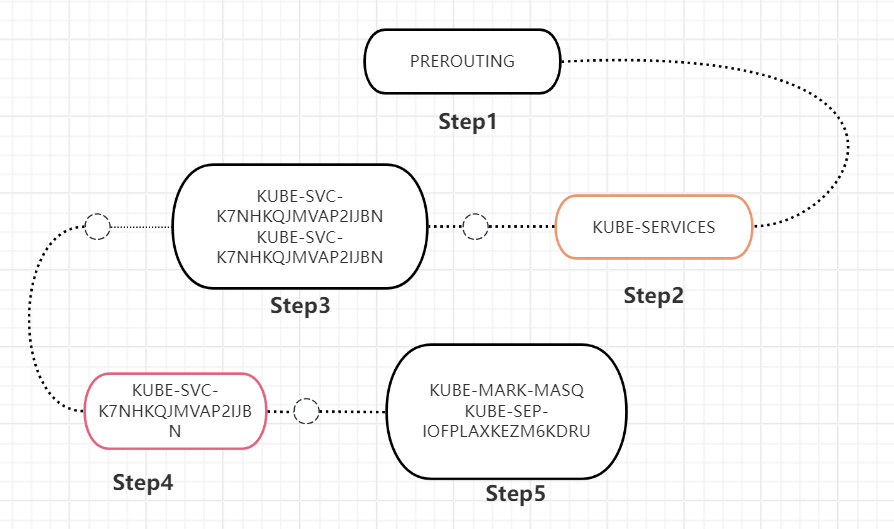

**当进入dnat后，数据包如何进入的pod内部？**

当`iptables`规则通过DNAT将流量的目的地修改为Pod的IP（例如`10.244.1.184:3000`）之后，数据包的发送到Pod内部的过程涉及Kubernetes的网络层和底层操作系统的网络堆栈。这个过程可以大致分解为以下步骤：

1. DNAT转换

- DNAT操作修改了数据包的目的IP和端口，将其从原始的集群IP和端口（如一个服务的ClusterIP）转换为实际Pod的IP和端口（`10.244.1.184:3000`）。

2. 路由决策

- 一旦DNAT完成，操作系统的路由表用于决定如何发送这个已修改的数据包。因为目的IP现在是Pod的IP，路由表将指示数据包通过与该Pod关联的网络接口发送。

3. 网络接口和CNI

- 在Kubernetes中，Pod网络通常由CNI（容器网络接口）插件管理。这些插件配置了每个节点上的网络，包括如何路由到每个Pod的流量。
- CNI插件创建了一个虚拟网络接口（比如veth pair），这个接口连接了Pod和宿主机的网络命名空间。

4. 到达Pod网络命名空间

- 数据包通过宿主机的网络堆栈，进入与Pod关联的虚拟网络接口。
- 从宿主机的网络命名空间，数据包被转发到Pod的网络命名空间。

5. Pod内部处理

- 一旦数据包到达Pod的网络命名空间，它会被Pod内部运行的应用程序接收。在这个例子中，监听在端口3000上的应用程序会处理这个数据包。

6. 应用程序响应

- 应用程序处理接收到的数据包，并可能产生响应。响应数据包会通过相同的网络路径返回给原始发送者，但是在发送前会经过源地址转换（SNAT），以确保响应能夠回到正确的源地址。


### TCP协议

#### 握手的目的

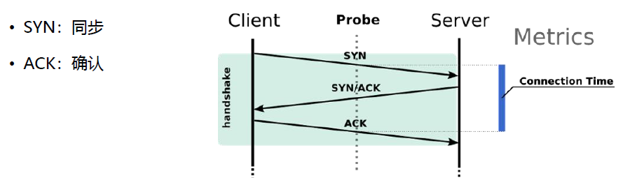

**同步 Sequence 序列号**
	初始序列号 ISN（Initial Sequence Number）
**交换 TCP 通讯参数**
	如 MSS、窗口比例因子、选择性确认、指定校验和算法

#### 数据包结构


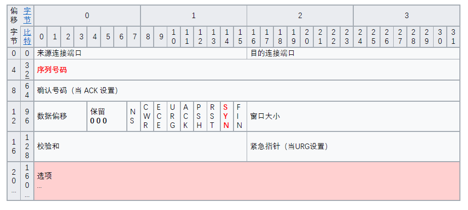


1. **保留（Reserved）**：
   - **作用**：这些位目前是保留的，用于未来的扩展。在当前的标准中，这些位必须被设置为0，并在接收时被忽略。

2. **标志位（Flags）**：
   - **作用**：TCP头中的标志位用于控制TCP连接的状态。每个标志位代表不同的控制信号。常见的标志位包括SYN（同步序列编号，用于建立连接）、ACK（确认，用于确认接收到的数据）、FIN（结束，用于关闭连接）、RST（重置，用于强制关闭连接）、PSH（推送，告诉接收端应立即处理这些数据）、URG（紧急，用于紧急数据的传送）。

3. **紧急指针（URG）**：
   - **作用**：当URG标志位被设置时，紧急指针字段被激活。它告诉接收端TCP头后面有紧急数据，紧急指针字段的值是一个正偏移量，它与序列号字段的值相加后，指示紧急数据的最后一个字节的序列号。紧急模式允许发送端通知接收端有一些紧急的数据需要被优先处理。

4. **数据偏移（Data Offset）**：
   - **作用**：数据偏移字段，也称为头部长度字段，指示TCP头部的大小。这个字段的值是32位字的数量，用于确定数据开始的地方和TCP头的结束位置。这个字段很重要，因为TCP头可能包含一个可变数量的选项。


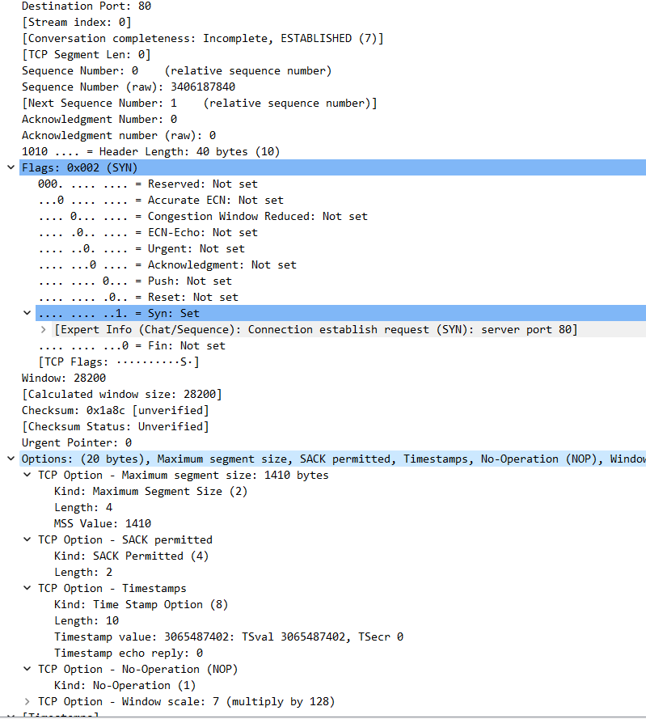

1. **目的端口（Destination Port）和 源端口 （src port）：** 
   
2. **序列号（Sequence Number）：** 是一个32位的数字，用于标识从TCP源端到目的端发送的数据字节流的顺序号。
   
3. **确认号（Acknowledgment Number）：** 如果ACK标志位被设置，则该字段包含发送确认的一端所期望收到的下一个序列号。
   
4. **头部长度（Header Length）：** 以32位字为单位的TCP头部长度。也被称为**数据偏移**。
   
5. **标志位（Flags）：**
   
   - **SYN（同步）：** 用于建立连接时同步序列号。
   - **其它标志位：** 如ACK、FIN、RST等，不过在这个报文中没有被设置。
   
6. **窗口大小（Window）：** 指示从确认号开始，发送方能够接收的字节数。

7. **校验和（Checksum）：** 用于错误检测的校验值。

8. **紧急指针（Urgent Pointer）：** 当URG标志位被设置时，这个字段是有效的，它指示紧急数据的结束位置。

9. **选项（Options）：**
   - **最大段大小（Maximum Segment Size）：** 指示TCP通信双方可以接受的最大数据段大小。
   - **选择确认（SACK Permitted）：** 表示接受选择性确认的选项。
   - **时间戳（Timestamps）：** 用于记录数据包的发送和接收时间。
   - **无操作（No-Operation, NOP）：** 用作填充选项，以使后续的选项能在32位边界上开始。
   - **窗口缩放（Window scale）：** 用于扩大窗口大小字段的有效范围。
   
   1. **MSS（最大段大小）**：
      - **定义**：MSS是TCP连接中的每个数据包可以携带的最大数据量，不包括TCP头部和IP头部。
      - **目的**：它的设置是为了避免网络中的分片，确保数据包在网络中能够高效传输。分片发生在数据包大于网络的最大传输单元（MTU）时，导致数据包需要被分成多个小片在网络中传输。
      - **使用**：通常，在TCP三次握手的初始SYN消息中，每一方都会声明自己的MSS值，这是基于其网络环境下的最佳估计。
   
   2. **窗口缩放（Window Scaling）**：
      - **定义**：窗口缩放是一种TCP选项，用于支持大于65,535字节的窗口大小，通过使用一个缩放因子来扩展窗口大小字段的能力。
      - **目的**：在高延迟或高带宽的网络环境中，较大的窗口大小可以提高传输效率，因为它允许发送更多的数据而不需要等待确认。
      - **使用**：窗口缩放选项也是在TCP三次握手中设置的，它通过一个缩放因子（通常是2的幂次）来增加窗口大小的表示范围。
   
   3. **选择性确认（Selective Acknowledgment, SACK）**：
      - **定义**：SACK是TCP的一种改进机制，允许接收方告诉发送方哪些数据被成功接收，而哪些数据需要重新传输。
      - **目的**：这使得在发生数据包丢失时，发送方只需重新传输那些未被确认接收的数据包，而不是从最后一个确认的数据包之后的所有数据重新开始发送。
      - **使用**：SACK的使用通常在TCP头中有专门的选项字段来指明，当数据包丢失时，SACK可以显著提高TCP的性能，特别是在丢包率高的网络环境中。
   
   4. **指定校验和算法**：
      - **定义**：TCP校验和是一种错误检测机制，用于检查TCP头部和数据部分是否在传输过程中发生错误。
      - **目的**：校验和可以检测数据在传输过程中的变化，包括意外的错误和潜在的恶意篡改。
      - **使用**：每个TCP段在发送前都会计算校验和，并在头部中包含这个校验和值。接收方在收到TCP段后会重新计算校验和，以验证数据的完整性。如果计算出的校验和与接收到的不符，TCP段将被丢弃。
   
   

#### tcp链接(三次握手)

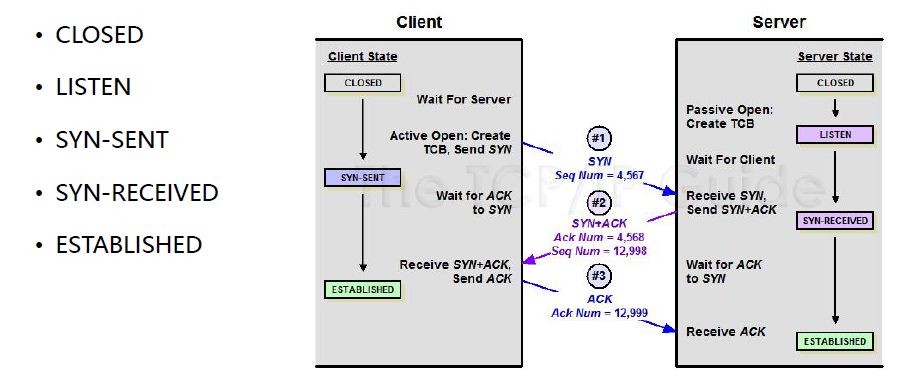


#### 系统优化常用参数

1. **tcp_max_syn_backlog**：
   - 控制SYN接收队列的最大长度，对于高性能或高负载的服务器来说非常重要，尤其是在面对大量并发连接请求时。

2. **tcp_synack_retries**：
   - 定义在放弃响应一个TCP SYN请求前，发送SYN-ACK包的最大次数。这个设置影响到在网络延迟较高或丢包情况下连接的建立。

3. **tcp_fin_timeout**：
   - 控制TCP连接在关闭请求后等待时间的长度。这个设置对于管理TIME_WAIT套接字的数量和行为很关键。

4. **tcp_tw_reuse** 和 **tcp_tw_recycle**：

   - 这两个参数控制TCP在TIME_WAIT状态的套接字的处理。`tcp_tw_reuse` 允许重用处于TIME_WAIT状态的套接字，而 `tcp_tw_recycle` 更加激进地快速回收TIME_WAIT状态的套接字。

5. **tcp_syn_retries = 6**  客户端主动建立连接时，发 SYN 的重试次数 

6. **tcp_fastopen**  

   

   0：关闭

   1：作为客户端时可以使用TFO

   2：作为服务器时可以使用TFO

   3：无论作为客户端还是服务器，都可以使用TFO

7. **tcp_keepalive_time**, **tcp_keepalive_probes**, **tcp_keepalive_intvl**：

   - 这些参数控制TCP保活功能的行为，包括在开始发送保活探测包前的空闲时间（`tcp_keepalive_time`）、断开前发送探测包的最大次数（`tcp_keepalive_probes`）以及探测包的发送间隔（`tcp_keepalive_intvl`）。

8. **tcp_retries2**：
   - 定义在放弃尝试重新传输TCP报文段之前的最大重传次数。这个设置影响到在网络问题出现时连接的持续时间。

9. **tcp_rmem** 和 **tcp_wmem**：
   - 这些参数分别控制TCP套接字的读缓冲区和写缓冲区的最小值、默认值和最大值，对于调整网络吞吐量和性能来说非常关键。

10. **tcp_congestion_control**：
   - 设置使用的TCP拥塞控制算法。不同的算法在不同网络条件下的表现会有所差异。

11. **tcp_syncookies**：
    - 用于防御SYN洪水攻击，当SYN队列满时启用SYN Cookies可以帮助服务器继续接受新的连接。

    `tcp_syncookies`是一种防御SYN泛洪攻击的技术。在正常情况下，当服务器接收到客户端的SYN请求时，它会在SYN队列中分配资源，然后向客户端发送SYN-ACK响应，并等待客户端的ACK回复。如果客户端发送ACK，TCP连接建立成功，资源从SYN队列移到Accept队列。如果服务器的SYN队列满了，它会开始拒绝新的SYN请求，这可能在SYN泛洪攻击期间发生，攻击者发送大量的SYN包以填满队列，导致合法用户无法建立连接。

    当启用了`tcp_syncookies`时，服务器的工作过程会有所不同：

    1. 当SYN队列满了之后，服务器不会简单地丢弃SYN包，而是发送一个特殊构造的SYN-ACK响应，这个响应包含一个“SYN cookie”。这个cookie是一个编码的值，它包含了初始序列号和其他一些信息，如客户端的IP地址、端口号和MSS大小。

    2. 服务器不会在其SYN队列中为这个连接保留状态。相反，它依赖于客户端来回复正确的ACK响应。如果攻击者发送SYN请求但不响应SYN-ACK，则不会消耗服务器的资源。

    3. 如果客户端是合法的，并且发送了包含cookie信息的ACK响应，服务器通过验证这个ACK中的cookie确认这是一个有效的连接尝试，并建立连接。因为cookie中包含了创建SYN-ACK时的状态信息，服务器可以重建连接的初始状态，即使它没有在队列中保留这个状态。

    4. 这样，即使在SYN攻击期间，服务器也能处理合法的连接尝试，而不会因为SYN队列满了而拒绝服务。

    总结来说，`tcp_syncookies`技术允许服务器在受到SYN泛洪攻击时仍然接受和建立合法的TCP连接，它通过在不保存连接状态的情况下验证客户端的响应来实现这一点。这是一个不依赖于队列的状态，而是通过客户端来证明其意图的状态无关的机制。

    

    **查看SYN队列：**

    `netstat -tan | grep SYN_RECV`

    内核可能会在系统日志中记录有关信息。查看`/var/log/syslog`或者使用`dmesg`命令可以找到这些信息

    `dmesg | grep -i syn`

    `ss`命令是一个查看socket统计信息的工具，它可以显示类似`netstat`的信息

    `ss -tan state syn-recv`

    `/proc`文件系统包含了内核运行时的信息，包括网络状态

    `cat /proc/net/sockstat`

12. **tcp_timestamps**：

    - 控制是否启用TCP时间戳，这个特性可以改善对延迟和重复数据的处理。


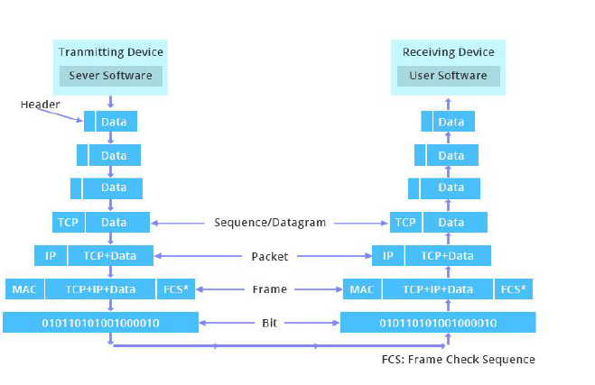

1. **帧（Frame）**：在数据链路层（如以太网）中使用，帧定义了如何在两个直接连接的节点之间传输数据。它包括了硬件地址（MAC地址）和错误检测等信息。

2. **包（Packet）**：在网络层（如IP协议）中使用，包是一种包含源地址和目的地址的数据单位，使得网络上不同的系统可以通过路由将数据从一个系统传输到另一个系统。

3. **数据报（Datagram）**：在传输层中使用的术语，UDP协议中的通信单位称为数据报。它是一种无连接的、不保证顺序和可靠性的传输方式。如果是TCP协议，则使用“段”来描述这一层的数据单位，它保证数据的顺序和可靠性。

统称所有这些单位为“包”可能会导致混淆，因为这忽略了它们在不同层次上的特定功能和角色。例如，一个网络层的包可以包含多个传输层的数据报或段，而一个数据链路层的帧可能会包含一个完整的网络层包或者包的一部分。正确地区分这些术语有助于精确地讨论和理解数据在网络中的传输机制。


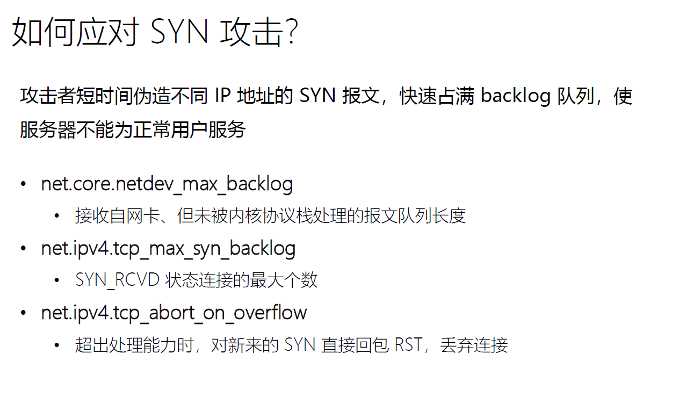

1. **net.core.netdev_max_backlog**:
   
   - **作用**: 控制在进入处理程序前，网络设备队列的最大数目。如果这个队列满了，系统将丢弃新的包，这对于防止DOS攻击很有用。
   - **调整方法**: 可以增加这个值，允许更多的包排队等待处理，这样在高流量下可以减少包的丢失。
   - **示例**:
     ```sh
     sysctl -w net.core.netdev_max_backlog=2000
     ```
     或者在`/etc/sysctl.conf`文件中设置:
     ```
     net.core.netdev_max_backlog = 2000
     ```
   
2. **net.ipv4.tcp_max_syn_backlog**:
   - **作用**: 在SYN_RCVD状态的套接字队列最大数目，即还未完成连接的SYN请求的最大数量。
   - **调整方法**: 增加这个值，可以允许更多的等待中的连接请求，这样在SYN泛洪攻击时，合法的连接请求更有可能被处理。
   - **示例**:
     ```sh
     sysctl -w net.ipv4.tcp_max_syn_backlog=2048
     ```
     或者在`/etc/sysctl.conf`文件中设置:
     ```
     net.ipv4.tcp_max_syn_backlog = 2048
     ```

3. **net.ipv4.tcp_abort_on_overflow**:
   - **作用**: 如果为真，当SYN队列溢出时，系统将不再尝试再次发送SYN+ACK，而是直接发送RST（重置）包。
   - **调整方法**: 启用这个选项，可以在SYN队列溢出时快速拒绝新的连接请求，从而保护系统资源。
   - **示例**:
     ```sh
     sysctl -w net.ipv4.tcp_abort_on_overflow=1
     ```
     或者在`/etc/sysctl.conf`文件中设置:
     ```
     net.ipv4.tcp_abort_on_overflow = 1
     ```

要使这些更改永久生效，需要将它们添加到`/etc/sysctl.conf`文件中，并执行`sysctl -p`来重新加载配置。请注意，更改这些参数可以帮助缓解SYN泛洪攻击，但可能需要根据具体的服务器性能和网络环境进行调整。过高的值可能会消耗过多资源，而过低的值可能无法有效缓解攻击。


`net.core.netdev_max_backlog`和`tcp_max_syn_backlog`是两个不同的内核参数，它们在网络堆积和连接请求管理中扮演不同的角色：

1. **net.core.netdev_max_backlog**：
   - **定义**：这个参数指定了在网络接口层面，即在数据包被内核网络堆栈处理之前，允许在网络设备驱动的队列中堆积的数据包的最大数量。
   - **影响**：当网络流量非常高时，如果数据包到达的速率超过内核处理的速率，这个队列就会开始填满。如果队列已满，新到达的数据包将被丢弃。
   - **调整场景**：当服务器面临大量流入的网络流量时，可能需要调整这个值，以避免因为队列溢出而丢弃数据包。

2. **net.ipv4.tcp_max_syn_backlog**：
   - **定义**：这个参数决定了系统中可以排队等待完成TCP三次握手过程（即处于SYN_RCVD状态）的SYN请求的最大数量。
   - **影响**：当有大量的并发传入TCP连接请求时，这个队列填满会导致新的传入连接请求被拒绝。这个参数对防御SYN泛洪攻击特别重要，因为它可以帮助控制在攻击期间保持的半开连接数量。
   - **调整场景**：面对大规模的SYN泛洪攻击时，可能需要调整这个值，以便系统可以处理更多的半开连接，同时避免合法的连接请求被错误地拒绝。

简而言之，`netdev_max_backlog`与网络设备层面的数据包处理有关，而`tcp_max_syn_backlog`专门针对TCP连接初始化过程。二者都是在高流量情况下避免丢包和服务拒绝的关键参数，但作用于网络协议栈的不同层次。根据不同的使用场景和性能需求对它们进行调整，可以帮助提高系统对高流量的处理能力和抵御一定级别的网络攻击。


#### 滑动窗口

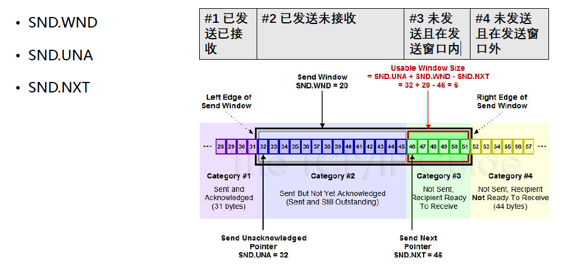

这张图展示了TCP协议中滑动窗口的工作原理，包括三个关键的变量：

1. **SND.WND (发送窗口大小)**：这是发送方的TCP窗口大小，决定了可以发送的数据量而不需要接收方确认。

2. **SND.UNA (未确认的最小序列号)**：这是发送方已经发送出去，但尚未收到确认的数据的最小序列号。

3. **SND.NXT (下一个要发送的序列号)**：这是发送方准备发送的下一个数据字节的序列号。

图中的四个类别表示了：

- **#1 类别**：已经发送并且已经被确认的数据（在SND.UNA左侧）。
- **#2 类别**：已经发送但还未被确认的数据（SND.UNA和SND.NXT之间）。
- **#3 类别**：还未发送，但接收方已经准备好接收的数据（SND.NXT之后，直到窗口右边界）。
- **#4 类别**：还未发送，且接收方还未准备好接收的数据（窗口右边界之后的数据）。

滑动窗口通过移动这些变量的值来控制数据的传输。例如，当SND.UNA的值增加时，表示之前发送的数据已被确认，窗口会向右“滑动”，允许发送更多的数据。这个过程持续进行，确保流量控制和数据传输的可靠性。

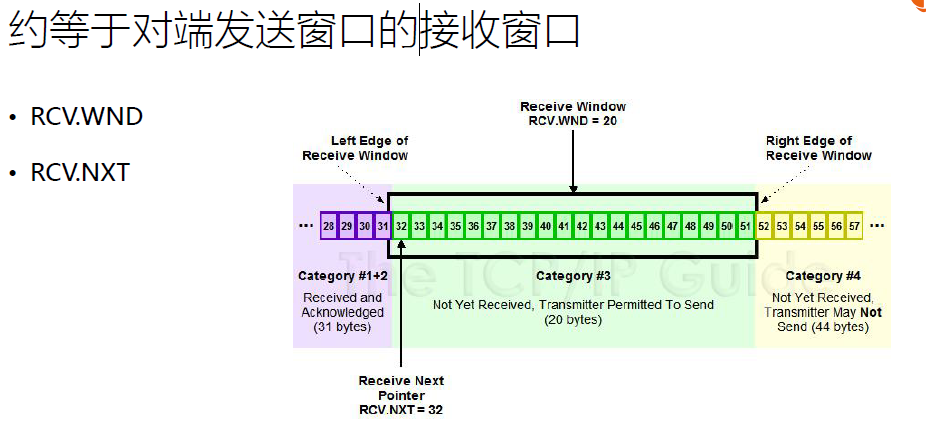

这张图描述了TCP协议中的接收窗口（RCV.WND）以及与之相关的概念。在TCP连接中，接收窗口用于控制从发送方接收数据的速率，以防止接收方的缓冲区溢出。

- **RCV.WND (接收窗口大小)**: 这是接收方能够接受但尚未确认的数据量。在这个例子中，窗口大小是20字节。
- **RCV.NXT (下一个期望的序列号)**: 这是接收方期望接收的下一个数据字节的序列号。在这个例子中，接收方期待接收的下一个数据字节的序列号是32。

图中显示的窗口分为四个部分：

- **已收到并已确认的数据（紫色区域）**：表示这些数据已经被接收并发送了ACK确认，序列号小于RCV.NXT。
- **未收到但允许发送方发送的数据（绿色区域）**：这部分数据是接收方准备好接收的，位于RCV.NXT和RCV.WND之间。
- **未收到且不允许发送方发送的数据（黄色区域）**：位于接收窗口右边界之外的数据，发送方不应发送这些数据，因为它们超出了接收方当前的接收窗口。

通过更新RCV.WND和RCV.NXT，接收方可以控制发送方的数据流，这是TCP流量控制的关键组成部分。通过这种方式，接收方可以根据自身的处理能力来调整接收窗口的大小。

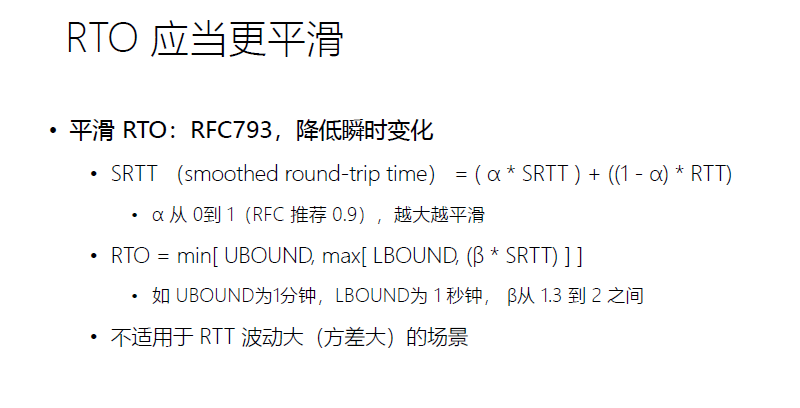

图中内容关于TCP协议中的重传超时计时器（RTO）的计算方法。RTO是根据往返时间（RTT）的估计值来设置的，用于确定在重传一个TCP段之前应该等待的时间。

- **SRTT（平滑往返时间）**：它是RTT的加权平均值，计算公式是 `SRTT = (α * SRTT) + ((1 - α) * RTT)`，其中α通常为0.9，这样新的RTT测量值只占10%，老的SRTT占90%。
- **RTO计算**：`RTO = min[UBOUND, max[LBOUND, (β * SRTT)]]`，其中UBOUND是RTO的上限，LBOUND是下限，β是一个延迟变量，RFC推荐值为1.3。
- **注意**：这个计算不应当使用一个单次的RTT测量值，而是要使用平滑后的SRTT值。

这个机制帮助TCP在网络条件变化时动态调整重传时间，以优化性能并避免过早或过晚的数据重传。


**tcp_adv_win_scale**

在Linux TCP协议栈中，`net.ipv4.tcp_adv_win_scale` 参数用于调整TCP的窗口缩放行为。窗口缩放是一种允许发送者和接收者协商一个缩放因子，该因子乘以最大窗口大小（通常是65535字节），以允许更大的窗口大小，从而在高延迟和高带宽的网络上实现更高的吞吐量。

`tcp_adv_win_scale` 参数影响的是TCP窗口大小的通告值。此参数的值通常介于-31到14之间。当设置为正数时，TCP窗口通告值将乘以2的`tcp_adv_win_scale`次方。当设置为负数时，窗口通告值将除以2的`tcp_adv_win_scale`绝对值次方。

例如：
- 如果 `tcp_adv_win_scale` 设置为1，那么应用缓冲区（接收缓冲区的一部分，用于存储从网络接收的数据，直到应用程序读取它）将是内核缓冲区大小的1/2。
- 如果设置为2，那么应用缓冲区将是内核缓冲区的1/4。
- 如果设置为-1（对于较旧的内核），应用缓冲区将是内核缓冲区的两倍。

调整这个参数可以帮助在保持TCP连接的可靠性的同时，根据网络条件和应用需求，优化TCP的吞吐量。在某些高速网络环境中，增加窗口的通告大小可以提高数据传输的速度，因为它允许更多的数据在等待确认之前被发送出去。然而，这需要谨慎进行，因为如果窗口太大，可能会导致网络拥塞或接收方处理能力不足。


**查看内核缓冲区**

在Linux系统中，可以通过查看`/proc/sys/net/core/`下的相关文件来查看TCP的默认缓冲区大小：

1. **查看默认的TCP接收缓冲区大小**:
   ```sh
   cat /proc/sys/net/core/rmem_default
   ```

2. **查看默认的TCP发送缓冲区大小**:
   ```sh
   cat /proc/sys/net/core/wmem_default
   ```

3. **查看TCP接收缓冲区的最大值**:
   ```sh
   cat /proc/sys/net/core/rmem_max
   ```

4. **查看TCP发送缓冲区的最大值**:
   ```sh
   cat /proc/sys/net/core/wmem_max
   ```

这些值是以字节为单位的，可以通过`sysctl`命令或直接写入这些文件来进行调整。需要注意的是，对于特定的TCP连接，应用程序可以使用`setsockopt`系统调用来设置不同于系统默认值的缓冲区大小。

**配置TCP缓冲区**

这些参数是Linux系统中用于配置TCP缓冲区大小的设置。

1. `net.ipv4.tcp_rmem`：这个设置控制TCP接收缓冲区的最小值、默认值和最大值（按字节计）。默认情况下，TCP栈会自动调整每个socket的接收缓冲区大小，但这个范围限定了自动调整的上下界。

2. `net.ipv4.tcp_wmem`：与`tcp_rmem`类似，这个参数控制TCP发送缓冲区的大小。同样有三个数值，分别表示最小值、默认值和最大值。

3. `net.ipv4.tcp_mem`：这个参数控制TCP栈应该如何反应内存压力。它有三个数值，分别是当TCP栈使用的页数低于第一个值时，TCP不会考虑释放内存；当TCP栈使用的页数超过第二个值时，将进入内存压力模式，开始释放内存；当使用的页数超过第三个值时，TCP栈将拒绝一些新的连接来保护系统不被耗尽内存。

4. `net.ipv4.tcp_moderate_rcvbuf`：当这个设置为1时，系统将自动调整socket接收缓冲区的大小，以提高网络性能。这是一个启用或禁用TCP接收缓冲区自动调整的开关。

这些参数允许系统管理员根据网络条件、服务器硬件和应用程序需求来优化性能。


**内核缓冲区通常指的是操作系统层面为网络通信提供的缓冲区 内核会为每个应用程序提供一个内核缓冲区吗？**

内核为每个网络连接，而不是每个应用程序，提供独立的发送和接收缓冲区。这意味着每个使用网络通信的应用程序会通过其套接字（socket）拥有与之关联的内核缓冲区。这样，即使是同一个应用程序的不同网络连接也会有各自独立的缓冲区。这些缓冲区确保了数据可以在应用程序准备好读取之前被暂存，以及在网络准备好发送之前存储待发送的数据。


**/proc/sys/net/core/ 这个目录和/proc/sys/net/ipv4 区别**

`/proc/sys/net/core/` 目录包含了影响整个系统网络核心层面的参数。这些参数通常与网络接口和各种网络协议族的核心功能有关，不仅仅限于IPv4，也适用于IPv6、IPX等。

`/proc/sys/net/ipv4/` 目录则包含了特定于IPv4协议的参数。这些参数用于控制与IPv4相关的行为，比如地址选择、路由、数据包过滤和某些特定于IPv4的特性，如ICMP行为、TCP行为调整等。

总的来说，`/proc/sys/net/core/` 更广泛地涉及到了系统的网络栈，而 `/proc/sys/net/ipv4/` 专注于IPv4协议相关的配置。

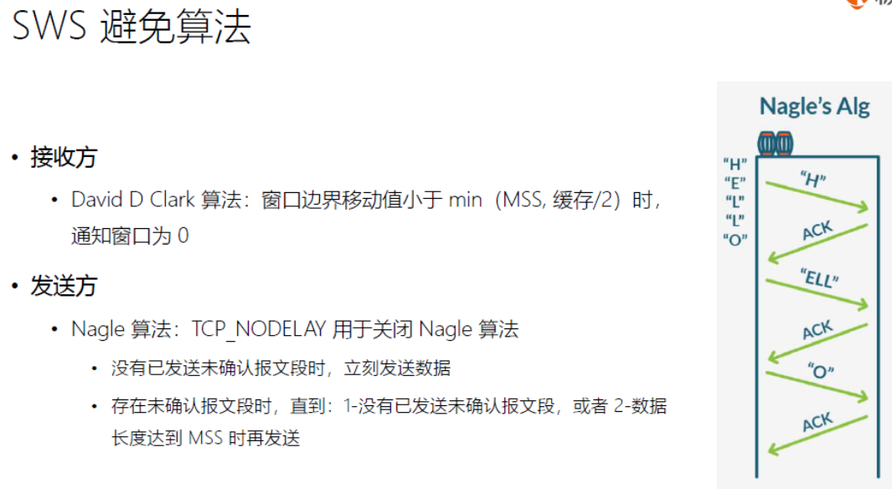

SWS（Silly Window Syndrome，愚蠢窗口综合症）指的是在TCP连接中由于接收方的接收窗口过小导致发送方频繁发送小数据包的问题，这种情况会降低网络的传输效率。Clark算法是用来避免SWS的，它规定发送方不应该发送小于最大段大小（MSS）或半个缓冲区大小的数据。

为了解决SWS和其他问题，TCP协议实现了Nagle算法。这个算法通过缓存小的数据包并在收到前一个数据包的ACK之后再发送，来减少网络上的小数据包数量。如果需要发送实时数据或者交互性较强的应用（如Telnet或SSH），可以设置TCP_NODELAY选项来禁用Nagle算法，允许数据立即发送而不是等待ACK或者缓冲区填满。这有助于减少延迟，但可能会增加网络上的小数据包数量。


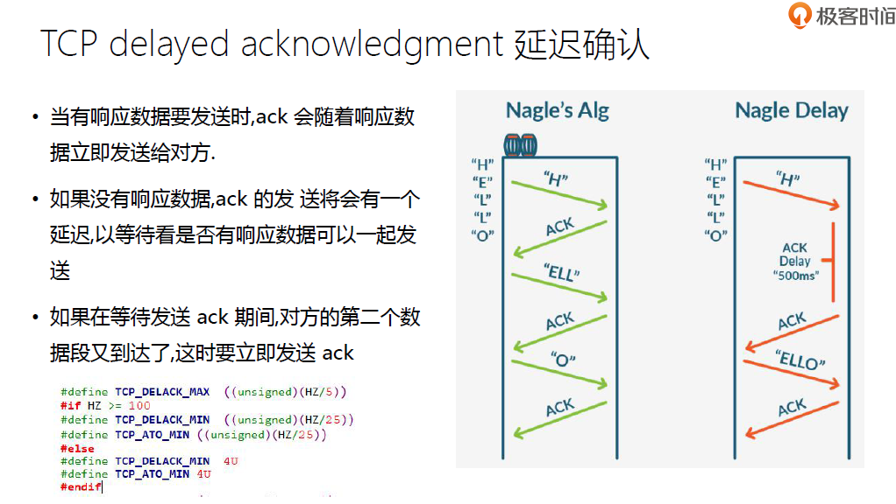


TCP延迟确认（TCP delayed acknowledgment）是一种TCP协议中的技术，用于提高网络效率。其工作原理如下：

- 当TCP接收到一个数据包时，它并不立即发送ACK（确认）。相反，TCP可能会等待短暂的时间，期望在此期间收到更多的数据包，这样可以一次性确认多个数据包，从而减少需要发送的ACK数量。
- 如果在延迟时间窗口内没有接收到更多的数据包，TCP会发送一个ACK来确认之前接收到的数据。
- Linux内核定义了两个宏`TCP_DELACK_MIN`和`TCP_DELACK_MAX`来配置延迟确认的时间范围。比如，最小延迟确认时间可能被设置为40毫秒，而最大延迟确认时间可能是200毫秒。

图中展示了Nagle算法的工作原理，这个算法旨在减少网络上的小数据包数量。它会延迟发送小数据包，直到之前的数据都已被确认或者累积足够大的数据包为止。然而，当启用了Nagle算法时，如果不进行适当的调整，可能会引起延迟，这就是图中所示的Nagle延迟。


Nagle算法和延迟确认（Delayed ACK）是TCP/IP网络通信中的两种不同的优化技术，它们各自有不同的目的和行为：

1. **Nagle算法（TCP_NODELAY）**：
   - 用于减少网络上小尺寸的TCP数据包数量。
   - 当应用程序执行多个小数据块的写操作时，Nagle算法会尝试聚合这些小数据块，直到累积的数据达到最大段大小（MSS），或者收到前一个小数据块的ACK。
   - 可以通过设置TCP_NODELAY套接字选项来禁用Nagle算法，允许小数据包立即发送。

2. **延迟确认（TCP_QUICKACK）**：
   - 是接收方用来减少发送ACK的频率的策略，它会等待一段时间（通常是200毫秒），或者直到接收到更多的数据包，然后一次性确认多个数据包。
   - 这可以减少因为ACK而产生的网络流量，但可能会增加数据传输的延迟。
   - 可以通过设置TCP_QUICKACK来控制这个行为，让ACK被立即发送，而不是延迟。

在某些场景下，这两种算法可能会相互影响，例如，在交互式应用程序（如SSH或游戏）中，Nagle算法可能会导致不必要的延迟，而延迟确认可能会进一步增加这种延迟。因此，在这些情况下，可能需要禁用这两种算法中的一个或两个，以减少延迟并提高响应速度。


#### 拥塞控制


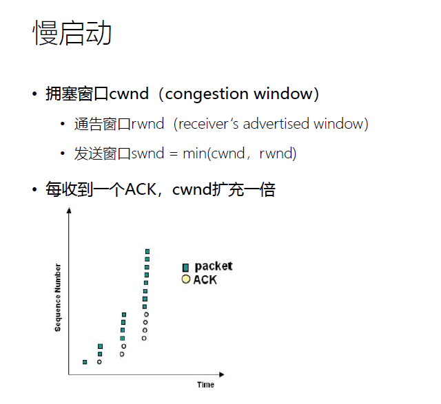

拥塞窗口（cwnd）和接收窗口（rwnd）是TCP协议中控制数据流量的两个关键参数。

1. **拥塞窗口（cwnd）**：发送方基于网络的拥塞状态动态维护的状态变量。例如，如果网络没有拥塞，cwnd会逐渐增加，允许发送更多数据；如果检测到拥塞，如出现丢包，cwnd将减小，以减少网络中的数据量。

2. **接收方窗口（rwnd）**：接收方根据其接收缓冲区的大小通告给发送方的窗口大小，表明它能接收的最大数据量。

发送窗口（swnd）是在任何时候决定发送方可以发送数据量的窗口大小，它取cwnd和rwnd的较小值。

**举例说明**：
假设cwnd为10KB，而rwnd为15KB，这表示发送方认为基于当前网络条件，它每次可以发送最多10KB的数据以避免拥塞；同时接收方表示它最多只能接收15KB的数据。在这种情况下，swnd将是10KB，这是发送方实际上会使用的窗口大小。如果接收方的缓冲区变小了，比如变为8KB，那么swnd将会更新为8KB，即使cwnd仍然是10KB。


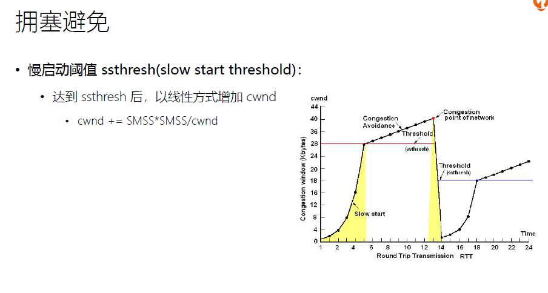

拥塞避免（Congestion Avoidance）是TCP协议中控制数据传输速率以防止网络拥塞的机制。在TCP的初始阶段，拥塞窗口（cwnd）会通过慢启动（Slow Start）算法呈指数增长，直到达到一个阈值（ssthresh，Slow Start Threshold）。

当cwnd达到或超过ssthresh时，TCP便进入拥塞避免阶段。在这个阶段，cwnd的增长转变为线性增长，即每经过一个往返时间（RTT），cwnd只增加一个最大段大小（MSS）。这样的增长速率比慢启动阶段要慢得多，目的是为了避免因为过快增加发送率而导致网络拥塞。

如果发生了丢包，表明网络出现了拥塞，TCP将会减少ssthresh的值，并将cwnd重置为一个较低的值，通常是新的ssthresh值，然后重新开始慢启动过程。这个过程可以在上述图表的拥塞窗口曲线中看到，拥塞避免阶段通常表示为曲线中的直线部分。


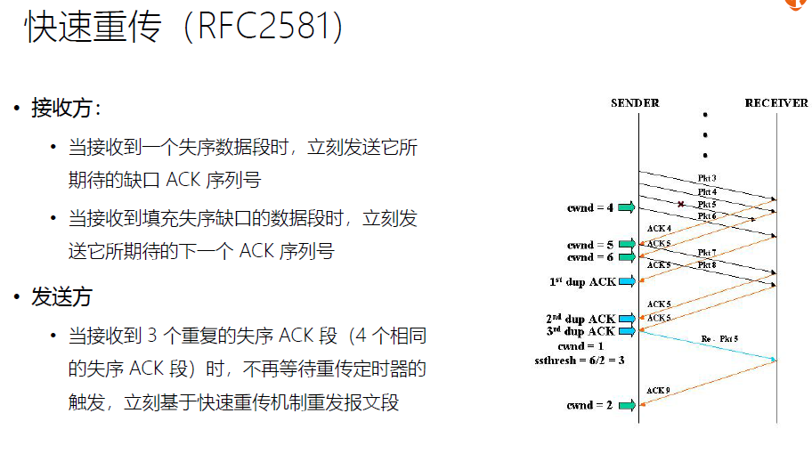

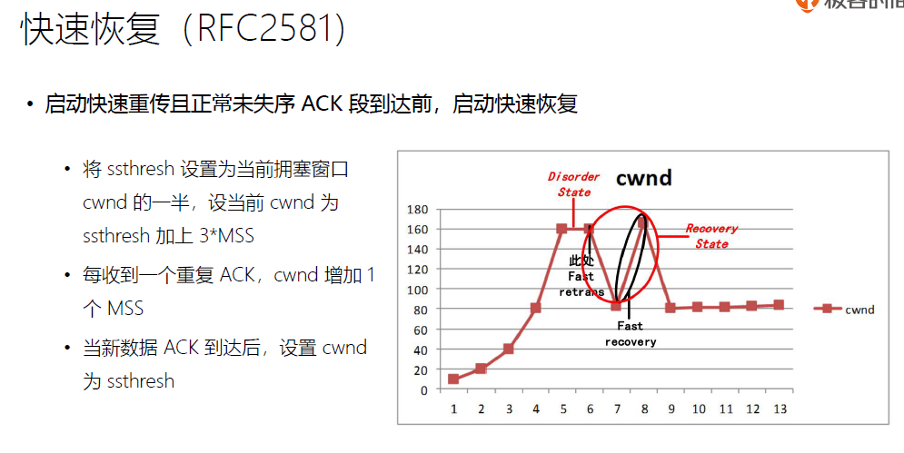

这张图和文本描述了TCP的快速恢复算法（RFC 2581），这是一种拥塞控制机制。当检测到数据包丢失时（通常是因为收到了三个重复的ACK），TCP执行以下操作：

1. **ssthresh更新**：将慢启动阈值（ssthresh）设置为当前拥塞窗口（cwnd）的一半，不过至少要有3个MSS的大小。
2. **cwnd调整**：在快重传（fast retransmit）之后，cwnd被设置为新的ssthresh加上3个MSS的大小，这反映了已经收到的三个重复ACK。
3. **每收到一个重复ACK**：cwnd增加1个MSS，这样做是为了“充气”拥塞窗口，为即将到来的新确认做好准备。
4. **新的数据包被确认时**：将cwnd设置回ssthresh的大小，这标志着TCP进入了拥塞避免阶段。

图中的曲线展示了在丢包发生后，拥塞窗口cwnd如何调整。在快速重传和快速恢复期间，cwnd会有一个短暂的“充气”过程，在此期间如果有新的确认到达，它会退回到一个较小的值，这个值等于ssthresh，然后线性增长，这代表了网络从拥塞中恢复过来。


#### 关闭链接

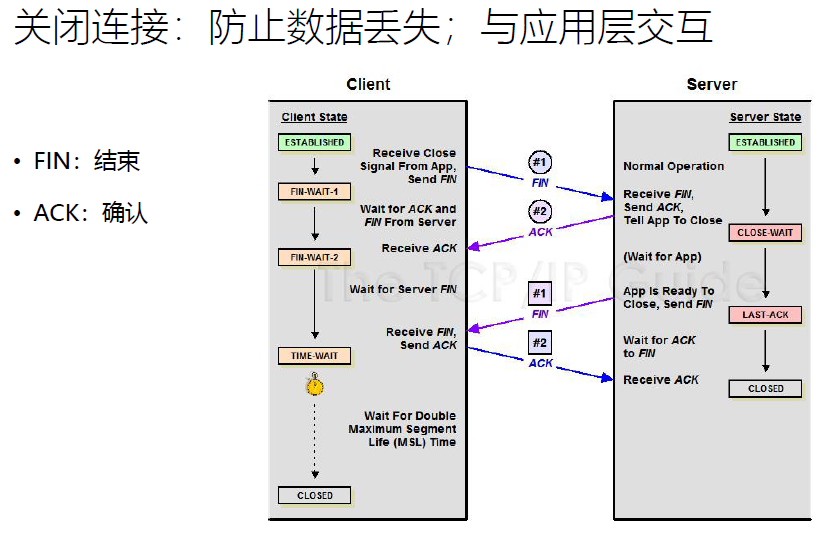

在TCP协议中，`TIME_WAIT` 是一个连接在完全关闭之前必须经过的状态。`TIME_WAIT` 状态的持续时间通常是最大报文生存时间（MSL, Maximum Segment Lifetime）的两倍，即 `2MSL`。

MSL 是任何给定的数据包在网络中最长的生存时间。在这个时间内，数据包应该到达目的地，或者在网络中丢失。`2MSL` 的等待时间是一个保守措施，用以确保：

1. 使连接中的最后一个ACK可以重发，如果接收方没有收到。
2. 确保所有的重复数据包在网络中消失，这样新的连接不会接收到这些遗留的数据包。

这个等待期确保了TCP连接可靠地终止，防止了潜在的数据混淆。


**time_wait优化**

• net.ipv4.tcp_tw_reuse = 1
• 开启后，作为客户端时新连接可
以使用仍然处于 TIME-WAIT 状
态的端口
• 由于 timestamp 的存在，操作系
统可以拒绝迟到的报文
• net.ipv4.tcp_timestamps = 1

• net.ipv4.tcp_tw_recycle = 0
• 开启后，同时作为客户端和服务器都可以使用 TIME-WAIT 状态的端口
• 不安全，无法避免报文延迟、重复等给新连接造成混乱
• net.ipv4.tcp_max_tw_buckets = 262144
• time_wait 状态连接的最大数量
• 超出后直接关闭连接


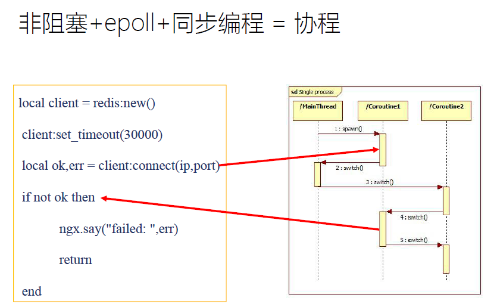


协程是一种轻量级的线程，它允许非阻塞操作和高效的I/O处理。结合`epoll`和协程，可以在单个线程内执行多个并发操作。

在这种模型中：
- **非阻塞操作**：确保当I/O操作（如网络请求）不立即可用时，不会阻塞整个程序的执行。
- **epoll**：是一种I/O事件通知机制，它可以通知应用程序哪些非阻塞socket准备好读取或写入。
- **同步编程**：尽管I/O操作是非阻塞的，代码的写法仍然是顺序的，看起来就像是同步执行的。

结合这三者，你可以在一个单线程的程序中使用协程同时管理多个I/O操作，每当一个操作被阻塞时，程序就可以切换到另一个协程继续执行，大大提高了资源的利用率和程序的响应性。在Lua语言中，这可以通过调用如`ngx`库中的函数实现，这样可以在Nginx服务器上高效地处理网络请求。


#### 几个常用命令

```bash
#用来查看所有的bridge 和与bridge相连接的veth
[root@tgq205 ~]# brctl show
bridge name     bridge id               STP enabled     interfaces
cni0            8000.9652de6b60b3       no              veth0fccc29b
                                                        veth1eb2e7ad
                                                        veth2399fb7c
                                                        veth2f4bf872
                                                        veth5f05b485
                                                        veth6ef22d85
                                                        vethb57e0ef7
                                                        vethbf16690b
                                                        vethf8f10afb
docker0         8000.0242f5ca3ed3       no
```


