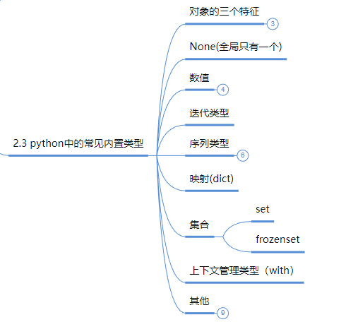
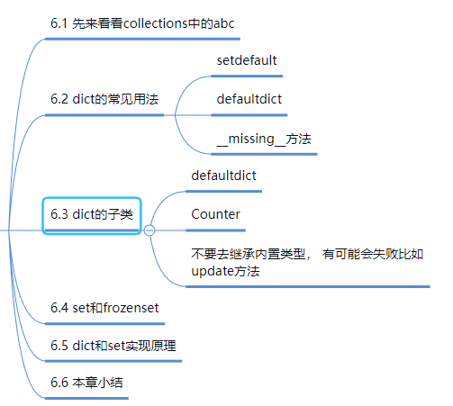

### 第二章- 一切皆对象

#### 2.2 type class object 关系


在Python中，`type`, `object`, 和 `class` 之间的关系是紧密且复杂的。以下是关于这三者之间关系的说明和代码示例：

1. **object**: 是所有Python类的基类。换句话说，所有Python类，无论是否显式声明，都是继承自 `object` 的。

2. **type**: 是一个内建的元类，用于创建其他类。简单来说，就像类是对象的蓝图，元类是类的蓝图。默认情况下，`type` 是所有类的元类。

3. **class**: 用户可以定义的自定义类型。类的实例是对象。但在Python中，类本身也是对象，它们是`type`的实例。

##### 代码示例：

```python
# 定义一个简单的类
class MyClass:
    pass

# MyClass 是 object 的子类
print(issubclass(MyClass, object))  # True

# MyClass 的类型是 type
print(isinstance(MyClass, type))  # True

# MyClass 的实例的类型是 MyClass
my_instance = MyClass()
print(isinstance(my_instance, MyClass))  # True

# 但 MyClass 的实例是 object 的实例
print(isinstance(my_instance, object))  # True
```

可以使用 `type` 函数动态地创建类，而不需要使用`class`关键字：

```python
# 使用type动态创建一个类
NewClass = type('NewClass', (object,), {'x': 5})

new_instance = NewClass()
print(new_instance.x)  # 输出 5
```

在上面的代码中，我们使用 `type` 动态地创建了一个新类 `NewClass`，它有一个属性 `x`。

总结：在Python中，所有的类都是`type`的实例，并且都继承自`object`。这种设计使得Python的对象模型特别灵活和统一。

#### 2.3 python中常见的内置类型



当然可以。根据你提供的图，以下是对Python中列出的每种类型的简要解释：

1. **对象的三个特征**

   - 身份(id)

     - 每个对象在Python中都有一个唯一的身份标识，通常我们可以认为它是对象在内存中的地址。

     - 可以使用内置函数 `id()` 获取对象的身份。

     - 身份在对象的生命周期中是恒定的。也就是说，一旦对象被创建，它的身份就不会改变，直到它被销毁。

       `x = [1, 2, 3]
       print(id(x))  # 输出该列表对象的身份`

   - 类型(type)

     - 对象的类型决定了该对象可以存储什么样的值，可以进行哪些操作，以及遵循哪些规则。 
     - 可以使用内置函数 `type()` 获取对象的类型。
     - 在Python中，类型本身也是对象。例如，`int`, `float`, `list`, `dict` 等都是类型对象。
     - 与身份一样，对象的类型在其生命周期中也是不变的。也就是说，你不能更改对象的类型，除非你重新创建该对象。

     `x = [1, 2, 3]
     print(type(x))  # 输出 <class 'list'>`

   - 值(value)

     - 对象的值是数据项表示的数据。例如，整数对象 `3` 的值就是数字 `3`，字符串对象 `"hello"` 的值就是文本 `hello`。
     - 对象的值可以是可变的或不可变的，这取决于对象的类型。例如，列表是可变的，这意味着你可以修改其内容；而字符串是不可变的，这意味着你不能修改字符串的内容。

     ```python
     x = [1, 2, 3]
     x[0] = 4  # 修改列表的值
     print(x)  # 输出 [4, 2, 3]
     y = "hello"
     y[0] = "H"  # 这会导致错误，因为字符串是不可变的`
     ```

2. **None（全局只有一个）**：

   - `None` 是Python中的一个特殊类型，代表“无”或“不存在”。
   - 它经常用于表示变量尚未被赋值，或函数没有返回值。
   - 在Python中，`None` 是唯一的一个`NoneType` 对象。

3. **数值**：
   - Python支持多种数值类型，如整数 (`int`), 浮点数 (`float`), 复数 (`complex`)  , bool。
   - 例如：`5` (整数), `3.14` (浮点数), `3 + 4j` (复数), True or False(bool)。

4. **迭代类型**

   1. list tuple string  dic set file-object generator 等等

   ```python
   def generator_func():
       yield 1
       yield 2
       yield 3
   for item in generator_func():
       print(item)
   ```

   任何定义了`__iter__()`方法或`__getitem__()`方法的对象都可以被认为是可迭代的。实际上，当你尝试在对象上进行迭代时，Python会首先查找`__iter__()`，如果没有找到，它会尝试`__getitem__()`，从索引0开始并递增，直到引发`IndexError` 。

5. **序列类型**

   1. Python中的序列类型是一组按特定顺序排列的元素集合。以下是您提供的序列类型，并配有简短的解释及代码演示：

      1. **list (列表)**:
         - 一个有序的元素集合，元素可以是任何数据类型，并且可以修改。
         
         ```python
         my_list = [1, 2, 3, 'a', 'b']
         print(my_list[3])  # 输出 'a'
         ```

      2. **bytes, bytearray, memoryview**:
         
         - `bytes`: 不可变的字节序列。
         - `bytearray`: 可变的字节序列。
         - `memoryview`: 内存查看对象，它暴露了底层数据的字节级视图。
         
         ```python
         b = bytes([65, 66, 67])
         print(b)  # 输出 b'ABC'
         
         ba = bytearray([65, 66, 67])
         print(ba)  # 输出 bytearray(b'ABC')
         
         mv = memoryview(ba)
         print(mv[1])  # 输出 66
         ```
         
      3. **range**:
         - 返回一个数字序列。
         
         ```python
         for i in range(3):
             print(i)  # 输出 0, 1, 2
         ```

      4. **tuple (元组)**:
         - 与列表类似，但元组是**不可变**的。
         
         ```python
         my_tuple = (1, 2, 3, 'a', 'b')
         print(my_tuple[3])  # 输出 'a'
         ```

      5. **str (字符串)**:
         
         - 一个字符序列。
         
         ```python
         my_str = "Hello, world!"
         print(my_str[7])  # 输出 'w'
         ```
         
      6. **array**:
         
         - 与列表类似，但`array`模块提供了一个更为紧凑的存储方式，它要求所有元素都是相同的数据类型。
         
         ```python
         from array import array
         #i表示数组中的元素是哪种数据类型
         my_array = array('i', [1, 2, 3, 4])
         print(my_array[2])  # 输出 3
         ```

      这些序列类型都支持索引、切片等常见操作，并有自己独特的特性和用途。

6. **字典 (dict)**：

   - 一个无序的键-值对集合。
   - 键必须是唯一的，例如：`{'a': 1, 'b': 2, 'c': 3}`。
   - 字典也是可变的。

7. **集合 (set)**：

   `set` 是 Python 中的一种数据结构，用于存储不重复元素的无序集合

   1. 使用花括号 `{}`:
   ```python
   my_set = {1, 2, 3, 4, 5}
   ```

   2. 使用 `set()` 函数:
   ```python
   my_list = [1, 2, 3, 4, 5, 5]
   my_set = set(my_list)  # 结果为 {1, 2, 3, 4, 5}
   ```
      - 创建一个空集合：
   ```python
   empty_set = set()
   ```

   注意: 不能直接使用空的 `{}` 来创建空集合，因为这实际上会创建一个空字典。

   基本用法：

   1. 添加元素:

      使用 `add` 方法添加单个元素:
   ```python
   my_set.add(6)
   ```
   ​	使用 `update` 方法添加多个元素 (可从其他序列添加):

   ```python
   my_set.update([6, 7, 8])
   ```

   2. 删除元素:
      
      使用 `remove` 方法删除指定元素 (如果元素不存在，会引发错误):
   ```python
   my_set.remove(5)
   ```
      - 使用 `discard` 方法删除指定元素 (如果元素不存在，不会引发错误):
   ```python
   my_set.discard(5)
   ```
      - 使用 `pop` 方法随机删除并返回一个元素:
   ```python
   elem = my_set.pop()
   ```
      - 使用 `clear` 方法清空集合:
   ```python
   my_set.clear()
   ```

   3. 集合运算:
      - 交集 (使用 `&` 运算符或 `intersection` 方法):
   ```python
   a = {1, 2, 3, 4}
   b = {3, 4, 5, 6}
   result = a & b  # 或者 result = a.intersection(b)
   ```
      - 并集 (使用 `|` 运算符或 `union` 方法):
   ```python
   result = a | b  # 或者 result = a.union(b)
   ```
      - 差集 (使用 `-` 运算符或 `difference` 方法):
   ```python
   result = a - b  # 或者 result = a.difference(b)
   ```
      - 对称差集 (使用 `^` 运算符或 `symmetric_difference` 方法):
   ```python
   result = a ^ b  # 或者 result = a.symmetric_difference(b)
   ```

   4. 其他方法和操作:
      
      检查一个元素是否在集合中:
   ```python
   if 3 in my_set:
       print("3 is in the set")
   ```
   ​	获取集合的长度:

   ```python
   length = len(my_set)
   ```
   ​	比较两个集合:

   ```python
   a = {1, 2, 3}
   b = {1, 2, 3, 4}
   is_subset = a.issubset(b)  # 检查 a 是否是 b 的子集
   ```

8. **frozenset**：

   - 与 `set` 相似，但是`frozenset`是不可变的。
   - 由于其不可变性，它可以作为字典的键，而普通的 `set` 不能。

9. **上下文管理器 (with)**：

   - 不是数据类型，而是一种控制资源，如文件或网络连接的分配和释放的方法。
   - 常用于文件操作，例如：`with open("file.txt", "r") as f: ...`

10. **生成器**：

   - 一种特殊的迭代器，允许你使用函数而不是循环来产生迭代的数据。
   - 使用 `yield` 关键字生成值，例如：
     ```python
     def generator_func():
         yield 1
         yield 2
         yield 3
     ```

11. **其他类型**

    1. **模块类型**:

       - 当你导入一个模块，Python创建了一个模块对象。
       - 你可以使用 `type(module_name)` 来查看。

    2. **类类型**:

       - 在Python中，你可以使用 `class` 关键字定义一个新的类型。
       - 示例: 
         ```python
         class MyClass:
             pass
         ```

    3. **实例类型**:

       - 当你从一个类创建一个对象时，这个对象是类的一个实例。
       - 示例:
         ```python
         obj = MyClass()
         ```

    4. **方法类型**:
       - 这是关联到对象的函数，可以访问和修改对象的数据。
       - 示例:
         ```python
         class MyClass:
             def my_method(self):
                 pass
         ```

    5. **代码类型**:
       - 这是Python中的代码对象，通常你不直接与它们交互。

    6. **object对象**:
       - 所有Python类都直接或间接地从 `object` 类派生。
       - 它是最基本的、最通用的类型。

    7. **type对象**:

       - `type` 是Python的元类，它本身是一个类，用于创建和管理其他类。

    8. **ellipsis对象**:

       - 通常表示为 `...`，在多种上下文中使用，例如在NumPy数组切片中表示连续的行或列。

    9. **notimplemented对象**:

       - 这是一个特殊的值，由二进制（特殊）方法返回，以表示它们不支持特定操作。


### 第三章-魔法函数


Python 中的 "魔法方法"（Magic Methods），也被称为 "特殊方法"（Special Methods）或 "双下方法"（Dunder Methods，dunder 是 "double underscore" 的缩写），是指在 Python 类中定义的一些带有双下划线前后缀的方法，如 `__init__`、`__call__`、`__str__` 等。

魔法方法允许对象自定义某些内置操作，使得对象可以更加符合 Python 的数据模型，并且能够更自然地融入 Python 的语法和内置函数。

在 Python 中，魔法方法允许我们自定义对象的行为以模拟内置类型的行为，例如数字、字符串或列表。通过实现这些魔法方法，我们可以让自定义对象支持如加法、减法、乘法等操作，或者可以像字典或列表一样进行索引。

这里有一些具体的例子来解释这个概念：

##### 模拟数字类型

通过定义魔法方法如 `__add__`，我们可以让自定义对象支持加法操作

```python
class MyNumber:
    def __init__(self, value):
        self.value = value
    
    def __add__(self, other):
        return MyNumber(self.value + other.value)
```

使用这个类，我们可以进行如下操作：

```python
a = MyNumber(1)
b = MyNumber(2)
c = a + b  # 这里会调用 a.__add__(b)，得到一个新的 MyNumber 对象
```

##### 模拟容器类型

通过定义魔法方法如 `__getitem__` 和 `__setitem__`，我们可以让自定义对象像列表或字典一样进行索引。

```python
class MyList:
    def __init__(self):
        self.data = []
    
    def __getitem__(self, index):
        return self.data[index]
    
    def __setitem__(self, index, value):
        while len(self.data) <= index:
            self.data.append(None)
        self.data[index] = value
```

使用这个类，我们可以进行如下操作：

```python
my_list = MyList()
my_list[0] = 1  # 这里会调用 my_list.__setitem__(0, 1)
print(my_list[0])  # 这里会调用 my_list.__getitem__(0)
```

##### 与 Python 语法和内置函数的融合

魔法方法还可以让我们的自定义对象更自然地融入 Python 语法和内置函数。例如，通过定义 `__str__` 或 `__repr__` 方法，我们可以改变打印对象时的输出，或者使用 `str()` 和 `repr()` 函数获取对象的字符串表示。

```python
class MyObject:
    def __str__(self):
        return "This is MyObject"
```

使用这个类，我们可以进行如下操作：

```python
obj = MyObject()
print(obj)  # 输出：This is MyObject
```

通过实现魔法方法，我们的自定义对象能够更符合 Python 的数据模型，使得对象的使用更加直观和 Pythonic，也就是符合 Python 的编程习惯。

##### 以下是一些魔法方法的作用示例：

###### 1. `__init__`
用于在创建对象后对其进行初始化。这个方法会在类的对象被实例化时自动调用。你可以在 `__init__` 方法中设置对象属性的初始值或执行任何其他必要的设置

1. 默认参数：如果 `__init__` 方法中的参数有默认值，那么在实例化对象时可以省略这些参数。如果省略，将使用默认值。

   ```python
   class Example:
       def __init__(self, a, b=2):
           self.a = a
           self.b = b
   obj = Example(1)  # 这里只提供了一个参数，b 使用默认值 2
   ```
   
2. 可变数量的参数：`__init__` 方法可以接受可变数量的参数，如 `*args` 和 `**kwargs`，这允许在实例化时提供不同数量的参数。

   ```python
   class Example:
       def __init__(self, a, *args, **kwargs):
           self.a = a
           self.args = args
           self.kwargs = kwargs
   
   obj = Example(1, 2, 3, x=4, y=5)  # 这里提供了多个参数
   ```

3. 没有参数：如果 `__init__` 方法没有定义任何参数（除了 `self` 外），那么在实例化时不需要提供任何参数。

   ```python
   class Example:
       def __init__(self):
           self.a = 1
   obj = Example()  # 这里没有提供参数
   ```

总之，在实例化类的对象时，应根据 `__init__` 方法的定义提供适当的参数。如果没有提供必要的参数且没有默认值，Python 将引发类型错误（TypeError），指出缺少必要的位置参数。

**番外：**

`*args` 和 `**kwargs` 是 Python 中的两种特殊参数传递方法，它们允许你在函数或方法中传递可变数量的非关键字参数（`*args`）和关键字参数（`**kwargs`）

**`*args`**

- `*args` 允许你传递可变数量的非关键字参数到函数中。
- 在函数内部，`args` 是一个包含所有传递的参数的元组。

```python
def function_with_args(*args):
    for arg in args:
        print(arg)

# 调用函数，传递任意数量的参数
function_with_args(1, 2, 3, 4)  # 输出：1 2 3 4
```

`**kwargs`

- `**kwargs` 允许你传递可变数量的关键字参数到函数中。
- 在函数内部，`kwargs` 是一个包含所有关键字参数的**字典**。

```python
def function_with_kwargs(**kwargs):
    for key, value in kwargs.items():
        print(key, value)

# 调用函数，传递任意数量的关键字参数
function_with_kwargs(a=1, b=2, c=3)  # 输出：a 1 b 2 c 3
```

- 结合使用 `*args` 和 `**kwargs`

你还可以在同一个函数中同时使用`*args` 和 `**kwargs`，但 `*args` 必须出现在 `**kwargs` 之前。

```python
def function_with_args_and_kwargs(*args, **kwargs):
    print("Args:")
    for arg in args:
        print(arg)
    
    print("Kwargs:")
    for key, value in kwargs.items():
        print(key, value)

# 调用函数，传递非关键字参数和关键字参数
function_with_args_and_kwargs(1, 2, a=3, b=4)
# 输出：
# Args:
# 1
# 2
# Kwargs:
# a 3
# b 4
```

- 在函数调用中使用 `*` 和 `**`

你也可以在函数调用时使用 `*` 和 `**`，用来解包元组和字典，将它们作为参数传递给函数。

```python
def function(a, b, c):
    print(a, b, c)

# 使用 * 解包元组
args = (1, 2, 3)
function(*args)  # 输出：1 2 3

# 使用 ** 解包字典
kwargs = {'a': 1, 'b': 2, 'c': 3}
function(**kwargs)  # 输出：1 2 3
```

- 小结

  - `*args` 用于传递可变数量的非关键字参数。

  - `**kwargs` 用于传递可变数量的关键字参数。

  - 它们可以在函数定义和函数调用中使用，实现参数的动态传递和解包。

###### 2. `__str__` 和 `__repr__`

`__str__` 和 `__repr__` 是 Python 中的两个魔法方法，都是用于定义对象的字符串表示形式，但它们之间有一些区别，并且各自适用于不同的场合。

`__str__`

- `__str__` 方法应返回一个字符串，这个字符串是对用户友好的，简单明了的对象描述。
- 当你使用 `print()` 函数或 `str()` 函数对一个对象进行转换时，Python 会自动调用该对象的 `__str__` 方法。

```python
class MyClass:
    def __str__(self):
        return "This is a MyClass object"

obj = MyClass()
print(obj)  # 输出：This is a MyClass object
```

`__repr__`

- `__repr__` 方法应返回一个字符串，这个字符串尽可能包含对象的详细信息，甚至可以用来重新创建对象（当然，这不是强制的）。
- 当你在控制台中直接输入对象名，或使用 `repr()` 函数进行转换时，Python 会自动调用该对象的 `__repr__` 方法。

示例：

```python
class MyClass:
    def __repr__(self):
        return 'MyClass()'

obj = MyClass()
print(repr(obj))  # 输出：MyClass()
```

当两者同时存在时

如果一个对象同时定义了 `__str__` 和 `__repr__`，则 `print()` 和 `str()` 会优先使用 `__str__`，而在控制台中直接输入对象名或使用 `repr()` 会使用 `__repr__`。

```python
class MyClass:
    def __str__(self):
        return "This is a MyClass object"
    
    def __repr__(self):
        return 'MyClass()'

obj = MyClass()
print(obj)  # 输出：This is a MyClass object
print(repr(obj))  # 输出：MyClass()
```

当只定义了 `__repr__` 时

如果只定义了 `__repr__` 而没有定义 `__str__`，那么 `__repr__` 也会在调用 `print()` 和 `str()` 时被使用。

```python
class MyClass:
    def __repr__(self):
        return 'MyClass()'

obj = MyClass()
print(obj)  # 输出：MyClass()
```

总结

- `__str__` 更注重用户可读性，用于输出简单明了的对象信息。
- `__repr__` 更注重详细性和精确性，甚至可以用来重新创建对象。

###### 3. `__call__`
`__call__` 是一个特殊方法，用于使一个对象变得可调用。换句话说，它允许一个对象的实例被像函数一样调用。当你调用一个对象的实例就像调用一个函数一样时，Python 会自动执行该对象的 `__call__` 方法。

```python
class Greeter:
    def __init__(self, greeting="Hello"):
        self.greeting = greeting
    
    def __call__(self, name):
        return f"{self.greeting}, {name}!"

# 创建一个 Greeter 对象
greeter = Greeter()

# 调用 greeter 实例，传递 "World" 作为参数
print(greeter("World"))  # 输出：Hello, World!

# 你也可以改变问候语
greeter_custom = Greeter("Hi there")
print(greeter_custom("Python"))  # 输出：Hi there, Python!
```

- `Greeter` 类有一个 `__call__` 方法，它接受一个 `name` 参数。
- 当我们像调用函数一样调用 `Greeter` 类的实例 `greeter("World")` 时，`__call__` 方法被执行。
- `__call__` 方法返回一个字符串，该字符串包含一个问候语和传递给它的 `name`。

`__call__` 方法增加了对象的灵活性，使其可以以多种方式被使用和调用。通过 `__call__` 方法，你可以创建像函数一样表现的对象，同时还保留了更多 OOP（面向对象编程）的特性，如状态保持和方法。

###### 4. `__getitem__` 和 `__setitem__`

用于自定义获取和设置元素的行为，使对象可以像列表或字典一样进行索引。
```python
class Example:
    def __getitem__(self, key):
        return self.data[key]
    def __setitem__(self, key, value):
        self.data[key] = value
```

###### 5. `__eq__` 和其他比较方法
`__eq__` 是一个 Python 的魔法方法，用于自定义对象的等值比较逻辑。当你使用等号 `==` 来比较两个对象是否相等时，Python 会调用这个方法。

`__eq__` 方法应该接受两个参数：第一个是 `self`（代表实例自身），第二个是被比较的对象。方法应该返回一个布尔值，表示两个对象是否相等。

```python
class Point:
    def __init__(self, x, y):
        self.x = x
        self.y = y
        
    def __eq__(self, other):
        if isinstance(other, Point):
            return self.x == other.x and self.y == other.y
        return False

# 创建两个 Point 对象
p1 = Point(1, 2)
p2 = Point(1, 2)
p3 = Point(3, 4)

# 使用 == 操作符比较两个 Point 对象
print(p1 == p2)  # 输出：True
print(p1 == p3)  # 输出：False
```

- `Point` 类有一个 `__eq__` 方法，用于比较两个 `Point` 对象是否有相同的 `x` 和 `y` 值。
- 当我们使用 `==` 操作符比较两个 `Point` 对象时，`__eq__` 方法被调用，并返回一个布尔值。

通过自定义 `__eq__` 方法，你可以根据自己的需求定义对象的等值比较规则，以支持 `==` 操作符的自定义行为。这使得你的自定义对象能够更自然地融入 Python 的语法和数据模型中。

###### 6. `__add__` 和其他数学运算方法
`__add__` 是Python中的一个魔法方法，用于重载加法操作符（`+`）。通过定义该方法，你可以为自定义类的对象自定义加法操作。

当使用 `+` 运算符将两个对象相加时，Python会自动调用 `__add__` 方法，并传递参与加法操作的两个对象作为参数。

```python
class ComplexNumber:
    def __init__(self, real, imag):
        self.real = real
        self.imag = imag
        
    def __add__(self, other):
        if isinstance(other, ComplexNumber):
            return ComplexNumber(self.real + other.real, self.imag + other.imag)
        return NotImplemented
    
    def __str__(self):
        return f"({self.real} + {self.imag}i)"

# 创建两个 ComplexNumber 对象
num1 = ComplexNumber(1, 2)
num2 = ComplexNumber(3, 4)

# 使用 + 运算符将两个 ComplexNumber 对象相加
result = num1 + num2

# 输出结果
print(result)  # 输出：(4 + 6i)
```

在这个示例中：

- `ComplexNumber` 类有一个 `__add__` 方法，用于定义两个 `ComplexNumber` 对象的加法操作。方法返回一个新的 `ComplexNumber` 对象，其实部和虚部分别为两个被加对象的实部和虚部之和。
- 当我们使用 `+` 运算符将两个 `ComplexNumber` 对象相加时，`__add__` 方法被调用，并返回一个新的 `ComplexNumber` 对象作为结果。

###### 7. `__enter__` 和 `__exit__`
`__enter__` 和 `__exit__` 是 Python 的魔法方法，主要用于实现上下文管理器。上下文管理器是一种 Python 对象，它定义了在 with 语句中需要设置的运行时上下文，并且由于某些代码块的执行而进行清理。这通常用于管理如文件、网络连接和锁这样的资源。

`__enter__(self)`

当执行 with 语句时，会首先调用上下文管理器对象的 `__enter__` 方法。`__enter__` 方法的返回值会被赋值给在 as 关键字后面指定的变量。

示例：

```python
class ManagedFile:
    def __init__(self, filename):
        self.filename = filename

    def __enter__(self):
        self.file = open(self.filename, 'w')
        return self.file

```

`__exit__(self, exc_type, exc_val, exc_tb)`

当 with 语句中的代码块被执行完毕后，`__exit__` 方法会被调用，即使在代码块中发生了异常也是如此。`__exit__` 方法可以接受三个参数，它们分别是异常类型、异常值和追踪信息。

示例：

```python
class ManagedFile:
    # ... (其他代码)

    def __exit__(self, exc_type, exc_val, exc_tb):
        if self.file:
            self.file.close()
```

你可以在 with 语句中使用定义了 `__enter__` 和 `__exit__` 方法的类的实例。

```python
with ManagedFile('hello.txt') as file:
    file.write('Hello, world!')
    file.write('Bye, world!')
```

- `ManagedFile` 类的 `__enter__` 方法打开一个文件并返回它。
- `file.write(...)` 代码在文件中写入一些内容。
- `__exit__` 方法关闭文件，即使写入文件时发生了异常也会执行此操作。

通过实现 `__enter__` 和 `__exit__` 方法，你可以定义自己的上下文管理器，进而优雅地管理资源和处理异常。

###### Pythonic

"Pythonic" 是一个广泛用于描述代码的术语，表示代码不仅仅是用Python语言编写的，而且是遵循Python的哲学和最佳实践编写的。一个Pythonic的代码通常会更易于阅读、理解和维护。这种代码通常也会更加简洁和优雅，并且充分利用了Python的特性和功能。

Python有一些核心的设计哲学，如在PEP 20中描述的"Zen of Python"（Python之禅）。其中包括了一些指导原则，如：

- 美胜于丑陋（Beautiful is better than ugly）
- 显式优于隐式（Explicit is better than implicit）
- 简单胜于复杂（Simple is better than complex）
- 复杂胜于复杂化（Complex is better than complicated）
- 可读性计数（Readability counts）

编写Pythonic代码通常包括以下几个方面：

1. **遵循PEP 8编码风格**：PEP 8是Python编程的样式指南，包括命名约定、代码布局和缩进等。

2. **使用Python的数据结构和函数**：充分利用Python的内置类型和函数，如列表推导式、生成器、装饰器等。

3. **编写自文档化的代码**：代码应该易于理解，注释应该是用来解释代码的“为什么”而不是“什么”。

4. **利用Python的特殊方法**：如上面提到的魔法方法，使得自定义对象能够更自然地融入Python的语言特性和数据模型。

5. **优先考虑代码的可读性和可维护性**：代码应该是易于他人阅读和维护的。

总之，Pythonic意味着编写的代码不仅符合Python的语法规则，而且符合Python的文化和习惯，使得代码更加清晰、简洁和优雅。

### 第四章-类与对象


##### 1. 抽象基类(abc模块)

抽象基类（Abstract Base Classes，简称 ABCs）是Python中的一个概念，允许我们定义抽象方法和抽象类。一**个抽象类是不能被实例化的类，而一个抽象方法是在抽象类中必须由任何子类实现的方法**。`abc`模块为我们提供了工具来定义抽象基类和抽象方法。

**作用：**

1. 定义接口：ABCs允许我们定义一个类应该有哪些方法，而不需要实现它们。这为代码提供了明确的规范。
  
2. 强制实现：继承自抽象基类的子类必须实现所有的抽象方法，否则它们也将成为抽象类，并且不能被实例化。

**示例**:

1. 定义一个抽象基类表示所有的多边形，并要求子类实现计算面积的方法：

```python
from abc import ABC, abstractmethod

class Polygon(ABC):

    @abstractmethod
    def area(self):
        pass

class Rectangle(Polygon):
    def __init__(self, width, height):
        self.width = width
        self.height = height

    def area(self):
        return self.width * self.height

class Triangle(Polygon):
    def __init__(self, base, height):
        self.base = base
        self.height = height

    def area(self):
        return 0.5 * self.base * self.height

# 正常工作，因为子类实现了area()方法
rectangle = Rectangle(10, 5)
print(rectangle.area())

triangle = Triangle(10, 5)
print(triangle.area())

# 将导致错误，因为Polygon是抽象类，不能被实例化
# polygon = Polygon()
```

2. 定义一个抽象基类，表示所有的电子设备，并要求子类实现开启和关闭的方法：

```python
from abc import ABC, abstractmethod

class ElectronicDevice(ABC):

    @abstractmethod
    def turn_on(self):
        pass

    @abstractmethod
    def turn_off(self):
        pass

class Television(ElectronicDevice):

    def turn_on(self):
        print("Television is now on!")

    def turn_off(self):
        print("Television is now off!")

tv = Television()
tv.turn_on()
tv.turn_off()

# 将导致错误，因为ElectronicDevice是抽象类，不能被实例化
# device = ElectronicDevice()
```

以上示例中，如果你试图不实现`area()`或`turn_on()`和`turn_off()`方法，Python将会在运行时给出错误，因为这些方法是被标记为`@abstractmethod`的。这就确保了所有的子类都正确地实现了所需的方法。

##### 2. isinstance 用法

1. `isinstance`使用场景：

   `isinstance` 是一个内置函数，用于检查一个对象是否是指定类的实例，或是否是一个类的子类的实例。以下是一些常见的使用场景：

   - 类型检查：在函数或方法中，确保参数是正确的类型。
     ```python
     def add_numbers(a, b):
         if not isinstance(a, (int, float)) or not isinstance(b, (int, float)):
             raise ValueError("Inputs must be numbers")
         return a + b
     ```

   - 处理不同的数据类型：基于输入的数据类型执行不同的代码。
     
     ```python
     def process_data(data):
         if isinstance(data, list):
             # Handle list
         elif isinstance(data, dict):
             # Handle dictionary
     ```
     
   - 检查是否是子类的实例：与特定类或其子类的实例进行交互。
     
     ```python
     if isinstance(obj, BaseClass):
         # obj is an instance of BaseClass or a subclass of BaseClass
     ```

2. `is` 与 `==` 的区别：

   - `is`：检查两个引用是否指向内存中的同一个对象。也就是说，它比较的是对象的身份。
     
     ```python
     a = [1, 2, 3]
     b = a
     print(a is b)  # True，因为a和b指向同一个对象
     ```
     
   - `==`：检查两个对象的内容是否相等，基于它们的 `__eq__` 方法进行比较（如果定义了的话）。
     
     ```python
     a = [1, 2, 3]
     b = [1, 2, 3]
     print(a == b)  # True，因为a和b的内容相同
     print(a is b)  # False，因为a和b指向不同的对象
     ```
   
   因此，`is` 是检查两个变量是否引用同一对象，而 `==` 是检查两个对象的内容是否相等。在大多数情况下，我们更关心的是内容是否相等，所以更常使用 `==`。但在检查变量是否为 `None` 时，通常使用 `is`：
   ```python
   if variable is None:
       # Do something
   ```

##### 3. 类变量的作用

类变量（有时也被称为类属性或静态变量）是附加到类本身的变量，而不是类的具体实例。这意味着类变量在所有实例之间是共享的，而不是每个实例都有自己的拷贝。下面是类变量的一些特点和用途：

1. 共享值：因为类变量在所有实例之间共享，所以当一个实例修改类变量时，其他所有实例看到的值也会被修改。

2. 存储常量：类变量经常被用来定义一个类的常量设置。

3. 计数器功能：可以使用类变量来计算创建了多少个类的实例。

4. 默认值：类变量可以用作实例变量的默认值。

```python
class Car:
    # 1. 共享值：类变量，记录所有汽车的默认颜色
    default_color = "White"
    
    # 2. 存储常量：汽车的最大速度
    MAX_SPEED = 200
    
    # 3. 计数器功能：记录已经创建的汽车数量
    num_of_cars = 0
    
    def __init__(self, brand, speed):
        self.brand = brand
        # 4. 默认值：如果创建实例时没有指定颜色，将使用default_color作为默认值
        self.color = Car.default_color
        self.speed = speed if speed <= Car.MAX_SPEED else Car.MAX_SPEED
        Car.num_of_cars += 1

    # 方法：修改类变量default_color
    @classmethod
    def set_default_color(cls, new_color):
        cls.default_color = new_color


# 创建两辆车
car1 = Car("Toyota", 180)
car2 = Car("BMW", 210)

# 输出默认颜色和汽车数量
print(car1.color)  # 输出: White
print(Car.num_of_cars)  # 输出: 2

# 修改默认颜色
Car.set_default_color("Blue")

# 创建第三辆车
car3 = Car("Mercedes", 190)

# 查看第三辆车的颜色（已修改为新的默认颜色）
print(car3.color)  # 输出: Blue

# 查看三辆车的速度（注意：尽管BMW的速度被设置为210，但由于MAX_SPEED是200，所以速度被限制在200以内）
print(car1.speed)  # 输出: 180
print(car2.speed)  # 输出: 200
print(car3.speed)  # 输出: 190
```

##### 4. 实例方法，类方法，静态方法

实例方法、类方法和静态方法是 Python 中定义在类内部的三种方法，它们有不同的应用场景和调用方式。

1. 实例方法：
   
    - 定义：实例方法的第一个参数是`self`，它表示类的实例。
    - 调用：需要通过类的实例来调用。

    ```python
    class Person:
        def __init__(self, name):
            self.name = name
        
        # 实例方法
        def greet(self):
            print(f"Hello, my name is {self.name}.")
    
    p = Person("Alice")
    p.greet()  # 输出: Hello, my name is Alice.
    ```

2. 类方法：
    - 定义：类方法的第一个参数是`cls`，它表示类本身。使用`@classmethod`装饰器定义。
    - 调用：可以通过类或其实例来调用。
    
    ```python
    class Counter:
        count = 0
        
        @classmethod
        def increment(cls):
            cls.count += 1
        
        @classmethod
        def get_count(cls):
            return cls.count
    
    Counter.increment()
    print(Counter.get_count())  # 输出: 1
    ```
    
3. 静态方法：
   
    - 定义：静态方法没有特殊的第一个参数（如`self`或`cls`）。使用`@staticmethod`装饰器定义。
    - 调用：可以通过类或其实例来调用。
    - 场景：当方法不需要访问实例或类的属性，但仍与类相关并需要在类内部定义时。
    
    ```python
    class MathHelper:
        
        @staticmethod
        def add(x, y):
            return x + y
        
        @staticmethod
        def subtract(x, y):
            return x - y
    
    result = MathHelper.add(5, 3)
    print(result)  # 输出: 8
    ```

总结：
- 实例方法用于操作与特定实例相关的数据。
- 类方法用于操作与整个类相关的数据。
- 静态方法不与特定实例或类数据相关，但仍然是类的逻辑组成部分。

##### 5. 自省机制和动态特性

1.Python对象的动态性质

在许多编程语言中，对象的结构（属性和方法）在定义时是固定的，不能在运行时修改。但是Python的对象模型是动态的，这意味着您可以在运行时为对象添加、修改或删除属性和方法。

```python
class Person:
    def __init__(self, name):
        self.name = name

# 创建一个实例
p = Person("Alice")

# 动态添加一个新属性
p.age = 25

# 动态添加一个新方法
def say_hello(self):
    print(f"Hello, I'm {self.name} and I'm {self.age} years old.")
    
#`types.MethodType(say_hello, p)`：这将`say_hello`函数转换为`p`的实例方法。也就是说，我们现在可以像调用对象的任何其他方法一样来调用`say_hello`。
#`p.say_hello = ...`：这行代码将转换后的方法赋值给`p`的`say_hello`属性，从而为`p`对象添加了一个新的方法
import types
p.say_hello = types.MethodType(say_hello, p)
p.say_hello()  # 输出: Hello, I'm Alice and I'm 25 years old.

# 动态删除属性
del p.age
```

这行代码使用`del`语句删除了`p`对象的`age`属性。在这之后，试图访问`p.age`会引发一个`AttributeError`，因为该属性不再存在。 这段代码展示了Python的动态性，它允许我们在运行时为对象添加、修改或删除属性和方法。

2.自省机制

自省是指对象能够知道自己属性和方法的能力。Python中的自省机制允许您在运行时查询关于对象状态的信息。

Python提供了多种自省工具，如：
- `type()`: 返回对象的类型。
- `id()`: 返回对象的唯一标识符。
- `getattr()`, `setattr()`, `hasattr()`, `delattr()`: 获取、设置、检查和删除对象的属性。
- `isinstance()`: 检查对象是否是给定类型的实例。
- `dir()`: 返回对象的所有属性和方法的列表。

```python
class Sample:
    def __init__(self, value):
        self.value = value

    def show(self):
        print(self.value)

s = Sample(10)
print(dir(s))
```

这种能够在运行时查询和修改对象属性的能力使Python成为一种动态语言，为开发者提供了极大的灵活性。


##### 6. super用法

在Python 3中，`super()`函数常用于调用基类（父类）的方法。它的主要用途是在继承的情境下，尤其是多重继承的情境。以下是`super()`的常见应用场景：

1. 单继承 - 重写方法:
在单继承中，当子类需要重写父类的某个方法，但还希望在子类中保持父类该方法的某些功能时，通常会用到`super()`。

```python
class Par:
    def greet(self):
        print('hello i am your father')
    
class Clild(Par):
    def greet(self):
        super().greet()
        print('you are my son')
        
c = Clild()
c.greet()
```

2. 多继承 - MRO (Method Resolution Order):
在多重继承的场景中，`super()`用于确保所有基类的方法都得以调用，并遵循MRO。

```python
class Base:
    def greet(self):
        print("Hello from Base")

class A(Base):
    def greet(self):
        print("Hello from A")
        super().greet()

class B(Base):
    def greet(self):
        print("Hello from B")
        super().greet()

class Child(A, B):
    def greet(self):
        print("Hello from Child")
        super().greet()

c = Child()
c.greet()  # 输出顺序是：Child -> A -> B -> Base
```

在上面的代码中，`Child`类从`A`和`B`类继承，因此当调用`c.greet()`时，方法解析顺序确保了`A`的`greet`、`B`的`greet`和`Base`的`greet`都会被按照正确的顺序调用。

3. 使用super()初始化父类: 
    当子类需要继承父类的属性时，常使用`super()`在子类的`__init__`方法中初始化父类。

  ```python
  class Parent:
      def __init__(self, name, age):
          self.name = name
          self.age = age
  
  class Child(Parent):
      def __init__(self, name, age, grade):
          super().__init__(name, age)  # 使用super()初始化父类的属性
          self.grade = grade
  
  c = Child("Tom", 10, "Fifth")
  print(c.name)  # 输出: Tom
  print(c.age)  # 输出: 10
  print(c.grade)  # 输出: Fifth
  ```

  在上述代码中，`Child`类是`Parent`类的子类，并添加了额外的`grade`属性。我们使用`super().__init__(name, age)`来确保`Parent`类的`__init__`方法被正确调用，从而初始化`name`和`age`属性。 这种使用`super()`在子类中初始化父类的模式，确保子类不仅继承了父类的所有方法，而且还继承了父类的所有属性，从而提供了一个稳健的继承体系。

##### 7.contextlib用法

`contextlib`模块提供了用于与`with`语句一起工作的实用工具，使开发者能够更轻松地编写资源管理代码。

以下是一个常用的`contextlib`模块的功能：`contextmanager`装饰器。这个装饰器可以将生成器转换为上下文管理器，从而简化上下文管理器的创建。

```python
import time
from contextlib import contextmanager

@contextmanager
def measure_time():
    start_time = time.time()
    yield
    end_time = time.time()
    print(f"Elapsed time: {end_time - start_time:.2f} seconds")

# 使用示例
with measure_time():
    # 一些耗时的操作
    result = sum(i for i in range(10000000))
    print(result)
```

当进入`with`块时，`measure_time`上下文管理器的前半部分（`yield`之前的部分）会执行。当退出`with`块时，`yield`之后的部分会执行，从而完成资源的清理或其他必要操作。在这个例子中，我们使用上下文管理器来测量代码块的执行时间，从而无需显式地调用开始和结束的时间戳。

### 第五章-自定义序列类

##### 5.1 序列类型的分类

1. **容器序列**：这些序列可以存储不同类型的数据。

   - `list`：一个可变的、有序的数据集合。
     
     ```python
     lst = [1, 2, "hello", 3.14]
     lst.append("world")
     print(lst)
     ```
     
   - `tuple`：一个不可变的、有序的数据集合。
     
     ```python
     t = (1, 2, "hello")
     print(t[2])
     ```
     
   - `deque`：双端队列，可以在队列的两端进行插入和删除操作。
     
     ```python
     from collections import deque
     dq = deque([1, 2, 3])
     dq.appendleft(0)
     dq.append(4)
     print(dq)
     ```

2. **扁平序列**：这些序列只能容纳单一类型的数据。

   - `str`：字符串，用于存储文本信息。
     
     ```python
     s = "Hello, world!"
     print(s.lower())
     ```
     
   - `bytes`：一个不可变的字节序列。
     ```python
     b = b"hello"
     print(b[0])
     ```

   - `bytearray`：一个可变的字节序列。
     
     ```python
     ba = bytearray(b"hello")
     ba[0] = 72
     print(ba)
     ```
     
   - `array`：数组，存储同一类型的数据。
     
     ```python
     import array
     arr = array.array('i', [1, 2, 3])
     arr.append(4)
     print(arr)
     ```

3. **可变序列**：这些序列的内容可以修改。

   请参考上面的`list`、`deque`和`bytearray`的示例。

4. **不可变**：这些序列的内容一旦定义就不能更改。

   请参考上面的`tuple`、`str`和`bytes`的示例。

这四种分类代表了Python中数据结构的不同特点。以下是每个分类的特性以及它们之间的主要区别：

1. **容器序列** (`list`, `tuple`, `deque`)
   - 可以存储不同类型的元素。例如，它们可以同时存储整数、字符串、其他对象等。
   - 存储的是元素的引用（或指针），而不是直接存储元素本身。

2. **扁平序列** (`str`, `bytes`, `bytearray`, `array.array`)
   - 只能存储单一类型的元素。例如，`str`只能存储字符，`bytes`只能存储字节。
   - 存储的是值本身，而不是引用。因此，它们在内存中是连续的，并且通常更加紧凑。

3. **可变序列** (`list`, `deque`, `bytearray`, `array`)
   - 元素或内容可以在创建后进行修改。例如，您可以向列表中添加、删除或更改元素。
   - 适合那些需要动态调整或变化的数据结构。

4. **不可变序列** (`tuple`, `str`, `bytes`)
   - 一旦定义，其内容就不能更改。
   - 这些不可变的特性使它们在某些情况下更加安全和高效（例如作为字典的键）。

简而言之，主要的区别在于：
- 容器与扁平：是根据存储的元素类型（多种或单一）以及存储方式（引用还是值本身）来区分的。
- 可变与不可变：是根据元素是否可以在创建后更改来区分的。

##### 5.2 序列的abc继承关系

在 Python 中，`collections.abc` 模块提供了一系列抽象基类 (ABCs, Abstract Base Classes) 来为容器类型和其他与容器相关的类型定义形式化的接口。对于序列，`collections.abc` 模块提供了多个 ABCs，如 `Iterable`, `Container`, `Sized`, `Sequence` 等，这些可以帮助定义和判断对象是否满足某种序列的接口。

以下是序列相关的 ABCs 和它们之间的继承关系：

1. `Iterable`: 所有迭代对象的基本接口，定义了 `__iter__()` 方法。

2. `Container`: 定义了 `__contains__()` 方法，用于判断元素是否在容器中。

3. `Sized`: 定义了 `__len__()` 方法，返回容器中的元素数量。

4. `Sequence`: 继承自 `Iterable`, `Container`, 和 `Sized`。它定义了序列的核心接口，如索引 (`__getitem__()`), `count()`, 和 `index()`。所有满足序列接口的对象应该直接或间接地继承自这个 ABC。

5. `MutableSequence`: 继承自 `Sequence`。除了所有 `Sequence` 的方法外，还增加了修改序列的方法，如 `__setitem__()`, `__delitem__()`, `insert()`, `append()`, `reverse()` 等。这表示一个可变的序列。

6. `Reversible`: 定义了 `__reversed__()` 方法，允许对象以反向顺序进行迭代。

例如，`list` 是一个 `MutableSequence`，因为你可以修改它（添加、删除、修改元素）。而 `str` 和 `tuple` 则是 `Sequence`，因为它们是不可变的。

要注意的是，不需要直接继承这些 ABCs 来被认为是序列或迭代器。只要对象正确实现了相应的方法（鸭子类型），`isinstance()` 检查就会认为它是对应的类型。例如，只要对象实现了 `__iter__()` 方法，它就被认为是一个 `Iterable`。

在实际的编码过程中，这些 ABCs 对于确定一个给定的类是否满足某个接口，以及为自定义的容器类型提供标准接口非常有用。

##### 5.3 列外的+, +=和extend的区别

序列中的 `+`, `+=` 和 `extend()` 方法都与序列的连接和扩展有关，但它们的工作方式和使用场景有所不同。以下是它们之间的主要区别：

1. `+` (连接)
   
    - `+` 用于连接两个相同类型的序列，例如两个列表或两个字符串。
    
    - 它不会修改原始序列，而是返回一个新的序列。
    
      ```python
      list1 = [1, 2, 3]
      list2 = [4, 5, 6]
      result = list1 + list2
      print(result)  # 输出：[1, 2, 3, 4, 5, 6]
      ```
    
2. `+=` (原地增加)
   
    - 对于可变序列，如列表，`+=` 会原地修改序列。
    
    - 它等效于使用 `extend()` 方法对列表进行扩展。
    
      ```python
      list1 = [1, 2, 3]
      list1 += [4, 5, 6]
      print(list1)  # 输出：[1, 2, 3, 4, 5, 6]
      ```
    
3. `extend()` (扩展)
   
    - `extend()` 是列表的一个方法，用于在列表的末尾添加另一个序列的元素。
    
    - 它会修改原始列表。
    
    - 与 `+=` 不同，`extend()` 只适用于列表，而 `+=` 可用于所有支持原地增加的序列。
    
      ```python
      list1 = [1, 2, 3]
      list1.extend([4, 5, 6])
      print(list1)  # 输出：[1, 2, 3, 4, 5, 6]
      ```

小结:

- `+` 用于连接，返回一个新的序列。
- `+=` 和 `extend()` 用于原地修改可变序列。
- `+=` 可用于所有支持原地增加的序列，而 `extend()` 仅适用于列表。

另外，使用 `+` 连接大量序列可能会导致效率问题，因为每次连接都会创建一个新的序列。在这种情况下，使用 `+=` 或 `extend()` 可能更为高效，因为它们原地修改序列，不需要创建新的对象。

##### 5.4 实现可切片的对象

记住一个公式： [start: end: step]

##### 5.5 bisect管理可排序序列

`bisect` 是 Python 标准库中的一个模块，用于处理已排序的序列。它提供了二分查找算法来快速找到一个元素在排序序列中的位置或应该插入的位置。这对于大量数据的搜索和插入操作非常有用，因为它可以显著提高效率。

1. `bisect_left(a, x, lo=0, hi=len(a))`:

    - 返回 `x` 在 `a` 中应该插入的位置，以保持排序顺序。如果 `x` 已经存在于 `a` 中，返回 `x` 左边的位置。

      ```python
      import bisect
      numbers = [1, 3, 4, 4, 6, 8]
      position = bisect.bisect_left(numbers, 4)
      print(position)  # 输出：2
      ```

2. `bisect_right(a, x, lo=0, hi=len(a))` 或 `bisect(a, x, lo=0, hi=len(a))`:

    - 返回 `x` 在 `a` 中应该插入的位置，以保持排序顺序。如果 `x` 已经存在于 `a` 中，返回 `x` 右边的位置。

      ```python
      import bisect
      numbers = [1, 3, 4, 4, 6, 8]
      position = bisect.bisect_right(numbers, 4)
      print(position)  # 输出：4
      ```

3. `insort_left(a, x, lo=0, hi=len(a))`:
   
    - 将 `x` 插入到 `a` 中，使其保持排序顺序。如果 `x` 已经存在于 `a` 中，将其插入在 `x` 左边的位置。
    
      ```python
      import bisect
      numbers = [1, 3, 4, 4, 6, 8]
      bisect.insort_left(numbers, 5)
      print(numbers)  # 输出：[1, 3, 4, 4, 5, 6, 8]
      ```
    
4. `insort_right(a, x, lo=0, hi=len(a))` 或 `insort(a, x, lo=0, hi=len(a))`:

    - 将 `x` 插入到 `a` 中，使其保持排序顺序。如果 `x` 已经存在于 `a` 中，将其插入在 `x` 右边的位置。

      ```python
      import bisect
      numbers = [1, 3, 4, 4, 6, 8]
      bisect.insort_right(numbers, 5)
      print(numbers)  # 输出：[1, 3, 4, 4, 5, 6, 8]
      ```

这些函数都接受可选的 `lo` 和 `hi` 参数，用于指定在序列中进行搜索的子范围。

##### 5.6 array和deque

`array` 和 `deque` 都是 Python 的内置模块，用于存储数据。但它们的特性和日常用途有所不同。

1. array:
   `array` 模块提供了一个 `array()` 对象，这是一个紧凑的、可变的、序列数据结构，它存储的是基于数组的元素（如整数或浮点数），而不是普通的 Python 列表中的元素。

   日常开发中的用法:
   - 当需要一个只包含数字的列表，并且想要更加节省存储空间时。

   ```python
   #使用 `array` 可以帮助节省存储空间，特别是与普通的 Python 列表相比
   from array import array
   import sys
   
   # 创建一个普通的 Python 列表
   normal_list = [i for i in range(100000)]
   print("Size of normal list:", sys.getsizeof(normal_list))  # 输出普通列表的大小
   
   # 创建一个整数数组
   int_array = array('i', [i for i in range(100000)])
   print("Size of array:", sys.getsizeof(int_array))  # 输出整数数组的大小，你会发现 `array` 的大小通常小于普通的 Python 列表
   ```

   - 与文件 I/O 一起使用，例如，直接从二进制文件中读取或写入数字数组。

   ```python
   from array import array
   
   # 创建一个整数数组
   numbers = array('i', [1, 2, 3, 4, 5])
   
   # 将数组写入二进制文件
   with open("data.bin", "wb") as file:
       numbers.tofile(file)
   
   # 从二进制文件中读取数组
   read_numbers = array('i')  # 创建一个空的整数数组
   with open("data.bin", "rb") as file:
       read_numbers.fromfile(file, len(numbers))
   
   print(read_numbers)  # 输出：array('i', [1, 2, 3, 4, 5])
   ```

   `list` 和 `array` 是 Python 中的两种不同的数据结构，它们之间有几个主要的区别：

   1. 数据类型的均一性:
       - `list`: 可以包含不同类型的元素，例如整数、字符串、对象等。
       - `array`: 只能包含单一类型的元素，例如只有整数或只有浮点数。

   2. 存储效率和性能:
       - `list`: 由于它是一种通用数据结构，它需要存储额外的信息以支持混合类型的元素，这导致它占用更多的内存。
       - `array`: 由于它存储的是均一的数据类型，它可以紧凑地存储数据，从而减少内存使用。此外，由于不需要额外的类型检查，某些操作可能更快。

   3. 灵活性:
       - `list`: 更为灵活，可以轻松地增加、删除和修改元素。
       - `array`: 在某些操作上可能不如 `list` 灵活，特别是当涉及到改变数组大小或类型时。

   4. 用途:
       - `list`: 适用于标准的序列操作，如插入、删除、迭代等。
       - `array`: 适用于更为特定的任务，如数值计算、文件 I/O 操作或其他需要均一数据类型的场合。

   为什么 `list` 效率低，占用空间大：

   - **动态类型**：Python 中的 `list` 是动态类型的，这意味着每个元素都是一个对象，包含了类型信息、引用计数等。而 `array` 只存储相同类型的数据，不需要为每个元素存储这些额外的信息。
     
   - **内存分配**：为了支持快速增加元素，`list` 在背后可能会预分配额外的内存。这意味着 `list` 的实际内存消耗可能大于它当前所包含的元素所需的内存。
     
   - **指针/引用存储**：`list` 存储的实际上是指向对象的指针，而不是直接存储值，这导致了额外的内存开销。而 `array` 直接存储值。

2. deque:
   `deque` 是 "double-ended queue" 的缩写，代表双端队列。它允许你在队列的两端都进行添加和删除操作。

   日常开发中的用法:

   - 快速地在头部和尾部进行添加和删除操作

   ```python
   from collections import deque
   
   # 创建一个双端队列
   dq = deque([1, 2, 3, 4, 5])
   
   # 在头部和尾部添加元素
   dq.appendleft(0)
   dq.append(6)
   
   # 在头部和尾部删除元素
   dq.popleft()  # 删除并返回 0
   dq.pop()      # 删除并返回 6
   ```

​	当你需要一个可以快速地在头部和尾部进行添加和删除操作的数据结构时，`deque`（双端队列）是一个非常好的选择。它是从 `collections` 模块中导入的。

实现队列和栈的数据结构

队列:

```python
queue = deque()

# 入队操作
queue.append("first")
queue.append("second")
queue.append("third")

# 出队操作
print(queue.popleft())  # 输出: first
```

栈:

```python
stack = deque()

# 压栈操作
stack.append("bottom")
stack.append("middle")
stack.append("top")

# 弹栈操作
print(stack.pop())  # 输出: top
```

-  实现滑动窗口或者轮询等算法:

  滑动窗口:

  ```python
  from collections import deque
  
  def moving_average(sequence, n=3):
      # 初始化一个迭代器，用于遍历输入的序列
      it = iter(sequence)
      
      # 初始化滑动窗口。使用生成器表达式计算序列的前n个元素的和，并将其除以n得到平均值。
      # 这是我们的初始滑动窗口的值。
      total = sum(next(it) for _ in range(n))
      
      # 创建一个滑动窗口deque，并将前n个元素添加进去
      d = deque(sequence[i] for i in range(n))
      
      # 产出初始窗口的平均值
      yield total / n
      
      # 使用迭代器it遍历序列的剩余部分
      for elem in it:
          # 将新元素添加到deque的右侧
          d.append(elem)
          
          # 将deque的左侧元素（即离开窗口的元素）从总和中减去
          total -= d.popleft()
          
          # 把新元素加到总和中
          total += elem
          
          # 产出新窗口的平均值
          yield total / n
  
  # 输入序列
  sequence = [1, 2, 3, 4, 5, 6, 7, 8, 9]
  # 调用函数并打印结果
  print(list(moving_average(sequence)))
  ```

  轮询算法:

  ```python
  #这是一个简单的轮询调度器的例子
  tasks = deque(["task1", "task2", "task3", "task4"])
  
  while tasks:
      task = tasks.popleft()
      # ...处理任务...
      print(f"Handling {task}")
      # ...假设每次我们处理完一个任务后，我们再次将其放回队列末尾...
      tasks.append(task)
  ```

  **注意**：上面的轮询示例会产生无限循环，因为我们始终将任务放回队列末尾。在实际应用中，你可能需要某种退出条件或计数器来确定何时停止轮询。

结论:

- 如果你需要一个简单、紧凑且只包含基本数据类型的数据结构，那么 `array` 可能是一个好选择。
- 如果你需要一个可以从两端快速添加和删除元素的动态数据结构，那么 `deque` 是更好的选择。

##### 5.7 列表推导式、生成器表达式、字典推导式

推导式（comprehensions）是Python中的一个强大功能，它们提供了一种简洁的方式来创建列表、字典或集合。与此同时，生成器表达式允许你创建一个生成器，这是一种更为内存友好的数据结构。

1. 列表推导式 (List Comprehensions):
   
   列表推导式为创建列表提供了一种简明的方法。

   ```python
   # 使用列表推导式从0到9获取每个数的平方
   squares = [x**2 for x in range(10)]
   print(squares)  # 输出: [0, 1, 4, 9, 16, 25, 36, 49, 64, 81]
   ```

   还可以在推导式中添加条件判断：

   ```python
   # 使用列表推导式从0到9获取每个偶数的平方
   even_squares = [x**2 for x in range(10) if x % 2 == 0]
   print(even_squares)  # 输出: [0, 4, 16, 36, 64]
   ```

2. 生成器表达式 (Generator Expressions):
   
   生成器表达式与列表推导式语法相似，但使用圆括号而不是方括号。它返回一个生成器对象，该对象可以逐个产生值，从而节省内存。

   ```python
   # 使用生成器表达式从0到9获取每个数的平方
   gen_squares = (x**2 for x in range(10))
   
   for square in gen_squares:
       print(square)
   ```

3. 字典推导式 (Dictionary Comprehensions):
   
   字典推导式可以用来直接生成字典

   ```python
   # 创建一个字典，其中键是0到9之间的数字，值是其平方
   square_dict = {x: x**2 for x in range(10)}
   print(square_dict)  # 输出: {0: 0, 1: 1, 2: 4, 3: 9, ...}
   ```

   可以像列表推导式一样添加条件判断：

   ```python
   # 创建一个字典，其中键是0到9之间的偶数，值是其平方
   even_square_dict = {x: x**2 for x in range(10) if x % 2 == 0}
   print(even_square_dict)  # 输出: {0: 0, 2: 4, 4: 16, 6: 36, 8: 64}
   ```

日常开发中的使用:

- 列表推导式通常用于根据现有列表创建新列表，例如进行数据转换或过滤。
  
- 生成器表达式非常适合处理大数据流或可能无法一次性放入内存的数据集，因为它是延迟计算的并且每次只产生一个值。
  
- 字典推导式用于从现有数据结构创建字典，例如，根据两个相关的列表创建一个映射关系。

### 第六章-SET and DICT



##### 6.1 dict与abc继承关系

`dict`（字典）在Python中是一个内置的数据类型，用于存储键值对。在Python的`collections.abc`模块中，有许多抽象基类 (ABCs, Abstract Base Classes) 用于定义容器类应该具有的接口和行为。这些抽象基类为容器类型定义了一组共同的方法，并且可以用来检查某个类是否满足特定的接口。

关于`dict`和`collections.abc`之间的关系，以下是一些要点：

1. `collections.abc.Mapping`:
   - `dict` 是 `collections.abc.Mapping` 的一个具体实现。
   - `Mapping` 定义了键值对容器应该有的基本方法，如 `__getitem__`, `__iter__`, `__len__`, `keys`, `items`, `values` 等。
   - 所有满足这些基本方法的键值对容器都可以被认为是 `Mapping`，包括内置的 `dict`。

2. `collections.abc.MutableMapping`:
   - `dict` 还实现了 `collections.abc.MutableMapping` 接口。
   - `MutableMapping` 继承自 `Mapping`，并添加了一些修改映射内容的方法，如 `__setitem__`, `__delitem__`, `pop`, `popitem`, `clear` 等。
   - `dict` 作为一个可变的映射，提供了这些方法的具体实现。

3. 其他ABCs:
   - 还有一些其他的ABCs在`collections.abc`中定义，但`dict`主要与`Mapping`和`MutableMapping`相关。

在实践中，你可以使用 `isinstance` 函数来检查一个对象是否是某个ABC的实例。例如，检查一个对象是否是一个映射（不仅仅是`dict`，还可以是其他实现了映射接口的对象）：

```python
from collections.abc import Mapping

d = {}
print(isinstance(d, Mapping))  # 输出: True
```

总之，`dict` 是 `collections.abc` 中 `Mapping` 和 `MutableMapping` 抽象基类的一个具体实现，并提供了这些基类定义的所有方法的具体实现。

##### 6.2 `dict`的常见用法:

- `setdefault`: 这是一个`dict`的方法，用于获取一个键的值，如果该键不存在于字典中，则返回一个默认值，并同时设置这个键到字典中。

- `defaultdict`是Python的`collections`模块中提供的一个子类，它继承自Python的内建`dict` 类。其主要特点是它可以为字典提供一个默认值，这样在访问不存在的键时，它会自动为这个键生成一个默认值，而不是抛出 `KeyError`异常。

  下面是`defaultdict`的一些基本用法：

  1. 创建defaultdict

  首先，你需要从`collections`模块导入`defaultdict`。

  ```python
  from collections import defaultdict
  ```

  当你创建一个`defaultdict`时，你需要提供一个返回默认值的函数。常见的用法是使用内建的`list`、`int`或`set`函数。

  2. 使用`list`作为默认值

  这在你需要一个列表来存储某个键的多个值时很有用。

  ```python
  dd_list = defaultdict(list)
  dd_list["a"].append(1)
  dd_list["a"].append(2)
  dd_list["b"].append(4)
  print(dd_list)  # defaultdict(<class 'list'>, {'a': [1, 2], 'b': [4]})
  ```

  3. 使用`int`作为默认值

  这在你需要计数或累加某个键的值时很有用。

  ```python
  dd_int = defaultdict(int)
  words = ["apple", "banana", "apple", "orange", "banana"]
  for word in words:
      dd_int[word] += 1
  print(dd_int)  # defaultdict(<class 'int'>, {'apple': 2, 'banana': 2, 'orange': 1})
  ```

  4. 使用`set` 作为默认值

  这在你需要存储某个键的唯一值时很有用。

  ```python
  dd_set = defaultdict(set)
  dd_set["a"].add(1)
  dd_set["a"].add(2)
  dd_set["a"].add(1)
  print(dd_set)  # defaultdict(<class 'set'>, {'a': {1, 2}})
  ```

  ### 注意事项

  - 默认值的生成是通过传递给`defaultdict`的函数进行的，该函数不接受任何参数并返回期望的默认值。
  - 当你尝试访问不存在的键时，该函数会被调用并为该键生成一个默认值。这也意味着每次访问不存在的键时，字典的大小都会增加。

  `defaultdict`在处理复杂数据结构或需要默认值的场景时特别有用，例如在图算法或文本处理中。

- `_missing_`方法: 这是`dict`的一个魔术方法，当使用`defaultdict`或自定义的字典类时，这个方法可以定义对不存在的键的处理方式。

`dict`（字典）是Python中的一个核心数据类型，它用于存储键-值对。字典的键是唯一的，而值可以是任意类型。以下是`dict`在日常开发中的一些常见用法：

1. **基本操作**：
   
   - 创建字典：
     ```python
     my_dict = {"a": 1, "b": 2, "c": 3}
     ```
   - 获取值：
     ```python
     value = my_dict["a"]
     ```
   - 设置值：
     ```python
     my_dict["d"] = 4
     ```
   
2. **使用`get`方法安全地获取值**：避免直接访问字典键导致的KeyError。
   
   ```python
   value = my_dict.get("e", default_value)
   ```
   
3. **遍历字典**：
   - 遍历键：
     ```python
     for key in my_dict:
         print(key)
     ```
   - 遍历键-值对：
     ```python
     for key, value in my_dict.items():
         print(key, value)
     ```

4. **使用字典推导式**：轻松创建或转换字典。
   
   ```python
   squared = {k: v*v for k, v in my_dict.items()}
   ```
   
5. **删除键-值对**：
   ```python
   del my_dict["a"]
   ```

6. **合并两个字典**：
   ```python
   dict1 = {"a": 1, "b": 2}
   dict2 = {"b": 3, "c": 4}
   merged_dict = {**dict1, **dict2}  # {'a': 1, 'b': 3, 'c': 4}
   ```

7. **使用`setdefault`**：如果键不存在于字典中，设置其默认值。
   ```python
   my_dict.setdefault("e", 5)
   ```

8. **字典作为缓存（Memoization）**：使用字典存储计算结果，避免重复计算。
   ```python
   def fibonacci(n, memo={}):
       if n in memo:
           return memo[n]
       if n <= 1:
           return n
       result = fibonacci(n-1, memo) + fibonacci(n-2, memo)
       memo[n] = result
       return result
   ```

9. **组织数据**：将相关数据组织为字典，例如存储用户信息：
   
   ```python
   user = {"id": 123, "name": "Alice", "email": "alice@example.com"}
   ```
   
10. **默认字典（`defaultdict`）**：自动为不存在的键提供默认值。
   ```python
   from collections import defaultdict
   count = defaultdict(int)
   for letter in "banana":
       count[letter] += 1
   ```

11. **使用`Counter`计数**：快速统计元素的出现次数。
   ```python
   from collections import Counter
   letter_count = Counter("banana")
   ```

##### 6.3 `dict`的变体:

- **`Counter`**: 这是`collections`模块中的一个类，用于计算元素的数量。它是`dict`的一个子类，其中键是元素，值是元素的数量。
- 不要在字典的键和集合中使用可变类型：这是一个常见的建议，因为字典的键和集合的元素必须是不可变的。
- `update`方法: 这是`dict`的一个方法，用于将一个字典或键值对的可迭代对象合并到当前字典中。

##### 6.4 `set`和`frozenset`:

`set`和`frozenset`是Python中用来表示无序且不包含重复元素的集合类型。它们在很多应用场景中都非常有用。

###### set
1. **去重**：由于集合不允许重复的元素，所以它常被用来从列表或其他序列类型中删除重复的元素。
   
   ```python
   nums = [1, 2, 2, 3, 4, 4, 4]
   unique_nums = set(nums)
   ```
   
2. **集合运算**：集合支持多种集合运算，如并集、交集、差集等。
   
   ```python
   a = {1, 2, 3}
   b = {3, 4, 5}
   union_set = a | b
   intersection_set = a & b
   difference_set = a - b
   ```
   
3. **成员检查**：集合的成员检查操作比列表更快，特别是在数据量大的情况下。
   
   ```python
   if value in my_set:
       # Do something
   ```
   
4. **不可变数据类型的容器**：由于集合本身是可变的，它不能被用作其他集合的元素或字典的键。但是，你可以将其他不可变类型放入集合中。

5. **数据筛选**：结合条件表达式，使用集合可以轻松地筛选数据。
   
   ```python
   filtered_data = {x for x in data if x.condition()}
   ```

###### frozenset
1. **字典的键**：由于`frozenset`是不可变的，它可以被用作字典的键。
   
   ```python
   my_dict = {frozenset([1, 2, 3]): "value"}
   ```
   
2. **集合中的集合**：如果你需要一个集合，它的元素也是集合，那么这些元素集合必须是`frozenset`，因为`set`是可变的，不能被放入其他集合中。
   
   ```python
   set_of_sets = {frozenset([1, 2]), frozenset([3, 4])}
   ```
   
3. **不变的集合数据**：在需要确保集合数据不被修改的场景中，`frozenset`是一个很好的选择。

4. **集合运算**：与`set`相同，`frozenset`也支持集合运算，但任何修改操作（如`add`或`remove`）都是不允许的。

在日常开发中，`set`可能会更常见，因为它是可变的，更加灵活。但在需要不可变集合或要用集合作为字典键等特殊情况下，`frozenset`会非常有用。

### 第七章-对象引用，可变和垃圾回收

##### 7.1 python变量的本质

在Python中，变量可以被理解为一个指向对象的引用或标签。不同于一些其他的编程语言，Python中的变量不直接存储值，而是存储对一个对象的引用。

以下是Python变量的几个关键理解点：

1. 变量是引用，不是容器

当你在Python中创建一个变量并为其分配一个值，你实际上是在创建一个对象，并让变量指向该对象。例如：

```python
a = [1, 2, 3]
```

这里，一个列表对象`[1, 2, 3]`被创建，变量`a`是指向这个列表对象的引用。

2. 变量的赋值与对象的身份

当你对一个变量进行赋值操作，例如`b = a`，你并没有复制对象，而只是创建了一个新的引用`b`，它指向与`a`相同的对象。

```python
a = [1, 2, 3]
b = a
```

此时，`a`和`b`都指向同一个列表对象。

3. 可变对象 vs. 不可变对象

- **可变对象**：这些对象的内容（或称为状态）可以在创建后被改变。常见的可变对象有：列表、字典、集合等。
  
  ```python
  lst = [1, 2, 3]
  lst.append(4)  # lst 现在是 [1, 2, 3, 4]
  ```

- **不可变对象**：这些对象的内容在创建后不能被改变。常见的不可变对象有：整数、浮点数、字符串、元组等。

  ```python
  s = "hello"
  # s[0] = 'H'  # 这会抛出一个错误，因为字符串是不可变的
  ```

4. 对象的引用计数

Python使用引用计数作为垃圾回收的一部分。当一个对象的引用计数降为0时，该对象的内存就可以被释放。

```python
x = [1, 2, 3]
y = x  # x 和 y 指向同一个对象
del x  # 删除 x 的引用
# 此时对象 [1, 2, 3] 的引用计数不为 0，因为 y 仍然指向它
```

5. 变量和对象的生命周期

当一个变量的引用被重新赋值，原来的对象（如果没有其他引用指向它）的引用计数就可能变为0，从而成为垃圾回收的目标。

```python
x = [1, 2, 3]
x = "hello"
# 列表 [1, 2, 3] 现在没有任何引用指向它，它可以被垃圾回收
```

##### 7.2 == 与 is区别

`==` 和 `is` 在Python中都是比较操作符，但它们用于比较的目的和方式是不同的。以下是它们之间的主要区别：

1. `==`：值比较

- `==` 用于比较两个对象的值是否相等。
- 当两个对象的内容或数据相等时，即使它们在内存中是不同的对象，`==` 仍然会返回 `True`。

示例：
```python
list1 = [1, 2, 3]
list2 = [1, 2, 3]
print(list1 == list2)  # 输出 True，因为两个列表的内容相同
print(list1 is list2)  # False
```

2. `is`：身份比较

- `is` 用于比较两个对象是否是同一个对象（即，它们是否指向内存中的同一个位置）。
- 当两个变量指向同一个对象时，`is` 返回 `True`。

示例：
```python
list1 = [1, 2, 3]
list2 = list1  # list2 和 list1 指向同一个对象
print(list1 is list2)  # 输出 True
```

但在这种情况下：
```python
list1 = [1, 2, 3]
list2 = [1, 2, 3]
print(list1 is list2)  # 输出 False，因为 list1 和 list2 指向内存中的两个不同位置
```

特别注意：

对于一些小的整数和字符串，Python为了优化性能会缓存这些对象。因此，使用 `is` 来比较这些对象可能会产生意外的结果。

示例：
```python
x = 10
y = 10
print(x is y)  # 输出 True，因为 10 是一个小整数，被缓存

s1 = "hello"
s2 = "hello"
print(s1 is s2)  # 输出 True，因为 "hello" 字符串被缓存
```

总结：
- 使用 `==` 当你想要比较两个对象的值。
- 使用 `is` 当你想要检查两个引用是否指向同一个对象。

##### 7.3 del 和 垃圾回收

当我们在Python中创建对象（如整数、字符串、列表、字典、类的实例等），它们会在内存中占据一定的空间。为了管理这些内存空间，Python提供了自动的内存管理机制，其中包括垃圾回收机制来自动回收不再使用的内存。

1. `del` 语句：

- `del` 是Python提供的一个语句，用于删除对象的引用。
- 当你使用 `del` 删除一个变量引用后，该变量不再存在，尝试访问它会导致NameError。
- 但是，仅仅删除一个对象的引用并不意味着该对象的内存会被立即释放。实际上，只有当一个对象的引用计数降为0时，它的内存才有可能被回收。

```python
x = [1, 2, 3]
del x  # 删除 x 引用
# print(x)  # 这将抛出 NameError，因为 x 已经被删除了
```

2. 垃圾回收：

引用计数:

- Python内部使用引用计数机制来跟踪每个对象被引用的次数。
- 当一个对象的引用计数降为0时，意味着这个对象不再被任何变量或其他对象引用，因此它的内存可以被释放。

循环引用问题:

- 但是，有些时候可能会出现循环引用的情况，即对象A引用对象B，对象B引用对象A。这种情况下，即使没有其他引用它们，它们的引用计数也不会是0。
- 为了解决这个问题，Python提供了一个垃圾回收器来检测这种循环引用并释放相关内存。

```python
# 循环引用示例
a = []
b = [a]
a.append(b)
# 在这里，a 和 b 形成了循环引用
```

`gc` 模块:

- Python的 `gc` (Garbage Collector) 模块提供了与垃圾回收机制交互的功能。
- 默认情况下，垃圾回收是启用的，但你可以通过 `gc` 模块来手动控制它，例如手动运行垃圾回收或禁用它。

总结:

- 使用 `del` 可以删除对象的引用，但并不保证立即释放对象的内存。
- 当一个对象的所有引用都被删除时，该对象的内存可能会被自动回收。
- Python的垃圾回收机制确保了循环引用的对象也可以被正确地回收。

### 第八章-元编程

##### 8.1 property动态属性

`property` 是一个Python内置的装饰器，用于**将方法转换为属性**，从而允许用户以属性的方式访问对象的数据，同时可以提供数据的读取、设置、删除操作的自定义实现。

```python
class MyClass:
    def __init__(self, value):
        self._value = value

    @property
    def value(self):
        return self._value

    @value.setter
    def value(self, new_value):
        self._value = new_value
```

`property`是一个常用的Python内置装饰器，用于将方法转化为属性。通过`property`，开发者可以创建只读属性，或者在设置属性值时添加额外的逻辑，例如数据验证。它也是描述符的一种简单形式。

1. 基础用法 - 创建只读属性

```python
class Circle:
    def __init__(self, radius):
        self._radius = radius

    @property
    def radius(self):
        return self._radius

    @property
    def diameter(self):
        return self._radius * 2

circle = Circle(5)
print(circle.radius)  # 输出: 5
print(circle.diameter)  # 输出: 10
#在这个示例中，我们使用`property`为`Circle`类创建了一个只读的`diameter`属性。
```
2. 数据验证

```python
class Student:
    def __init__(self, name, age):
        self._name = name
        self.age = age  # 使用setter设置

    @property
    def age(self):
        return self._age

    @age.setter
    def age(self, value):
        if not (0 <= value <= 150):
            raise ValueError("Invalid age")
        self._age = value

student = Student("Alice", 20)
student.age = 25  # 正确
# student.age = 200  # 抛出ValueError: Invalid age
#在这个示例中，我们使用`property`来验证`age`属性的值是否在合理的范围内。 
```
3. 数据转换

```python
class Temperature:
    def __init__(self, celsius):
        self.celsius = celsius

    @property
    def fahrenheit(self):
        return self.celsius * 9/5 + 32

    @fahrenheit.setter
    def fahrenheit(self, value):
        self.celsius = (value - 32) * 5/9

temp = Temperature(0)
print(temp.fahrenheit)  # 输出: 32.0
temp.fahrenheit = 32
print(temp.celsius)  # 输出: 0.0
```
在这个示例中，我们使用`property`来在摄氏度和华氏度之间进行转换。

##### 8.2 `__getattr__` 与 `__getattribute__` 属性

`__getattr__` 和 `__getattribute__` 是特殊的魔法方法，用于定制属性的获取行为。其中 `__getattr__` 只有在属性找不到时调用，而 `__getattribute__` 则在每次属性访问时都会被调用。

1. `__getattribute__`：
   
    - 这是一个非常强大的魔法方法，因为**每次访问对象的任何属性时都会调用它**，无论该属性是否存在。
    - 由于它的这种行为，需要特别小心地使用它，以避免无限递归（因为在该方法内部访问任何属性都会再次触发它）。
    
    示例：
    ```python
    class MyClass:
        def __init__(self, data):
            self.data = data
    
        def __getattribute__(self, name):
            print(f"Accessing attribute {name}")
            return super().__getattribute__(name)
    
    obj = MyClass(5)
    print(obj.data)  # 输出 "Accessing attribute data" 然后输出 5
    ```
    
2. `__getattr__`：
    - 仅当所请求的属性在对象上不存在时，才会调用这个方法。
    - 它通常用于为未知的属性访问提供默认值或在动态地创建属性时进行一些处理。

    示例：
    ```python
    class MyClass:
        def __getattr__(self, name):
            print(f"Attribute {name} not found, providing a default value.")
            return 10
    
    obj = MyClass()
    print(obj.existing_attr)  # 输出 "Attribute existing_attr not found, providing a default value." 然后输出 10
    ```

以下是一个结合了 `__getattribute__` 和 `__getattr__` 的例子，展示了如何使用这两个方法来记录对不存在的属性的访问：

```python
class MyClass:
    def __init__(self, data):
        self.data = data

    def __getattribute__(self, name):
        print(f"Trying to access attribute {name}")
        return super().__getattribute__(name)

    def __getattr__(self, name):
        print(f"Attribute {name} not found.")
        return "Default value"

obj = MyClass(5)
print(obj.data)          # 输出 "Trying to access attribute data" 然后输出 5
print(obj.nonexistent)   # 输出 "Trying to access attribute nonexistent"，然后输出 "Attribute nonexistent not found."，最后输出 "Default value"
```

这些魔法方法为 Python 对象的属性访问提供了巨大的灵活性和控制能力，使开发者能够为不同的需求定制特定的行为。

##### 8.3 属性描述符和属性查找过程

属性描述符是Python中的一个高级特性，允许开发者自定义属性访问的行为。具体来说，描述符是一个实现了`__get__`、`__set__` 和/或 `__delete__` 方法的对象。这些特殊的方法允许开发者在获取、设置或删除属性时执行自定义的操作。描述符通常作为类的类属性使用，并且它们对于类的所有实例都是共享的。

描述符可以分为两类：

1. **数据描述符**：实现了`__set__`或`__delete__`方法的描述符。当一个描述符是数据描述符时，它的`__set__`方法会优先于实例字典中的同名属性。

2. **非数据描述符**：只实现了`__get__`方法的描述符。如果实例字典中有与描述符同名的属性，那么实例字典中的属性会覆盖非数据描述符。

一个简单的描述符示例：

```python
class Descriptor:
    def __get__(self, instance, owner):
        return "This is a descriptor!"

    def __set__(self, instance, value):
        print(f"Setting value: {value}")

class MyClass:
    attribute = Descriptor()

obj = MyClass()
print(obj.attribute)  # 输出: This is a descriptor!
obj.attribute = "Hello"  # 输出: Setting value: Hello
```

在上述示例中，`Descriptor` 是一个描述符类，它定义了`__get__`和`__set__`方法。当我们尝试访问`MyClass`的实例`obj`的`attribute`属性时，会调用`Descriptor`的`__get__`方法。当我们尝试设置`obj`的`attribute`属性时，会调用`Descriptor`的`__set__`方法。

描述符在很多Python内置功能中都有应用，例如`@staticmethod`、`@classmethod`和`@property`装饰器背后的实现都是基于描述符的。

属性描述符在开发中有多种应用场景。以下是几个常见的使用描述符的示例场景及代码例子：

1. **属性验证**：
   当你想要确保为某个属性设置的值满足特定条件时，可以使用描述符。

   ```python
   class PositiveValue:
       def __get__(self, instance, owner):
           return instance.__dict__['value']
       
       def __set__(self, instance, value):
           if value <= 0:
               raise ValueError("Value must be positive!")
           instance.__dict__['value'] = value
   
   class MyClass:
       value = PositiveValue()
   
   obj = MyClass()
   obj.value = 10   # 正确
   # obj.value = -5  # 将抛出 ValueError
   ```

2. **属性访问日志记录**：
   如果你希望记录每次属性被访问或更改的时间、旧值和新值，可以使用描述符。

   ```python
   import datetime
   
   class LoggedAttribute:
       def __get__(self, instance, owner):
           return instance.__dict__['attribute']
   
       def __set__(self, instance, value):
           print(f"{datetime.datetime.now()}: Updated 'attribute' from {instance.__dict__.get('attribute')} to {value}")
           instance.__dict__['attribute'] = value
   
   class MyClass:
       attribute = LoggedAttribute()
   
   obj = MyClass()
   obj.attribute = "Test"   # 输出时间和属性值的更新信息
   ```

3. **懒加载**：
   如果一个属性的计算成本很高，你可能希望它只在首次访问时被计算，并缓存其结果。

   ```python
   class LazyProperty:
       def __init__(self, function):
           self.function = function
           self.name = function.__name__
   
       def __get__(self, instance, owner):
           if self.name not in instance.__dict__:
               instance.__dict__[self.name] = self.function(instance)
           return instance.__dict__[self.name]
   
   class MyClass:
       @LazyProperty
       def expensive_calculation(self):
           print("Calculating...")
           return 42
   
   obj = MyClass()
   print(obj.expensive_calculation)  # 输出 "Calculating..." 然后输出 42
   print(obj.expensive_calculation)  # 只输出 42
   ```

4. **计算属性**：
   使用描述符可以创建基于其他属性的值动态计算的属性。

   ```python
   class Celsius:
       def __get__(self, instance, owner):
           return (instance.fahrenheit - 32) * 5.0/9.0
   
       def __set__(self, instance, value):
           instance.fahrenheit = value * 9.0/5.0 + 32
   
   class Temperature:
       celsius = Celsius()
   
       def __init__(self, fahrenheit=32):
           self.fahrenheit = fahrenheit
   
   temp = Temperature(212)
   print(temp.celsius)  # 输出 100.0
   temp.celsius = 0
   print(temp.fahrenheit)  # 输出 32.0
   ```

**属性查找过程:**

```python
如果user是某个类的实例，那么user.age（以及等价的getattr(user,’age’)）
首先调用__getattribute__。如果类定义了__getattr__方法，
那么在__getattribute__抛出 AttributeError 的时候就会调用到__getattr__，
而对于描述符(__get__）的调用，则是发生在__getattribute__内部的。
user = User(), 那么user.age 顺序如下：
（1）如果“age”是出现在User或其基类的__dict__中， 且age是data descriptor， 那么调用其__get__方法, 否则
（2）如果“age”出现在user的__dict__中， 那么直接返回 obj.__dict__[‘age’]， 否则
（3）如果“age”出现在User或其基类的__dict__中
（3.1）如果age是non-data descriptor，那么调用其__get__方法， 否则
（3.2）返回 __dict__[‘age’]
（4）如果User有__getattr__方法，调用__getattr__方法，否则
（5）抛出AttributeError
```

##### 8.4 `__new__` 与 `__init__` 的区别

`__new__` 和 `__init__` 都是 Python 中用于对象创建和初始化的魔法方法，但它们有明确的区别和用途。`__new__` 是一个静态方法，负责创建并返回一个对象实例，而 `__init__` 用于初始化这个对象的状态。

1. `__new__`:
   
    - `__new__` 是一个静态方法，它在 `__init__` 之前被调用。
    - 它负责创建并返回一个新的实例。如果没有重新定义 `__new__`，默认情况下它会创建一个该类的实例并返回。
    - 这是少数几个显式需要返回值的魔法方法之一（它必须返回一个实例）。
    - 它常用于控制不可变对象（如字符串、元组或自定义的不可变对象）的创建或单例模式的实现。
    
    ```python
    #在这段代码中，super() 函数的作用是临时提供 MyClass 的父类（在这个例子中，这个父类是内置的 object 类，因为 MyClass 没有明确地继承其他类）。
    
    #当在 MyClass 中调用 super().__new__(cls) 时，它实际上是在调用其父类（即 object 类）的 __new__ 方法来创建一个新的实例。然后，这个新创建的实例被返回，可以用作 MyClass 的实例。
    
    #简而言之，super() 在这里确保了 MyClass 的实例是通过其父类（object）的 __new__ 方法来创建的。这也是为什么当你实例化 MyClass 时，你会看到输出 "Creating an instance"。
    
    class MyClass:
        def __new__(cls, *args, **kwargs):
            print("Creating an instance")
            instance = super().__new__(cls)
            return instance
    
    obj = MyClass()  # 输出 "Creating an instance"
    ```
    
     `__new__` 在两种场景下的示例：
    
    1. 不可变对象的创建:
    
        假设我们想要创建一个自定义的不可变整数类，我们可以使用 `__new__` 来确保一旦对象被创建就不能再修改它。
    
        ```python
        class ImmutableInt:
            def __new__(cls, value):
                instance = super().__new__(cls)
                instance._value = value
                return instance
        
            @property
            def value(self):
                return self._value
        
        num = ImmutableInt(5)
        print(num.value)  # 输出: 5
        
        # num.value = 10  # AttributeError，因为没有提供 value 的 setter 方法
        ```
    
    2. 单例模式的实现:
    
        单例模式确保一个类只有一个实例，并提供一个全局点来访问这个实例。我们可以通过 `__new__` 来实现这一点，确保每次都返回相同的实例。
    
        ```python
        class Singleton:
            _instance = None
        
            def __new__(cls, *args, **kwargs):
                if not cls._instance:
                    cls._instance = super().__new__(cls)
                return cls._instance
        
        obj1 = Singleton()
        obj2 = Singleton()
        
        print(obj1 is obj2)  # 输出: True，说明 obj1 和 obj2 是相同的实例
        ```
    
        在上述单例模式示例中，我们首先检查 `_instance` 是否已经存在，如果不存在，则调用超类的 `__new__` 方法来创建一个实例。如果已经存在，则直接返回这个实例。这确保了 `Singleton` 类始终只有一个实例。
    
2. `__init__`:
   
    - `__init__` 用于初始化已创建的实例。
    - 与 `__new__` 不同，`__init__` 并不需要返回任何值。它只是修改对象的状态。
    - 在对象创建后立即被调用。
    
    ```python
    class MyClass:
        def __init__(self, data):
            print("Initializing an instance")
            self.data = data
    
    obj = MyClass(5)  # 输出 "Initializing an instance"
    ```

结合使用 `__new__` 和 `__init__` 的示例：
```python
class MyClass:
    def __new__(cls, *args, **kwargs):
        print("Creating an instance")
        instance = super().__new__(cls)
        return instance

    def __init__(self, data):
        print("Initializing an instance")
        self.data = data

obj = MyClass(5)
# 输出:
# Creating an instance
# Initializing an instance
```

总结：
- `__new__` 主要负责创建对象。
- `__init__` 主要负责初始化对象。
- 在日常的类定义中，我们主要使用 `__init__` 来定义对象的初始化行为。但在某些特殊场景下，例如单例模式、元编程或自定义不可变对象时，可能需要重写 `__new__`。

##### 8.5 自定义元类

在最基本的层面上，元类是创建类的类。在Python中，类也是对象。这意味着，就像所有对象（例如字符串、列表、字典等）都是由类创建的一样，类也是由某些东西创建的。那“某物”就是元类。

让我们逐步了解元类，并使用代码示例来演示其功能：

1. 类是对象的蓝图:
```python
class MyClass:
    pass

obj = MyClass()  # obj是由MyClass这个“蓝图”创建的实例
```

2. 但类也是对象 (type 最基本的元类) :
这意味着类（就像`MyClass`）本身也是由某个“蓝图”或类创建的。这个“蓝图”就是`type`。
```python
print(isinstance(MyClass, type))  # 输出: True
```

​	在Python中，`type`是最原始的元类。它实际上可以做两件事：

​		1. 当作为一个函数调用时（例如`type(obj)`），它返回`obj`的类型。

​		2. 当作为一个元类调用时，它可以创建并返回一个新的类。

```python
# 使用type创建一个新的类
MyClass = type('MyClass', (), {})
obj = MyClass()
print(isinstance(obj, MyClass))  # True
```

在上面的代码中，我们使用`type`直接创建了一个新的类。

在`type`用于创建类时，这三个参数的含义是：

1. **类的名称** (`'myclass'`): 这是一个字符串，表示要创建的类的名称。

2. **基类的元组** (`()`): 这是一个元组，其中包含了此类继承的所有基类。如果没有指定基类，则默认为继承自`object`。

3. **属性字典** (`{}`): 这是一个字典，其中包含了类的属性名和值。这可以是方法、类变量等。

因此，在这个例子中:
```python
myclass = type('myclass', (), {})
```
你创建了一个名为`myclass`的新类，它没有继承任何基类（除了隐式的`object`基类）并且没有任何属性或方法。

为了更好地理解，让我们看一个稍微复杂的例子：

```python
def my_method(self):
    return "Hello from my_method"

MyClass = type('MyClass', (object,), {'x': 10, 'my_method': my_method})

obj = MyClass()
print(obj.x)           # 输出: 10
print(obj.my_method()) # 输出: Hello from my_method
```

在这个例子中，我们创建了一个类`MyClass`，它继承了`object`并有一个类变量`x`和一个方法`my_method`。

3. 自定义元类:
    虽然`type`是最原始的元类，但我们可以定义自己的元类来更改类的创建方式。要定义自己的元类，只需继承`type`并重写其方法，例如`__new__`和`__init__`。

```python
class Meta(type):
    def __new__(cls, name, bases, dct):
        dct['class_created_by'] = "Meta class"
        return super(Meta, cls).__new__(cls, name, bases, dct)

class MyClass(metaclass=Meta):
    pass

obj = MyClass()
print(obj.class_created_by)  # 输出: Meta class
```
在上面的代码中，我们创建了一个名为`Meta`的元类，它确保任何使用它作为元类的类都会自动获得一个`class_created_by`属性。

4. 为什么使用元类?

​	元类通常用于框架和库中，其中开发者可能需要在多个类上提供一致的行为或结构，而无需手动为每个类编	写重复的代码。例如：

- **ORM (Object-Relational Mapping) 框架**：元类可以确保模型类的属性与数据库表中的列相匹配。
- **代码验证和强制模式**：元类可以在类创建时检查类定义，确保它们符合某些约定或模式。

5. 元类的工作原理

​	当Python解释器遇到类定义时，它使用三个参数（**类名、基类的元组和类属性的字典**）调用元类。元类负责	使用这些参数构造并返回新的类对象。

​	在没有明确指定元类的情况下，默认的元类是`type`。但是，通过在类定义中使用`metaclass`关键字，我们可	以指定使用自定义的元类。

##### 8.6 元类实现简单的orm

完整代码：

```python
import numbers
import pymysql

class Field:
    pass
    
class IntField(Field):
    # 数据描述符
    def __init__(self, db_column, min_value=None, max_value=None):
        self._value = None
        self.min_value = min_value
        self.max_value = max_value
        self.db_column = db_column
        if min_value is not None:
            if not isinstance(min_value, numbers.Integral):
                raise ValueError("min_value must be int")
            elif min_value < 0:
                raise ValueError("min_value must be positive int")
        if max_value is not None:
            if not isinstance(max_value, numbers.Integral):
                raise ValueError("max_value must be int")
            elif max_value < 0:
                raise ValueError("max_value must be positive int")
        if min_value is not None and max_value is not None:
            if min_value > max_value:
                raise ValueError("min_value must be smaller than max_value")

                
    def __get__(self, instance, owner):
        return self._value

    def __set__(self, instance, value):
        if not isinstance(value, numbers.Integral):
            raise ValueError("int value need")
        if value < self.min_value or value > self.max_value:
            raise ValueError("value must between min_value and max_value")
        self._value = value
        
        


class CharField(Field):
    def __init__(self, db_column, max_length=None):
        self._value = None
        self.db_column = db_column
        if max_length is None:
            raise ValueError("you must spcify max_lenth for charfiled")
        self.max_length = max_length

    def __get__(self, instance, owner):
        return self._value

    def __set__(self, instance, value):
        if not isinstance(value, str):
            raise ValueError("string value need")
        if len(value) > self.max_length:
            raise ValueError("value len excess len of max_length")
        self._value = value

        
        
#重点
class ModelMetaClass(type):
    def __new__(cls, name, bases, attrs, **kwargs):
        if name == "BaseModel":
            return super().__new__(cls, name, bases, attrs, **kwargs)
        fields = {}
        for key, value in attrs.items():
            if isinstance(value, Field):
                fields[key] = value
        attrs_meta = attrs.get("Meta", None)
        _meta = {}
        db_table = name.lower()
        if attrs_meta is not None:
            table = getattr(attrs_meta, "db_table", None)
            if table is not None:
                db_table = table
        _meta["db_table"] = db_table
        attrs["_meta"] = _meta
        attrs["fields"] = fields
        del attrs["Meta"]
        return super().__new__(cls, name, bases, attrs, **kwargs)


class BaseModel(metaclass=ModelMetaClass):
    
    db = None  # 设置数据库连接

    @classmethod
    def set_database(cls, db):
        cls.db = db
        
        
    def __init__(self, *args, **kwargs):
        for key, value in kwargs.items():
            setattr(self, key, value)
        return super().__init__()

    def save(self):
        fields = []
        values = []
        for key, value in self.fields.items():
            db_column = value.db_column
            if db_column is None:
                db_column = key.lower()
            fields.append(db_column)
            value = getattr(self, key)
            values.append(str(value))
        
        sql = f"INSERT INTO {self._meta['db_table']} ({','.join(fields)}) VALUES ({','.join(['%s'] * len(values))})"
        self.db.execute(sql, values)
        pass

    
class MySQLDatabase:
    def __init__(self, host, port, user, password, db_name):
        self.conn = pymysql.connect(
            host=host,
            port=port,
            user=user,
            password=password,
            db=db_name,
            charset='utf8'
        )
        self.cursor = self.conn.cursor()

    def execute(self, sql, params=None):
        self.cursor.execute(sql, params)
        self.conn.commit()

    def close(self):
        self.cursor.close()
        self.conn.close()

    
class User(BaseModel):
    name = CharField(db_column="name", max_length=100)
    age = IntField(db_column="age", min_value=1, max_value=100)

    class Meta:
        db_table = "user"

database = MySQLDatabase(host='10.244.1.101', port=3306, user='root', password='admin', db_name='testorm')

# 设置模型使用的数据库连接
BaseModel.set_database(database)        
user = User(name="hahahha", age=28)
user.save()   
database.close()
```

### 第九章-迭代器和生成器

##### 9.1 python的迭代协议
Python的迭代协议是一个定义对象如何成为可迭代对象和如何产生迭代器的协议。该协议基于两个主要的方法：`__iter__()` 和 `__next__()`。

1. __iter__() 方法:
    - 它在你尝试迭代一个对象时被调用（例如在一个 `for` 循环中）。
    - 它应该返回一个实现了 `__next__()` 方法的迭代器对象。
    - 如果类已经实现了 `__next__()` 方法，`__iter__()` 可以简单地返回 `self`。

2. __next__() 方法:
    - 当迭代器被用于产生下一个值时，这个方法会被调用。
    - 当没有更多的项可供返回时，它应该抛出一个 `StopIteration` 异常来终止迭代。

一个简单的例子是如何使用这两个方法在一个类中实现迭代协议：

```python
class SimpleCounter:
    def __init__(self, limit):
        self.limit = limit
        self.value = 0

    def __iter__(self):
        return self

    def __next__(self):
        if self.value < self.limit:
            self.value += 1
            return self.value - 1
        else:
            raise StopIteration

counter = SimpleCounter(3)
for val in counter:
    print(val)
```

输出：

```
0
1
2
```

以上，`SimpleCounter` 类定义了一个简单的计数器，它从0计数到（但不包括）指定的限制。当你在 `for` 循环中使用它时，它会使用迭代协议来产生值。

##### 9.2 什么是迭代器和可迭代对象
可迭代对象（Iterable）需要实现 `__iter__` 方法，**该方法返回一个迭代器**。

迭代器（Iterator）必须实现 `__iter__` 和 `__next__` 方法。其中，`__iter__` 方法应返回迭代器本身（即 `return self`），而 `__next__` 方法则负责返回序列的下一个元素，或当没有更多元素时抛出 `StopIteration` 异常。

所以，为了支持迭代，一个对象只需要实现 `__iter__` 方法。但要成为一个完全的迭代器，还需要实现 `__next__` 方法。

```python
#可迭代对象
class MyIterable:
    def __init__(self, start, end):
        self.start = start
        self.end = end

    def __iter__(self):
        # 返回一个新的迭代器对象
        return MyIterator(self.start, self.end)

# 迭代器
class MyIterator:
    def __init__(self, start, end):
        self.current = start
        self.end = end

    def __iter__(self):
        # 迭代器对象应返回自身
        return self

    def __next__(self):
        # 提供下一个值或者当所有值都被迭代完毕时抛出StopIteration
        if self.current < self.end:
            value = self.current
            self.current += 1
            return value
        else:
            raise StopIteration

```

**iter和getitem**

`__iter__` 和 `__getitem__` 都是Python中的魔术方法，它们与对象的迭代操作有关，但有一些关键的区别：

1. `__iter__`:

- 目的: 定义对象的迭代器协议。
- 实现: 当对象实现了 `__iter__` 方法，并且该方法返回一个具有 `__next__` 方法的对象时，该对象就被视为迭代器。
- 用法: 主要用于 `for` 循环中。每次循环时，都会调用迭代器的 `__next__` 方法来获取下一个值，直到 `StopIteration` 异常被抛出。
- 示例:

    ```python
    class MyIterable:
        def __init__(self, data):
            self.data = data
    
        def __iter__(self):
            self.index = 0
            return self
    
        def __next__(self):
            if self.index < len(self.data):
                result = self.data[self.index]
                self.index += 1
                return result
            raise StopIteration
    ```

2. `__getitem__`:

- 目的: 使对象支持下标操作（索引和切片）。
- 实现: 如果对象实现了 `__getitem__` 方法，那么你可以使用下标操作符 `[]` 来访问、切片或修改对象的内容。
- 用法: 主要用于支持索引、切片等操作。例如，字符串、列表和元组都实现了 `__getitem__`。
- 附加点: 如果一个类没有实现 `__iter__`，但实现了 `__getitem__`，那么它仍然可以在 `for` 循环中使用，因为Python会尝试从索引0开始，使用 `__getitem__` 来获取元素，直到抛出 `IndexError`。
- 示例:

    ```python
    class MyCollection:
        def __init__(self, data):
            self.data = data
    
        def __getitem__(self, index):
            return self.data[index]
    ```

区别总结:

1. 目的: `__iter__` 是为了实现迭代器协议，使对象可迭代；而 `__getitem__` 使对象支持下标操作。
2. 返回值: `__iter__` 应返回一个迭代器（通常是自身或其他对象），这个迭代器有 `__next__` 方法；而 `__getitem__` 返回指定索引的值。
3. 异常: 在迭代结束时，迭代器抛出 `StopIteration` 异常；如果使用 `__getitem__` 进行迭代，那么在迭代结束时会抛出 `IndexError`。

##### 9.3 生成器的使用
1. 什么是生成器？

生成器是一种特殊的迭代器。与普通函数不同，生成器允许你在函数中使用 `yield` 语句，这使得函数在每次调用时可以“暂停”并在下次调用时“恢复”。

2. 创建生成器

创建生成器的最简单方式是定义一个包含 `yield` 语句的函数：

```python
def simple_generator():
    yield 1
    yield 2
    yield 3
```

使用生成器函数：

```python
gen = simple_generator()
print(next(gen))  # 输出: 1
print(next(gen))  # 输出: 2
print(next(gen))  # 输出: 3
```

3. 为什么使用生成器？

生成器是“惰性的”，它们只在请求时生成值，而不是像列表那样预先存储所有值。这样可以节省内存，特别是在处理大数据流或无限系列时。

4. 生成器表达式

除了使用 `yield`，你还可以使用生成器表达式创建生成器：

```python
gen = (x**2 for x in range(5))
```

这与列表推导式非常相似，只是使用了**圆括号**而不是方括号。

5. 使用生成器实现迭代器

生成器可以非常简洁地实现迭代器协议：

```python
def countdown(n):
    while n > 0:
        yield n
        n -= 1
```

6. 使用 `yield from`

在Python 3.3及以上版本中，可以使用 `yield from` 来从另一个**生成器**或**可迭代对象**中产生值：

```python
def generator_chain():
    yield from range(3)
    yield from range(4, 7)
```

7. 发送值到生成器

使用生成器的 `send` 方法，可以向生成器发送值，这些值将作为 `yield` 表达式的结果：

```python
def repeater():
    while True:
        value = (yield)
        print(value)
        
gen = repeater()
next(gen)  # 必须首先调用一次，以启动生成器
gen.send('Hello')  # 输出: Hello
```

8. 生成器的异常处理

可以在生成器中使用 `try`/`except` 进行异常处理。如果在生成器外部使用 `throw` 方法抛出异常，它将在 `yield` 表达式位置被捕获：

```python
def handle_exception():
    while True:
        try:
            value = (yield)
            print(value)
        except ValueError:
            print("Caught a ValueError!")
            
gen = handle_exception()
next(gen)
gen.throw(ValueError)  # 输出: Caught a ValueError!
```

9. 使用 `close` 结束生成器

可以使用 `close` 方法来关闭生成器：

```python
gen = simple_generator()
print(next(gen))  # 输出: 1
gen.close()
```

关闭后再调用 `next` 会抛出 `StopIteration` 异常。

10. 总结

生成器为Python提供了一个简单、内存高效的方式来处理数据流或长系列。它们是**迭代器的一个子集**，**并允许你轻松地创建自己的迭代器而不必实现完整的迭代器协议**。

##### 9.4 生成器原理
当我们谈论堆和栈时，我们通常是在讨论两种主要的内存管理机制。生成器确实提供了一个很好的例子来展示这两者的工作方式。让我为你解释。

1. 栈内存：

这是程序执行时使用的内存区域，它遵循先进后出（LIFO）原则。当一个函数被调用时，一个新的栈帧就会被推到栈上，当函数完成时，这个栈帧就会被弹出。每个栈帧都包含了函数的局部变量、参数和返回地址。

2. 堆内存：

堆是程序中用于分配动态内存的区域。对象在这里被创建，并在不再需要时由垃圾收集器回收。

---

考虑我们的生成器：

```python
def simple_gen():
    yield 1
    a = 2
    yield a
    a = 3
    yield a
```

调用过程与内存状态：

1. 生成器对象的创建

当你调用`simple_gen()`时，它返回一个生成器对象，但函数本身并没有真正执行。这个生成器对象存储在堆上。

```ABAP
Stack:               Heap:
                    
                    simple_gen generator object
```

2. 请求第一个值

当你调用`next()`时，`simple_gen`开始执行直到第一个`yield`。

```ABAP
Stack:               Heap:
simple_gen frame    simple_gen generator object
(yielding 1)         
```

3. 请求第二个值

函数继续执行，创建局部变量`a`，并继续到第二个`yield`。

```ABAP
Stack:               Heap:
simple_gen frame    simple_gen generator object
(yielding 2)        a = 2
```

4. 请求第三个值

函数继续执行，修改局部变量`a`的值，并到达第三个`yield`。

```ABAP
Stack:               Heap:
simple_gen frame    simple_gen generator object
(yielding 3)        a = 3
```

5. 生成器耗尽

再次调用`next()`，没有更多的`yield`，`StopIteration`异常被抛出，栈帧被弹出。

```ABAP
Stack:               Heap:
                    simple_gen generator object
                    a = 3
```

此时，生成器对象仍然存在于堆上，但是它没有活跃的栈帧在栈上。生成器对象会在不再被引用时由垃圾收集器回收。

这就是为什么生成器可以暂停并恢复执行的原因：它们在堆上维护了一个状态，并且在需要时可以重新推入一个栈帧到调用栈上。

##### 9.6 生成器实现大文件读取
```python
#读取大文件
def readfiles(f, label):
    buf = ''
    while True:
        while label in buf:
            pos = buf.index(label)
            yield buf[:pos]
            buf = buf[pos + len(label):]
        chunk = f.read(4096 * 10)
        if not chunk:
            yield buf
            break
        buf += chunk

with open('test.txt') as f:
    for line in readfiles(f, "{|}"):
        print(line)
```

### 第十章- socket编程

|   OSI层    |             功能             |            TCP/IP            |
| :--------: | :--------------------------: | :--------------------------: |
|   应用层   | 文件传输、电子邮件、文件服务 | HTTP, FTP, SMTP, DNS, Telnet |
|   传输层   |       提供端对端的接口       |           TCP, UDP           |
|   网络层   |       为数据包选择路由       |           IP, ICMP           |
| 数据链路层 | 传输有地址的帧，错误检测功能 |             ARP              |
|   物理层   |           物理媒体           |         1000BASE-SX          |

##### 实现一个socket对话功能

```python
#server

import socket

def server_program():
    host = '127.0.0.1'
    port = 65432

    server_socket = socket.socket(socket.AF_INET, socket.SOCK_STREAM)
    server_socket.bind((host, port))
    server_socket.listen(1)
    print("服务器正在监听...")

    conn, address = server_socket.accept()
    print(f"连接来自 {address}")

    while True:
        data = conn.recv(1024).decode()
        if not data:
            break
        print(f"从客户端接收到的消息: {data}")

        message = "你好，客户端!"
        conn.send(message.encode())

    conn.close()

if __name__ == "__main__":
    server_program()
```

```python
#client
import socket

def client_program():
    host = '127.0.0.1'
    port = 65432

    client_socket = socket.socket(socket.AF_INET, socket.SOCK_STREAM)
    client_socket.connect((host, port))

    message = input(" -> ")
    while message.lower().strip() != 'bye':
        client_socket.send(message.encode())
        data = client_socket.recv(1024).decode()
        print(f"从服务器接收到的消息: {data}")
        message = input(" -> ")

    client_socket.close()

if __name__ == "__main__":
    client_program()
```

1. Socket 类型:
   - `SOCK_STREAM`: TCP socket
   - `SOCK_DGRAM`: UDP socket

2. Socket 地址家族:
   - `AF_INET`: IPv4
   - `AF_INET6`: IPv6

3. 错误处理: 使用 `socket.error` 处理 socket 相关的异常。

4. 非阻塞 Sockets: 使用 `setblocking(0)` 或 `settimeout(value)` 设置非阻塞模式或超时。

5. Socket 选项: 使用 `setsockopt()` 和 `getsockopt()` 方法设置和获取 socket 选项，例如 `SO_REUSEADDR`。

6. 获取本机信息: 使用 `gethostname()`, `gethostbyname()` 和其他相关方法。

7. 高级功能: 包括但不限于 SSL 封装、多路复用（使用 `select` 或 `selectors` 模块）等。

### 第十一章-多线程-多进程

##### 11.1 python中的GIL

具有GIL的Python环境中，即使在多核CPU上，也只有一个线程在任何给定时间点执行Python字节码

一个简单的 Python C 扩展示例，该示例首先释放 GIL，然后进行 CPU 密集型操作，之后再次获取 GIL。通过这个示例，您可以比较在释放 GIL 前后多线程程序的性能

```c
// gil_demo.c  C 扩展代码 
#include <Python.h>
#include <math.h>

static PyObject *cpu_intensive_task(PyObject *self, PyObject *args) {
    double result = 0.0;
    for (int i = 0; i < 100000000; i++) {
        result += sin(i) * tan(i);
    }
    return PyFloat_FromDouble(result);
}

static PyObject *cpu_intensive_task_no_gil(PyObject *self, PyObject *args) {
    double result = 0.0;

    Py_BEGIN_ALLOW_THREADS

    for (int i = 0; i < 100000000; i++) {
        result += sin(i) * tan(i);
    }

    Py_END_ALLOW_THREADS

    return PyFloat_FromDouble(result);
}

static PyMethodDef GILDemoMethods[] = {
    {"cpu_intensive_task", cpu_intensive_task, METH_VARARGS, "Execute a CPU-intensive task."},
    {"cpu_intensive_task_no_gil", cpu_intensive_task_no_gil, METH_VARARGS, "Execute a CPU-intensive task without GIL."},
    {NULL, NULL, 0, NULL}
};

static struct PyModuleDef gildemomodule = {
    PyModuleDef_HEAD_INIT,
    "gil_demo",
    NULL,
    -1,
    GILDemoMethods
};

PyMODINIT_FUNC PyInit_gil_demo(void) {
    return PyModule_Create(&gildemomodule);
}
```

```python
#构建扩展 (setup.py)

from distutils.core import setup, Extension

module = Extension('gil_demo', sources=['gil_demo.c'])

setup(name='GILDemo',
      version='1.0',
      description='This is a demo module to demonstrate GIL in C extensions.',
      ext_modules=[module])
```

构建并安装模块:  `python setup.py build_ext --inplace`

```python
#Python 测试脚本 (test_gil.py):

import threading
import gil_demo
import time

def test_task(use_gil=True):
    if use_gil:
        return gil_demo.cpu_intensive_task()
    else:
        return gil_demo.cpu_intensive_task_no_gil()

def main():
    NUM_THREADS = 4

    # With GIL
    start_time = time.time()
    threads = []
    for _ in range(NUM_THREADS):
        thread = threading.Thread(target=test_task)
        threads.append(thread)
        thread.start()
    for thread in threads:
        thread.join()
    end_time = time.time()
    print(f"Task with GIL took {end_time - start_time:.2f} seconds.")

    # Without GIL
    start_time = time.time()
    threads = []
    for _ in range(NUM_THREADS):
        thread = threading.Thread(target=test_task, args=(False,))
        threads.append(thread)
        thread.start()
    for thread in threads:
        thread.join()
    end_time = time.time()
    print(f"Task without GIL took {end_time - start_time:.2f} seconds.")

if __name__ == '__main__':
    main()
```

##### 11.2 python多线程编程

由于全局解释器锁（GIL）的存在，对于CPU密集型任务，线程可能并不会带来期望的性能提升，尤其在多核处理器上。但对于I/O密集型任务，如文件I/O、网络操作等，使用线程可以显著提高效率

```python
import threading

def worker():
    """thread worker function"""
    print('Worker')

threads = []
for i in range(5):
    t = threading.Thread(target=worker)
    threads.append(t)
    t.start()
```

线程同步:

```python
import threading

class Counter(object):
    def __init__(self):
        self.value = 0
        self._lock = threading.Lock()
    
    def increment(self):
        with self._lock:
            self.value += 1
```

##### 11.3 线程间通信-Queue

Python的`threading`模块提供了一些基本的同步原语，但对于线程间的通信，`queue`模块提供了一个更高级、更易于使用的方法，即`Queue`类。

`Queue`是一个线程安全的数据结构，允许多个线程安全地向其添加或从中删除项。

Queue的基本操作：

1. **`put(item)`**: 将项放入队列。如果队列已满，并且没有可用的空间，那么它将阻塞，直到有空间为止，除非提供了`block=False`。

2. **`get()`**: 从队列中删除并返回一个项目。如果队列为空，那么它将阻塞，直到有一个项目可用，除非提供了`block=False`。

3. **`empty()`**: 如果队列为空，返回True。

4. **`full()`**: 如果队列已满，返回True。

5. **`qsize()`**: 返回队列的当前大小。

使用Queue进行线程间通信的示例：

```python
import threading
import queue
import time

def producer(q):
    for i in range(5):
        print("Produced", i)
        q.put(i)
        time.sleep(1)

def consumer(q):
    while True:
        item = q.get()
        if item is None:
            break
        print("Consumed", item)

# 创建一个队列
q = queue.Queue()

# 创建并启动生产者和消费者线程
t1 = threading.Thread(target=producer, args=(q,))
t2 = threading.Thread(target=consumer, args=(q,))

t1.start()
t2.start()

# 等待生产者线程完成
t1.join()

# 停止消费者线程
q.put(None)
t2.join()
```

在上面的示例中，我们有一个生产者线程和一个消费者线程。生产者线程生产数据并将其放入队列，而消费者线程从队列中取出并消费数据。

注意事项：

- 当使用`Queue`作为线程间的通信机制时，尤其要注意阻塞调用，如`get()`和`put()`。这些方法在默认情况下会阻塞，直到它们可以执行（即，直到有数据可用或有空间可用）。
  
- 在上述示例中，我们使用了一个特殊的值`None`来指示消费者线程应当停止。这是一个常见的模式，但您应当确保队列的正常数据永远不会包含这个特殊值。

总的来说，`Queue`提供了一个强大、灵活且线程安全的方式来在线程之间传递消息或数据。对于需要多线程并发处理的任务，使用`Queue`来组织和协调线程之间的工作是一个很好的选择。

##### 11.4 线程同步 (Lock, RLock, Semaphores, Condition)

###### RLock

在Python的`threading`模块中，`RLock`是"Reentrant Lock"的缩写，也叫可重入锁。**它允许同一个线程多次获取同一个锁，这是与普通的`Lock`对象的主要区别**。

使用场景：

当你有某些代码需要重复调用某个已经加锁的方法时，使用`RLock`是非常有用的。例如，你有两个方法，`methodA`和`methodB`，`methodA`在执行时可能会调用`methodB`。如果两者都需要同一个锁，那么使用`RLock`可以确保不会因为同一个线程试图再次获取同一个锁而导致死锁。

以下是一个简单的例子，说明`RLock`的使用方法：

```python
import threading

class SimpleClass:
    def __init__(self):
        self.rlock = threading.RLock()
        # self.lock = threading.Lock()
    def methodA(self):
        with self.rlock:
        # 死锁
        with self.lock:
            print("In methodA")
            self.methodB()

    def methodB(self):
        with self.rlock:
        #产生死锁
        # with self.lock:
            print("In methodB")

obj = SimpleClass()
obj.methodA()
```

在这个例子中，当`methodA`被调用时，它会获取`rlock`并进入临界区域。然后，它调用`methodB`，这时`methodB`同样尝试获取`rlock`。如果这是一个普通的`Lock`，这将会导致死锁，因为`methodA`已经持有锁并等待`methodB`，而`methodB`又等待获得同一个锁。但由于我们使用了`RLock`，所以`methodB`可以在`methodA`的锁定范围内再次获取同一个锁。

使用`RLock`时要小心确保每次获取锁都有对应的释放，否则其他线程可能会永久地被阻止获取该锁。

###### Semaphore

`Semaphore` 是 Python 中 `threading` 模块提供的一个同步原语，它内部维护了一个计数器。这个计数器由两个主要方法进行管理：`acquire()` 和 `release()`。

- 当一个线程调用 `acquire()` 方法且计数器大于零时，计数器会减少。
- 当一个线程调用 `release()` 方法时，计数器会增加。
- 当计数器为零时，`acquire()` 会阻塞，直到其他线程调用 `release()`。

`Semaphore` 可以被用作一种意味着只有有限数量的线程可以同时访问某一资源或执行特定的操作的同步原语。

以下是一个简单的例子，模拟了一个线程池，其中只有3个线程可以同时执行任务：

```python
import threading
import time

# 定义一个信号量，允许最多3个线程同时执行
sem = threading.Semaphore(3)

def task():
    with sem:
        print(f"{threading.current_thread().name} starts")
        time.sleep(2)
        print(f"{threading.current_thread().name} finishes")

threads = []

for i in range(5):
    t = threading.Thread(target=task)
    threads.append(t)
    t.start()

for t in threads:
    t.join()
```

在这个例子中，你会看到只有3个线程会首先开始执行任务。其他线程会等待，直到前面的线程完成并释放信号量为止。

`Semaphore` 的一个常见用例是限制对资源的并发访问，例如限制同时执行的数据库连接数、同时访问的文件数等。在日常的软件开发中，信号量 (`Semaphore`) 主要用于控制对资源的并发访问，确保资源在高并发环境中的安全使用。以下是一些常见的应用场景：

1. 限制并发连接数：例如，一个应用可能要与数据库或外部服务进行连接，但这些资源可能有并发连接的限制。使用信号量可以确保不超过这些限制。

2. 限制内存或CPU使用：如果有一个操作非常占用内存或CPU，你可能想要限制同时执行该操作的线程数。信号量可以帮助实现这个限制。

3. Web 服务器或应用服务器中的线程池：服务器通常使用线程池来处理请求。为了避免系统过载，可能需要限制可以并发执行的线程数量。信号量可以帮助管理这个线程池的大小。

4. 限制访问文件或网络资源：例如，当多个线程需要写入同一个文件或使用网络带宽时，使用信号量可以防止过多的并发写入或网络请求。

5. 限制访问计算密集型资源：在某些情况下，特定的计算任务可能非常密集，而你希望在任何给定的时间只有少量的这些任务正在运行。信号量可以帮助你管理这些任务的并发执行。

6. 流量整形：在某些应用中，可能需要限制发送到外部系统的请求的速率，特别是当外部系统有请求速率限制时（例如，很多API有速率限制）。信号量可以帮助实现这种速率限制。

7. 作为计数器：虽然信号量的主要用途是作为控制并发的工具，但它们也可以作为简单的线程安全计数器。

在使用信号量时，重要的是确保在所有的代码路径上都正确地获取和释放信号量，避免死锁和资源泄露。

###### Condition

`Condition` 是 Python 的 `threading` 模块中的一个同步原语，它可以使一个或多个线程等待某个条件满足，而其他线程则可以设置或修改这个条件，并在条件满足后通知正在等待的线程。

### 使用方法：

`Condition` 对象提供了以下主要的方法：
- `wait()`: 使线程等待，直到被通知或直到达到可选的超时。
- `notify(n=1)`: 唤醒一个正在等待该 `Condition` 的线程。`n` 参数可以指定要唤醒的线程数。
- `notify_all()`: 唤醒所有正在等待此 `Condition` 的线程。
- `acquire()`: 获取与此 `Condition` 关联的底层锁。
- `release()`: 释放与此 `Condition` 关联的底层锁。

1. 生产者消费者问题

如上面所示，生产者生产物品并添加到共享资源中，消费者从中获取并消费物品。

```python
import threading
import time
import random

class SharedResource:
    def __init__(self):
        self.items = []
        self.condition = threading.Condition()

    def produce(self):
        with self.condition:
            item = random.randint(0, 100)
            print(f"Producing {item}")
            self.items.append(item)
            self.condition.notify()  # 通知消费者一个新物品已经生产

    def consume(self):
        with self.condition:
            while not self.items:
                self.condition.wait()  # 如果没有物品，则等待
            item = self.items.pop(0)
            print(f"Consuming {item}")

resource = SharedResource()
producer = threading.Thread(target=resource.produce)
consumer = threading.Thread(target=resource.consume)

producer.start()
time.sleep(0.5)
consumer.start()

producer.join()
consumer.join()
```

2. 等待特定条件

在这个示例中，我们等待列表的长度达到特定的阈值后再进行处理。

```python
import threading
import time

class ThresholdResource:
    def __init__(self):
        self.data = []
        self.condition = threading.Condition()
        self.THRESHOLD = 5

    def add_data(self, item):
        with self.condition:
            self.data.append(item)
            if len(self.data) == self.THRESHOLD:
                self.condition.notify()

    def process_data(self):
        with self.condition:
            while len(self.data) < self.THRESHOLD:
                self.condition.wait()
            print(f"Processing data: {self.data}")
            self.data.clear()

resource = ThresholdResource()
adder = threading.Thread(target=lambda: [resource.add_data(i) for i in range(5)])
processor = threading.Thread(target=resource.process_data)

adder.start()
processor.start()

adder.join()
processor.join()
```

3. 通知机制

这是一个简单的示例，其中线程A等待线程B完成特定任务后再继续执行。

```python
import threading
import time

class NotifierResource:
    def __init__(self):
        self.task_done = False
        self.condition = threading.Condition()

    def task_a(self):
        with self.condition:
            while not self.task_done:
                self.condition.wait()
            print("Task A continues after Task B is done.")

    def task_b(self):
        time.sleep(2)
        with self.condition:
            print("Task B is done.")
            self.task_done = True
            self.condition.notify()

resource = NotifierResource()
task_a_thread = threading.Thread(target=resource.task_a)
task_b_thread = threading.Thread(target=resource.task_b)

task_a_thread.start()
task_b_thread.start()

task_a_thread.join()
task_b_thread.join()
```

这三个示例展示了 `Condition` 的不同使用情况，并体现了它如何为线程间提供有条件的同步。

##### 11.5 concurrent线程池编码

###### executor

1. 创建线程池：使用 `ThreadPoolExecutor` 类，通常我们使用它作为一个上下文管理器来确保所有的线程都能完成并释放资源。

```python
from concurrent.futures import ThreadPoolExecutor
with ThreadPoolExecutor(max_workers=5) as executor:
    ...
```

其中 `max_workers` 是池中最大线程数。

2. 提交任务：使用 `submit` 方法提交一个函数及其参数进行异步执行。该方法会返回一个 `Future` 对象，代表异步执行的任务。

```python
future = executor.submit(function_name, arg1, arg2, ...)
```

3. 获取结果：可以使用 `Future` 对象的 `result()` 方法来获取任务的结果。如果任务尚未完成，该方法将阻塞，直到有结果为止。

```python
result = future.result()
```

4. 并行地映射输入到函数：`map` 方法可以让你并行地把一个函数应用到多个输入上。

```python
results = list(executor.map(function_name, iterable_of_inputs))
```

5. 关闭线程池：如果不使用上下文管理器，记得在完成后调用 `shutdown()` 方法来确保所有线程都完成并关闭线程池。

日常开发场景简化的 `ThreadPoolExecutor` 使用示例：

1. 并行API请求：
```python
import requests
from concurrent.futures import ThreadPoolExecutor

endpoints = ["http://api1.com/data", "http://api2.com/data", "http://api3.com/data"]

def fetch_data(url):
    response = requests.get(url)
    return response.json()

with ThreadPoolExecutor(max_workers=3) as executor:
    results = list(executor.map(fetch_data, endpoints))
```

2. 数据处理：
```python
data_list = [range(10000), range(10000, 20000), range(20000, 30000)]

def process_data(data):
    return sum(data)

with ThreadPoolExecutor(max_workers=3) as executor:
    results = list(executor.map(process_data, data_list))
```

3. Web爬虫：
```python
import requests
from concurrent.futures import ThreadPoolExecutor

urls = ["http://example1.com", "http://example2.com", "http://example3.com"]

def crawl(url):
    response = requests.get(url)
    return response.text

with ThreadPoolExecutor(max_workers=3) as executor:
    web_contents = list(executor.map(crawl, urls))
```

4. 后台任务：
```python
from concurrent.futures import ThreadPoolExecutor

def send_email(email_id):
    # Logic to send email
    pass

def generate_report(user_id):
    # Logic to generate report
    pass

tasks = [send_email, generate_report]

with ThreadPoolExecutor(max_workers=2) as executor:
    executor.map(lambda fn: fn(), tasks)
```

5. 文件I/O：
```python
filenames = ["file1.txt", "file2.txt", "file3.txt"]

def read_file(filename):
    with open(filename, 'r') as f:
        return f.read()

with ThreadPoolExecutor(max_workers=3) as executor:
    file_contents = list(executor.map(read_file, filenames))
```

6. 监控和日志：
```python
resources = ["server1", "server2", "server3"]

def check_status(resource):
    # Logic to check status
    return f"{resource} is up"

with ThreadPoolExecutor(max_workers=3) as executor:
    statuses = list(executor.map(check_status, resources))
```

7. 数据库操作：
```python
# Assuming a simplified DB connection and query logic
queries = ["SELECT * FROM table1", "SELECT * FROM table2", "SELECT * FROM table3"]

def execute_query(query):
    connection = create_db_connection()
    result = connection.execute(query)
    return result.fetchall()

with ThreadPoolExecutor(max_workers=3) as executor:
    db_results = list(executor.map(execute_query, queries))
```

以上都是简化的示例，旨在展示如何在各种场景中使用 `ThreadPoolExecutor`。在实际应用中，你可能还需要处理更多的逻辑和错误处理。

###### Future

`Future` 对象是 Python 中用于表示异步执行的计算的结果。它表示还未完成但预期会完成的计算。这样的计算通常是并发执行的，并且结果会在未来的某个时间点可用。

`Future` 的核心作用和特点包括：

1. 表示异步计算：当你提交一个任务到 `ThreadPoolExecutor` 或 `ProcessPoolExecutor` 中执行时，这些执行器会立即返回一个 `Future` 对象。这个对象代表了你提交的任务。

2. 查询状态：可以使用 `Future` 对象的方法来查询任务的状态，例如 `done()` 方法可以检查任务是否完成。

3. 获取结果：当任务完成后，可以使用 `Future` 对象的 `result()` 方法来获取任务的结果。如果任务还没有完成，`result()` 默认会阻塞直到结果可用。你也可以为 `result()` 设置一个超时时间。

4. 添加回调：你可以为 `Future` 对象添加回调函数，当任务完成时，这个回调函数会被调用。

5. 异常处理：如果任务中引发了异常，那么当你调用 `Future` 对象的 `result()` 方法时，这个异常会被重新引发。你还可以使用 `exception()` 方法来获取任务中的异常，而不是获取结果。

6. 取消任务：在任务开始执行之前，你可以使用 `Future` 对象的 `cancel()` 方法来尝试取消任务。如果任务已经开始执行，那么取消操作会失败。

简单的示例：
```python
from concurrent.futures import ThreadPoolExecutor
import time
def square(n):
    time.sleep(2)
    return n * n


with ThreadPoolExecutor() as executor:
    future = executor.submit(square, 5)
    
    if not future.done():
        print("task is doing")
    res = future.result()
    print(f"Res : {res}")
```

在这个例子中，`submit` 方法提交了一个计算平方的任务，并返回了一个 `Future` 对象。我们可以使用这个对象来查询任务状态和获取任务结果。

###### Map用法

`map()` 是 Python 的一个内置函数，用于将一个函数应用于一个或多个可迭代对象中的所有项。结果返回为一个 `map` 对象，它本身是一个迭代器。以下是 `map()` 的一些基础和高级用法：

基础用法

1. 单个可迭代对象：
```python
def square(x):
    return x * x

numbers = [1, 2, 3, 4, 5]
squared_numbers = map(square, numbers)
print(list(squared_numbers))  # 输出：[1, 4, 9, 16, 25]
```

2. 多个可迭代对象：
```python
def add(x, y):
    return x + y

list1 = [1, 2, 3]
list2 = [4, 5, 6]
result = map(add, list1, list2)
print(list(result))  # 输出：[5, 7, 9]
```

使用 Lambda 函数

`map()` 经常与匿名函数（即 lambda 函数）一起使用，使代码更简洁：
```python
numbers = [1, 2, 3, 4, 5]
squared_numbers = map(lambda x: x * x, numbers)
print(list(squared_numbers))  # 输出：[1, 4, 9, 16, 25]
```

使用多个可迭代对象和 Lambda 函数：

```python
list1 = [1, 2, 3]
list2 = [4, 5, 6]
result = map(lambda x, y: x + y, list1, list2)
print(list(result))  # 输出：[5, 7, 9]
```

注意事项：

1. `map()` 返回的是一个 `map` 对象，它是一个迭代器。要获取列表形式的结果，你需要使用 `list()` 函数转换它。
2. 所传递的函数应该接收与传递的可迭代对象数目相同的参数。例如，在上面的例子中，`add` 函数接收两个参数，因此我们传递了两个列表给 `map()`。

`map()` 是 Python 中处理列表（或其他可迭代对象）的一种非常高效和 Pythonic 的方式，特别是当你需要对数据进行某种转换或操作时。

##### 11.6 多进程编程-multiprocessing

`multiprocessing` 是 Python 的一个标准库模块，它允许并发地执行进程，提供了本地和远程并发的功能，使用子进程而不是线程，从而克服了 GIL（全局解释器锁）的限制。这意味着 `multiprocessing` 模块允许您充分利用多核处理器。

**基本用法**

1. 创建并启动进程：

```python
from multiprocessing import Process

def print_hello():
    print("Hello from process!")

if __name__ == "__main__":
    process = Process(target=print_hello)
    process.start()
    process.join()
```

2. 传递参数：

```python
from multiprocessing import Process

def show_number(num):
    print(f"Number: {num}")

if __name__ == "__main__":
    process = Process(target=show_number, args=(5,))
    process.start()
    process.join()
```

**进阶用法**

1. 使用 Pool：允许并行执行多个进程。特别适用于数据密集型任务。

```python
from multiprocessing import Pool

def square(n):
    return n * n

if __name__ == "__main__":
    data = [1, 2, 3, 4, 5]
    with Pool() as pool:
        results = pool.map(square, data)
        print(results)
```

2. 进程间通信：使用 `Queue` 或 `Pipe`。

```python
from multiprocessing import Process, Queue

def worker(queue):
    queue.put("Data from worker process")

if __name__ == "__main__":
    queue = Queue()
    process = Process(target=worker, args=(queue,))
    process.start()
    process.join()
    
    data = queue.get()
    print(data)
```

**常用的应用场景的** `multiprocessing` **示例**

1. 数据处理：

假设我们要计算一个大列表中每个数字的平方。

```python
from multiprocessing import Pool

def square(x):
    return x * x

data = list(range(10000))

if __name__ == "__main__":
    with Pool(processes=4) as pool:
        results = pool.map(square, data)
    print(results[:10])  # 打印前10个结果
```

2. Web爬虫：

假设我们要从三个不同的网站获取内容。

```python
import requests
from multiprocessing import Pool

def fetch_content(url):
    response = requests.get(url)
    return response.text

urls = ["http://example.com", "http://example.org", "http://example.net"]

if __name__ == "__main__":
    with Pool(processes=3) as pool:
        contents = pool.map(fetch_content, urls)
    for content in contents:
        print(len(content))
```

3. 并行API请求：

和上面的爬虫类似，只不过是请求API。

4. 图像/视频处理：

假设我们要为一个目录下的所有图像进行大小调整。

```python
from PIL import Image
import os
from multiprocessing import Pool

def resize_image(image_path):
    with Image.open(image_path) as img:
        img = img.resize((800, 600))
        img.save(image_path)
    return f"Resized {image_path}"

image_paths = ["path/to/image1.jpg", "path/to/image2.jpg"]  # 示例路径

if __name__ == "__main__":
    with Pool(processes=4) as pool:
        results = pool.map(resize_image, image_paths)
    for result in results:
        print(result)
```

5. 模拟/仿真：

假设我们要模拟抛硬币的过程。

```python
import random
from multiprocessing import Pool

def simulate_coin_tosses(n):
    return sum(random.choice([0, 1]) for _ in range(n))

total_tosses = 1000000
num_processes = 4
tosses_per_process = total_tosses // num_processes

if __name__ == "__main__":
    with Pool(processes=num_processes) as pool:
        results = pool.map(simulate_coin_tosses, [tosses_per_process]*num_processes)
    print(sum(results))
```

6. 批处理任务：

假设我们有一个任务列表，每个任务都需要执行一段时间。

```python
import time
from multiprocessing import Pool

def task(duration):
    time.sleep(duration)
    return f"Completed task in {duration} seconds"

tasks = [2, 3, 4, 5]

if __name__ == "__main__":
    with Pool(processes=4) as pool:
        results = pool.map(task, tasks)
    for result in results:
        print(result)
```

##### 11.7 进程间通信

好的，我会为您提供更详细的解释和示例。

1. ###### Queue

`Queue` 是一种先进先出 (FIFO) 的数据结构，允许多个进程放入和取出对象。

```python
from multiprocessing import Process, Queue

def put_data(q):
    for i in range(5):
        q.put(i)
        print(f"Put {i} into queue")

def get_data(q):
    for _ in range(5):
        data = q.get()
        print(f"Got {data} from queue")

if __name__ == "__main__":
    q = Queue()

    producer = Process(target=put_data, args=(q,))
    consumer = Process(target=get_data, args=(q,))

    producer.start()
    producer.join()

    consumer.start()
    consumer.join()
```

在多进程的生产者-消费者模型中，Queue 用于传递任务或消息。

###### 2. Pipe

`Pipe` 提供了一种在两个进程间进行双向通信的方法。

```python
from multiprocessing import Process, Pipe

def send_data(conn):
    for i in ["data1", "data2", "data3"]:
        conn.send(i)
        print(f"Sent {i}")

def receive_data(conn):
    for _ in range(3):
        data = conn.recv()
        print(f"Received {data}")

if __name__ == "__main__":
    parent_conn, child_conn = Pipe()

    sender = Process(target=send_data, args=(child_conn,))
    receiver = Process(target=receive_data, args=(parent_conn,))

    sender.start()
    sender.join()

    receiver.start()
    receiver.join()
```

当需要双向数据传输时，Pipe 很有用，如电话对话。

###### 3. Manager

`Manager` 提供了在多个进程之间共享数据的方法。

```python
from multiprocessing import Process, Manager

def modify_data(d, l):
    d['name'] = 'Alice'
    l.append(10)

if __name__ == "__main__":
    with Manager() as manager:
        shared_dict = manager.dict()
        shared_list = manager.list([1,2,3,4,5])

        p = Process(target=modify_data, args=(shared_dict, shared_list))
        p.start()
        p.join()

        print(shared_dict)   # 输出: {'name': 'Alice'}
        print(shared_list)   # 输出: [1, 2, 3, 4, 5, 10]
当多个进程需要访问同一个数据结构时，例如，在一个进程中修改数据结构，而其他进程读取它。
```

如果只是简单的数据传递，`Queue` 和 `Pipe` 是非常方便的。但是，当需要在多个进程之间共享复杂的数据结构或状态时，`Manager` 更为适合。

### 第十二章 协程和异步IO

###### 12.1 并发、并行、同步、异步、阻塞、非阻塞

1. 并发 (Concurrency)

并发是同时处理多个任务的能力，但这并不意味着所有任务都在同一时刻执行。例如，一个多任务操作系统可能只有一个CPU，但它能够并发地运行多个进程，因为它能在不同的进程间快速切换

```python
import time
import threading

def task_1():
    time.sleep(1)
    print("Task 1 completed")

def task_2():
    time.sleep(1)
    print("Task 2 completed")

# 使用 threading 实现并发
t1 = threading.Thread(target=task_1)
t2 = threading.Thread(target=task_2)

t1.start()
t2.start()

t1.join()
t2.join()
```

2. 并行 (Parallelism)

并行意味着多个任务在同一时刻执行。这通常需要多个处理器核心。例如，一个多核的CPU可以同时运行多个线程，这样每个线程都在自己的核上运行

```python
from multiprocessing import Process

# 与上面的并发示例类似，但使用 Process 实现并行
p1 = Process(target=task_1)
p2 = Process(target=task_2)

p1.start()
p2.start()

p1.join()
p2.join()
```

3. 同步 (Synchronous)

同步操作是连续的，必须等待一个操作完成后才能开始下一个操作。例如，一个同步的文件读取会阻塞程序，直到整个文件被读取

```python
def synchronous_task():
    print("Start task")
    time.sleep(2)  # 模拟耗时操作
    print("End task")

synchronous_task()
synchronous_task()
```

4. 异步 (Asynchronous)

异步操作允许开始一个操作，然后在其完成之前进行其他操作。例如，异步的文件读取会在读取文件的同时，允许程序执行其他任务。当文件读取完成时，通常会通过回调或事件来通知程序。

```python
import asyncio

async def asynchronous_task():
    print("Start task")
    await asyncio.sleep(2)
    print("End task")

asyncio.run(asynchronous_task())
```

5. 阻塞 (Blocking)

当操作挂起调用者，直到某些条件得到满足时，该操作被称为阻塞。例如，`input()` 和 `socket.recv()` 都是阻塞的。当调用一个阻塞的系统调用（如文件读取）时，调用者必须等待操作完成。

```python
print("Please enter something:")
data = input()  # 阻塞直到用户输入
print(f"You entered: {data}")
```

6. 非阻塞 (Non-blocking)

非阻塞操作会立即返回，而不等待操作完成。例如，在非阻塞模式下尝试从套接字读取数据：如果没有数据可用，它不会等待数据，而是直接返回。

```python
import socket

s = socket.socket()
s.setblocking(0)

try:
    data = s.recv(1024)
except BlockingIOError:
    print("No data available yet.")
```

**同步和阻塞得区别**

同步和阻塞是两个经常被一起使用的术语，但它们描述的是不同的概念。尽管它们在某些上下文中可能看起来相似，但了解它们的不同之处可以帮助更清晰地理解并发和并行编程的各种概念。

1. 同步 (Synchronous)
   - 当我们说一个操作是同步的，意思是在该操作完成之前，执行流程会被“暂停”，等待这个操作完成。一旦操作完成，执行流程将继续。
   - 例如，在读取文件或请求数据时，如果使用的是同步方法，程序会等待数据读取完毕或请求完成后再继续执行后面的代码。
   - 同步通常意味着在一个时间点只有一件事情在发生。

2. 阻塞 (Blocking)
   - 当我们说一个操作或线程被阻塞，意思是它正在等待某些条件得到满足才能继续执行。这个等待期间，它不能进行任何其他操作。例如，当一个线程尝试获取一个已经被另一个线程锁定的锁时，它会被阻塞，直到这个锁变得可用。
   
      - 阻塞通常与资源或条件的等待有关，它导致程序或线程暂停执行，直到某个特定条件得到满足。
   

相似之处：
两者都会导致程序或线程的执行暂停。在同步操作期间，我们通常也会看到阻塞的行为，因为程序等待同步操作完成。

不同之处：
- 同步和异步描述的是程序的执行顺序或流程。同步意味着按顺序执行，每个操作必须在下一个操作开始之前完成。异步则意味着不必等待当前操作完成，可以继续执行其他操作。
- 阻塞和非阻塞描述的是程序在等待某个条件时的状态。阻塞意味着程序在等待某个条件满足时被挂起，无法进行其他操作；非阻塞则意味着即使在等待某个条件时，程序仍然可以执行其他操作。

考虑一个电话的例子：

- 同步通话：当你打电话给某人并等待他接电话，直到他回应，这是同步的，因为你在等待响应。
- 阻塞通话：如果你打电话并等待对方接听，期间你不能做其他任何事情（例如，你不能同时打另一个电话），这是阻塞的。

##### 12.2 C10K问题和IO多路复用(select、poll、epoll)

###### 五种UNIX IO模型

1. 阻塞I/O (Blocking I/O)
   - 当应用程序执行一个I/O操作时，如`read()`，它将被阻塞，直到操作完成并返回。在此期间，应用程序无法执行其他操作。
   
2. 非阻塞I/O (Non-blocking I/O)
   - 当应用程序请求一个I/O操作时，如果数据尚未准备好，该调用将立即返回一个错误，而不是等待数据。
   - 为了获取数据，应用程序可能需要多次尝试或轮询。

3. I/O多路复用 (I/O Multiplexing)
   - 使用如`select()`或`poll()`等系统调用来同时监视多个文件描述符以检查其是否就绪（可读、可写或异常）。
   - 当其中一个或多个文件描述符就绪时，系统调用返回，使应用程序可以执行I/O操作。
   - 这种方式允许单一进程或线程管理多个I/O操作，但它在处理大量连接时可能不够高效。

4. 信号驱动I/O (Signal-driven I/O)
   - 应用程序通过`sigaction()`系统调用为一个文件描述符设置一个信号处理函数。
   - 当数据准备好并且可以进行I/O操作时，应用程序将收到一个信号。
   - 在收到信号后，应用程序可以启动非阻塞的I/O操作来读取或写入数据。

5. 异步I/O (Asynchronous I/O or POSIX aio_系列函数)
   - 应用程序启动一个I/O操作，并立即返回进行其他任务。
   - 当I/O操作完成时，应用程序会收到通知。
   - 与信号驱动I/O不同，异步I/O确保操作（如读取或写入）确实完成了，而不仅仅是数据已经准备好了。

###### 多路复用

1. `select` 是最早的 I/O 多路复用解决方案，支持跨平台。

- `select` 函数监控一组文件描述符的读、写和异常事件。
- 当你调用 `select` 函数时，它会阻塞，直到以下条件之一得到满足：
  - 监控的文件描述符之一发生了指定的事件；
  - 函数调用超时。

```c
#include <sys/select.h>
//这里定义了一个类型为fd_set的变量readfds。fd_set是一个文件描述符集合，用于存储和检查一组文件描述符的状态
fd_set readfds;
//定义了一个类型为struct timeval的变量timeout。struct timeval用于指定select函数的超时时间
struct timeval timeout;

FD_ZERO(&readfds);  // 清除文件描述符集合
FD_SET(fd, &readfds);  // 将文件描述符 fd 添加到集合

timeout.tv_sec = 5;  // 设置超时为 5 秒

int ret = select(fd+1, &readfds, NULL, NULL, &timeout);
```

- `FD_ZERO` 清除一个文件描述符集合。
- `FD_SET` 将一个文件描述符添加到集合中。

优缺点：

- 优点：简单，兼容性好。
- 缺点：效率不高；文件描述符数量受限；每次调用时都需要重置文件描述符集和时间结构。

2. `poll` 是 `select` 的改进，没有文件描述符数量限制。

- `poll` 通过一个 `pollfd` 的数组来监控多个文件描述符。
- 和 `select` 类似，`poll` 也会阻塞直到监控的文件描述符之一发生了指定的事件或函数调用超时。

```c
#include <poll.h>
//定义了一个 struct pollfd 类型的数组 fds，包含两个元素。struct pollfd 是一个结构体，用于存储文件描述符及我们对其状态感兴趣的事件（如：可读、可写等）
struct pollfd fds[2];
//数组 fds 的第一个元素的 fd 成员赋值，设置为 fd1。fd1 是我们要监视的第一个文件描述符
fds[0].fd = fd1;
//这一行为数组 fds 的第一个元素的 events 成员赋值，设置为 POLLIN。POLLIN 是一个常量，表示我们对文件描述符 fd1 的可读事件感兴趣
fds[0].events = POLLIN;

fds[1].fd = fd2;
fds[1].events = POLLIN;
//5000：指定超时时间，单位是毫秒。poll 函数会等待指定的时间，如果在这段时间内没有文件描述符就绪，poll 就会超时返回
//返回值 ret 是一个整数，表示有多少个文件描述符状态发生了变化（就绪）。如果超时，ret 会返回 0，如果有错误发生，ret 会返回 -1
int ret = poll(fds, 2, 5000);  // 5000 毫秒超时
```

- `pollfd` 结构包含文件描述符和待监控的事件。

- 优点：没有文件描述符数量限制。
- 缺点：仍然需要线性扫描文件描述符。

3. `epoll` 是 Linux 特有的，效率更高，适用于大量文件描述符的场景。

- `epoll` 使用事件驱动方式，只返回发生事件的文件描述符。
- `epoll` 可以在每个文件描述符上设置不同的事件处理方式。

```c
#include <sys/epoll.h>
//创建了一个 epoll 实例，并返回一个文件描述符 epfd 用于后续的 epoll 操作。0 参数意味着没有特别的选项被设置
int epfd = epoll_create1(0);

struct epoll_event event;
event.events = EPOLLIN;
event.data.fd = fd;

//将文件描述符 fd 和对应的事件 event 注册到 epoll 实例 epfd。EPOLL_CTL_ADD 是一个操作常量，表示我们要添加一个新的文件描述符到 epoll 实例
epoll_ctl(epfd, EPOLL_CTL_ADD, fd, &event);
//定义了一个 struct epoll_event 类型的数组 events，用于存储 epoll_wait 返回的就绪事件。MAX_EVENTS 是数组的大小，也就是我们准备处理的最大就绪事件数量。
struct epoll_event events[MAX_EVENTS];
int ret = epoll_wait(epfd, events, MAX_EVENTS, 5000);  // 5000 毫秒超时
```

- `epoll_create1` 创建一个 epoll 实例。
- `epoll_ctl` 添加、删除或修改监控的文件描述符和事件。
- `epoll_wait` 等待事件的发生。

- 优点：效率高；可以处理大量文件描述符。

- 对于少量并且活跃的文件描述符，`select` 和 `poll` 是可以的。
- 对于大量文件描述符，特别是并不都很活跃的，`epoll` 更有优势。

###### TCP服务器

TCP 服务器的示例，该服务器将使用 `select`, `poll`, 和 `epoll` 来处理客户端连接。

 `select`

这个示例是一个 TCP 服务器，它使用 `select` 来同时处理多个客户端连接。

```c
#include <stdio.h>
#include <stdlib.h>
#include <string.h>
#include <unistd.h>
#include <arpa/inet.h>

#define MAX_CLIENTS 1024
#define BUFFER_SIZE 1024

int main() {
    int server_fd, client_fd;
    struct sockaddr_in server_addr, client_addr;
    socklen_t client_len = sizeof(client_addr);
    fd_set master_fds, read_fds;
    int max_fd;
    char buffer[BUFFER_SIZE];
    
    // 创建并配置服务器 socket
    server_fd = socket(AF_INET, SOCK_STREAM, 0);
    memset(&server_addr, 0, sizeof(server_addr));
    server_addr.sin_family = AF_INET;
    server_addr.sin_addr.s_addr = INADDR_ANY;
    server_addr.sin_port = htons(8080);
    bind(server_fd, (struct sockaddr*)&server_addr, sizeof(server_addr));
    listen(server_fd, 5);
    
    // 初始化 fd_set
    FD_ZERO(&master_fds);
    FD_SET(server_fd, &master_fds);
    max_fd = server_fd;
    
    while (1) {
        read_fds = master_fds;
        select(max_fd + 1, &read_fds, NULL, NULL, NULL);
        
        for (int i = 0; i <= max_fd; i++) {
            if (FD_ISSET(i, &read_fds)) {
                if (i == server_fd) {
                    // 接受新的客户端连接
                    client_fd = accept(server_fd, (struct sockaddr*)&client_addr, &client_len);
                    FD_SET(client_fd, &master_fds);
                    max_fd = (client_fd > max_fd) ? client_fd : max_fd;
                } else {
                    // 处理客户端消息
                    int bytes_received = recv(i, buffer, BUFFER_SIZE, 0);
                    if (bytes_received <= 0) {
                        close(i);
                        FD_CLR(i, &master_fds);
                    } else {
                        send(i, buffer, bytes_received, 0);
                    }
                }
            }
        }
    }
    
    close(server_fd);
    return 0;
}
```

 `poll`

这个示例也是一个 TCP 服务器，它使用 `poll` 来同时处理多个客户端连接。

```c
#include <stdio.h>
#include <stdlib.h>
#include <string.h>
#include <unistd.h>
#include <arpa/inet.h>
#include <poll.h>

#define MAX_CLIENTS 1024
#define BUFFER_SIZE 1024

int main() {
    int server_fd, client_fd;
    struct sockaddr_in server_addr, client_addr;
    socklen_t client_len = sizeof(client_addr);
    struct pollfd fds[MAX_CLIENTS];
    int nfds = 1;
    char buffer[BUFFER_SIZE];

    // 创建并配置服务器 socket
    server_fd = socket(AF_INET, SOCK_STREAM, 0);
    memset(&server_addr, 0, sizeof(server_addr));
    server_addr.sin_family = AF_INET;
    server_addr.sin_addr.s_addr = INADDR_ANY;
    server_addr.sin_port = htons(8080);
    bind(server_fd, (struct sockaddr*)&server_addr, sizeof(server_addr));
    listen(server_fd, 5);

    fds[0].fd = server_fd;
    fds[0].events = POLLIN;

    while (1) {
        int ret = poll(fds, nfds, -1);

        for (int i = 0; i < nfds; i++) {
            if (fds[i].revents & POLLIN) {
                if (fds[i].fd == server_fd) {
                    // 接受新的客户端连接
                    client_fd = accept(server_fd, (struct sockaddr*)&client_addr, &client_len);
                    fds[nfds].fd = client_fd;
                    fds[nfds].events = POLLIN;
                    nfds++;
                } else {
                    // 处理客户端消息
                    int bytes_received = recv(fds[i].fd, buffer, BUFFER_SIZE, 0);
                    if (bytes_received <= 0) {
                        close(fds[i].fd);
                        fds[i] = fds[--nfds];
                        i--;
                    } else {
                        send(fds[i].fd, buffer, bytes_received, 0);
                    }
                }
            }
        }
    }

    close(server_fd);
    return 0;
}
```

 `epoll`

这个示例是一个使用 `epoll` 的 TCP 服务器。

```c++
#include <stdio.h>
#include <stdlib.h>
#include <string.h>
#include <unistd.h>
#include <arpa/inet.h>
#include <sys/epoll.h>

#define MAX_EVENTS 1024
#define BUFFER_SIZE 1024

int main() {
    int server_fd, client_fd;
    struct sockaddr_in server_addr, client_addr;
    socklen_t client_len = sizeof(client_addr);
    int epoll_fd;
    struct epoll_event event, events[MAX_EVENTS];
    char buffer[BUFFER_SIZE];

    // 创建并配置服务器 socket
    server_fd = socket(AF_INET, SOCK_STREAM, 0);
    memset(&server_addr, 0, sizeof(server_addr));
    server_addr.sin_family = AF_INET;
    server_addr.sin_addr.s_addr = INADDR_ANY

;
    server_addr.sin_port = htons(8080);
    bind(server_fd, (struct sockaddr*)&server_addr, sizeof(server_addr));
    listen(server_fd, 5);

    // 创建 epoll 实例
    epoll_fd = epoll_create1(0);
    
    event.events = EPOLLIN;
    event.data.fd = server_fd;
    epoll_ctl(epoll_fd, EPOLL_CTL_ADD, server_fd, &event);
    
    while (1) {
        int n = epoll_wait(epoll_fd, events, MAX_EVENTS, -1);
        
        for (int i = 0; i < n; i++) {
            if (events[i].data.fd == server_fd) {
                // 接受新的客户端连接
                client_fd = accept(server_fd, (struct sockaddr*)&client_addr, &client_len);
                event.events = EPOLLIN;
                event.data.fd = client_fd;
                epoll_ctl(epoll_fd, EPOLL_CTL_ADD, client_fd, &event);
            } else {
                // 处理客户端消息
                int bytes_received = recv(events[i].data.fd, buffer, BUFFER_SIZE, 0);
                if (bytes_received <= 0) {
                    close(events[i].data.fd);
                    epoll_ctl(epoll_fd, EPOLL_CTL_DEL, events[i].data.fd, NULL);
                } else {
                    send(events[i].data.fd, buffer, bytes_received, 0);
                }
            }
        }
    }
    
    close(server_fd);
    close(epoll_fd);
    return 0;
}
```


###### 多路复用和异步IO区别

1. 多路复用I/O允许单个线程监视多个文件描述符（通常是套接字）。当其中某个文件描述符准备好进行读取或写入时，操作系统会通知该线程。这样，程序可以在一个线程中管理多个I/O操作，提高了系统的效率和性能。

使用 `select` 系统调用

```c
#include <stdio.h>
#include <sys/select.h>
#include <unistd.h>

int main() {
    fd_set rfds;
    struct timeval tv;
    int retval;

    /* Watch stdin (fd 0) to see when it has input. */
    FD_ZERO(&rfds);
    FD_SET(0, &rfds);

    /* Wait up to five seconds. */
    tv.tv_sec = 5;
    tv.tv_usec = 0;

    retval = select(1, &rfds, NULL, NULL, &tv);
    if (retval == -1)
        perror("select()");
    else if (retval)
        printf("Data is available now.\n");
    else
        printf("No data within five seconds.\n");

    return 0;
}
```

示例显示了如何使用`select`系统调用来监视stdin（文件描述符0）的输入

2. 异步I/O允许启动一个I/O操作而不必等待其完成，程序可以继续执行其他任务。当I/O操作完成时，操作系统会以某种方式通知程序，通常是通过回调函数或信号。

使用 `aio_read` 异步读取

```c
/*
aio.h 是异步I/O操作相关的定义和函数。
stdio.h 是标准输入输出函数，如 printf()。
stdlib.h 是通用工具函数，如 malloc()。
strings.h 是字符串操作函数，如 bzero()。
unistd.h 是Unix标准函数，如 pause()。
*/

#include <aio.h>
#include <stdio.h>
#include <stdlib.h>
#include <strings.h>
#include <unistd.h>

//定义了一个宏，设置缓冲区的大小为1024字节
#define BUFFER_SIZE 1024

//异步I/O完成后的回调函数
void aio_completion_handler(sigval_t sigval) {
    //定义并获取了一个指向 aiocb 结构体的指针，这个结构体包含了异步I/O操作的信息 
    struct aiocb *req;
    req = (struct aiocb *)sigval.sival_ptr;
	
    //检查异步I/O操作是否成功完成
    if (aio_error(req) == 0) {
        //获取异步I/O操作的返回值，通常是读或写的字节数
        int ret = aio_return(req);
        //输出读取的字节数
        printf("Read %d bytes from file:\n", ret);
        //输出缓冲区的内容，也就是读取的数据
        printf("%s\n", (char *)req->aio_buf);
    }
}

int main() {
    
    //定义了一个 aiocb 结构体，用于描述异步I/O操作
    struct aiocb aio_req;
    int fd = 0; // file descriptor for stdin
    
	//清零 aiocb 结构体，为后续字段的初始化做准备
    bzero((char *)&aio_req, sizeof(struct aiocb));
    
    //设置 aiocb 结构体的文件描述符字段
    aio_req.aio_fildes = fd;
    //为缓冲区分配内存，并设置 aiocb 结构体的相应字段
    aio_req.aio_buf = malloc(BUFFER_SIZE+1);
    //设置 aiocb 结构体的字节计数字段，确定将要读取的字节数
    aio_req.aio_nbytes = BUFFER_SIZE;
    //设置文件偏移量。对于标准输入，这通常是0
    aio_req.aio_offset = 0;
    //设置异步I/O操作完成后的通知类型。这里是创建一个新线程来运行回调函数
    aio_req.aio_sigevent.sigev_notify = SIGEV_THREAD;
    //设置异步I/O操作完成后的回调函数
    aio_req.aio_sigevent.sigev_notify_function = aio_completion_handler;
    //设置创建新线程的属性，这里没有特别设置，所以是 NULL
    aio_req.aio_sigevent.sigev_notify_attributes = NULL;
    //设置传递给回调函数的值，这里是 aiocb 结构体的地址
    aio_req.aio_sigevent.sigev_value.sival_ptr = &aio_req;
	//启动异步读操作。这个函数会立即返回，不会等待I/O操作完成
    aio_read(&aio_req);
	//暂停程序，等待异步I/O操作的完成。在这个示例中，等待用户的输入
    pause(); // wait for the completion of the I/O operation

    return 0;
}
```

这个C程序示例展示了如何使用`aio_read`异步读取stdin的数据，并通过回调函数处理读取到的数据。

区别总结

1. 通知方式：多路复用I/O通过让操作系统通知哪个文件描述符准备好进行操作来工作，而异步I/O是在I/O操作完成后接收通知。

2. 阻塞：多路复用I/O通常在等待文件描述符准备好时阻塞，而异步I/O在I/O操作进行时不阻塞。

3. 使用场景：多路复用I/O适用于同时处理多个I/O操作，而异步I/O更适合于单个I/O操作的启动和忘记（fire-and-forget）模式。

4. 复杂性：异步I/O通常需要更复杂的编程模型，如回调函数或信号处理。

##### 12.3 epoll+回调+事件循环方式url

```python
import socket 
from urllib.parse import urlparse
from selectors import DefaultSelector, EVENT_READ, EVENT_WRITE


myselector = DefaultSelector()
urls = []
stop = False

class Fetcher:
    def connected(self, key):
        myselector.unregister(key.fd)
        self.client.send("GET {} HTTP/1.1\r\nHost:{}\r\nConnection:close\r\n\r\n".format(self.path, self.host).encode("utf8"))
        myselector.register(self.client.fileno(), EVENT_READ, self.readable)
        
        
    def readable(self, key):
        d = self.client.recv(1024)
        if d:
            self.data += d
        else:
            myselector.unregister(key.fd)
            data = self.data.decode("utf8")
            html_data = data.split("\r\n\r\n")[1]
            print(html_data)
            self.client.close()
            urls.remove(self.spider_url)
            if not urls:
                global stop 
                stop = True
                
    def get_url(self, url):
        self.spider_url = url
        
        url = urlparse(url)
        self.host = url.netloc
        self.path = url.path
        self.data = b""
        if self.path == "":
            self.path = "/"
            
        self.client = socket.socket(socket.AF_INET, socket.SOCK_STREAM)
        self.client.setblocking(False)
        
        try:
            self.client.connect((self.host, 80))
        except BlockingIOError as e:
            pass
        
        myselector.register(self.client.fileno(), EVENT_WRITE, self.connected)
        
def loop():
    while not stop:
        ready = myselector.select()
        for key, mask in ready:
            call_back = key.data
            call_back(key)

            
import time 
start = time.time()
for url in range(10):
    url = "http://shop.projectsedu.com/goods/{}/".format(url)
    urls.append(url)
    fetech = Fetcher()
    fetech.get_url(url)
loop()
print(time.time() - start)
```

##### 12.4 生成器的send和yield from

1. 生成器 (Generators)

生成器是一种特殊类型的迭代器。你可以使用函数来定义它，但不同于使用`return`返回值，你会使用`yield`来产生一系列的值。

```python
def simple_generator():
    yield 1
    yield 2
    yield 3

gen = simple_generator()
print(next(gen))  # 输出：1
print(next(gen))  # 输出：2
print(next(gen))  # 输出：3
```

2. `send` 方法

除了使用`next()`函数从生成器中获取值，你还可以使用`send()`方法向生成器发送一个值。这个值会成为`yield`表达式的结果。

```python
def echo_generator():
    while True:
        received = yield
        print("Received:", received)

gen = echo_generator()
next(gen)          # 首次激活生成器
gen.send("Hello")  # 输出：Received: Hello
gen.send("World")  # 输出：Received: World
```

3. `yield from`

`yield from`是Python 3.3及更高版本中的新语法。它允许一个生成器委托部分其操作到另一个生成器。这可以用于分解生成器函数到更小的片段，也支持将任何可迭代的对象当成一个子生成器。

```python
def gen1():
    yield 1
    yield 2

def gen2():
    yield 3
    yield 4

def combined_gen():
    yield from gen1()
    yield from gen2()

for item in combined_gen():
    print(item)  # 输出：1 2 3 4
```

上面的`combined_gen`函数可以用以下方法重写，但是`yield from`使其更加简洁

```python
def combined_gen():
    for item in gen1():
        yield item
    for item in gen2():
        yield item
```

此外，`yield from`还在协程和异步编程中有重要应用，特别是在早期的`asyncio`模块版本中。它可以用来委托操作到另一个协程，并将结果返回给主协程。

1.  最简单的`yield from`的使用是在一个生成器中产生另一个生成器的值

```python
def gen1():
    yield 1
    yield 2

def gen2():
    yield 3
    yield 4

def combined_gen():
    yield from gen1()
    yield from gen2()

list(combined_gen())  # [1, 2, 3, 4]
```

2. 委托产生和传值

当在一个生成器中使用`yield from`另一个生成器时，外部生成器（委托生成器）会暂停，直到内部生成器（子生成器）完成。这期间，子生成器可以产生多个值，而委托生成器则暂时不产生任何值。这就是“委托产生”。

此外，使用`send()`发送到委托生成器的值可以直接传递到子生成器。如果子生成器结束，并提供一个`return`值，那么这个值会作为`yield from`表达式的值。


1. 当在一个生成器中使用`yield from`另一个生成器时，外部生成器（委托生成器）会暂停，直到内部生成器（子生成器）完成。

当我们在委托生成器中调用`yield from`子生成器时，子生成器会开始执行，直到它完成。

```python
def sub_generator():
    yield "子生成器的第一个值"
    yield "子生成器的第二个值"
    return "子生成器结束"

def delegate_generator():
    result = yield from sub_generator()
    print(f"子生成器返回的结果是：{result}")
```

2. 子生成器可以产生多个值，而委托生成器则暂时不产生任何值。这就是“委托产生”。

当我们运行上述代码时：

```python
gen = delegate_generator()
print(next(gen))  # 输出：子生成器的第一个值
print(next(gen))  # 输出：子生成器的第二个值
# 第三次调用next，输出得是return中的值
print(next(gen))  #子生成器返回的结果是：子生成器结束
```

在上述代码中，尽管我们正在调用委托生成器，但打印的值实际上是来自子生成器的。

3. 使用`send()`发送到委托生成器的值可以直接传递到子生成器。

我们可以稍微修改`sub_generator`，使其接收从外部`send`的值。

```python
def sub_generator():
    received = yield "子生成器的第一个值"
    yield f"子生成器接收到：{received}"
    return "子生成器结束"
def delegate_generator():
    result = yield from sub_generator()
    print(f"子生成器返回的结果是：{result}")
```

现在，我们可以使用`send`方法将值发送到子生成器：

```python
gen = delegate_generator()
print(next(gen))  # 输出：子生成器的第一个值
print(gen.send("从外部发送的值"))  # 输出：子生成器接收到：从外部发送的值
```

4. 如果子生成器结束，并提供一个`return`值，那么这个值会作为`yield from`表达式的值。

这部分已经在上面的`delegate_generator`中展示过了。当我们尝试再次调用`next(gen)`，子生成器会抛出`StopIteration`异常，其中包含其`return`值，该值被赋值给`result`变量并被打印出来。


**理解send和next**

```python
def trest():
    global tt
    tt = yield
    print('jieshule')

t = trest()
```

接下来，你提到了以下的调用序列：
1. `t.send(None)`
2. `next(t)`
3. `t.send("fgsdg")`

首先，当你有一个生成器对象（如`t`），并且你想开始它的执行，通常你会使用`next(t)`或者`t.send(None)`。这两种方法都会启动生成器并执行到第一个`yield`表达式。所以，在你的代码中，当你调用`t.send(None)`，函数`trest`开始执行，直到遇到`yield`。此时，生成器会暂停。

然后你调用了`next(t)`，这会尝试从当前的`yield`处继续执行，但因为之前的`yield`已经执行过，并且之后没有其他的`yield`，所以它会执行`print('jieshule')`，然后到达函数的末尾并引发`StopIteration`异常，表示生成器已经完全执行完毕。

最后，你尝试调用`t.send("fgsdg")`，但是此时生成器已经结束了，因此你会看到另一个`StopIteration`异常。

简而言之，每当生成器到达其末尾（没有更多的`yield`，并且没有更多的代码可以执行），它就会引发`StopIteration`异常。当你尝试在一个已经结束的生成器上调用`send`时，你会看到这个异常。

要避免这种情况，确保在调用`send`之前，生成器还没有到达其末尾。

调换 2 3 执行顺序，tt 可以得到赋值，但依然会报`StopIteration`


##### 12.5 生成器如何变成协程？

###### 生成器与协程

生成器（Generator）和协程（Coroutine）在Python中都是基于生成器的概念。但是它们的用途和行为是不同的。生成器主要用于迭代，而协程用于协作式多任务处理。为了使生成器变成协程，我们需要使用`yield`关键字不仅来**生成值，还要接收值**。

让我们从生成器开始：

1. 生成器:
   生成器是一种特殊的迭代器，可以使用`yield`关键字暂停和恢复函数的执行。
   
   ```python
   def simple_generator():
       yield 1
       yield 2
       yield 3
   
   gen = simple_generator()
   print(next(gen))  # 输出 1
   print(next(gen))  # 输出 2
   ```
   
2. 使生成器变成协程:
   为了使生成器变成协程，你可以使用`yield`关键字来接收外部传入的值。这是通过`send`方法完成的。
   
   ```python
   def simple_coroutine():
       print("Coroutine started!")
       x = yield
       print(f"Coroutine received: {x}")
   
   coro = simple_coroutine()
   next(coro)  # 首先，你需要使用next来启动协程，输出 "Coroutine started!"
   coro.send(42)  # 输出
   
   /*
   Coroutine received: 42
   ---------------------------------------------------------------------------
   StopIteration                             Traceback (most recent call last)
   Cell In [5], line 1
   ----> 1 coro.send(42)
   
   StopIteration: 
   */
   ```
   
3. 进一步的协程与`yield from`:
   在Python 3.3及之后，`yield from`语法被引入，它允许一个生成器直接从另一个生成器、可迭代对象或协程中产出值。
   
   ```python
   def generator():
       yield 1
       yield 2
   
   def coroutine():
       yield from generator()
       x = yield
       print(f"Coroutine received: {x}")
   
   coro = coroutine()
   print(next(coro))  # 输出 1
   print(next(coro))  # 输出 2
   next(core) # 这一步是执行 x = yield 前面那部分， 给x赋值这一步还没执行
   coro.send(42)  # 输出 "Coroutine received: 42"
   ```
   
4. Python 3.5+中的`async/await`语法:
   在Python 3.5及之后，为了使异步编程更直观，引入了新的`async/await`语法。此时，标记为`async def`的函数自动变为协程，不再需要使用`yield`。

总结：通过使用`yield`来接收值（通过`send`方法），你可以将生成器转化为协程。在Python 3.3及之后，`yield from`语法使得协程变得更为强大。而在Python 3.5及之后，`async/await`语法为异步协程提供了一个更直观的方式。

###### 回调、事件循环与asyncio

回调是一种编程模式，其中一个函数接受另一个函数作为参数，并在某个特定事件或条件满足时调用它。事件循环则是一个不断检查和执行可用任务的循环。在异步编程中，当某个任务等待外部操作（如IO操作）完成时，事件循环可以继续执行其他任务。

1. 原生方式：

使用回调和事件循环：

```python
import selectors
import socket

sel = selectors.DefaultSelector()

def read(conn, mask):
    data = conn.recv(1000)
    if data:
        print("Echoing:", repr(data))
        conn.sendall(b"Hello, server22!")
    else:
        sel.unregister(conn)
        print("啥也没有")
        conn.close()

def accept(sock, mask):
    conn, addr = sock.accept()
    print("Accepted connection from", addr) 
    conn.setblocking(False)
    sel.register(conn, selectors.EVENT_READ, read)

sock = socket.socket()

sock.bind(('localhost', 12345))
sock.listen(100)

sock.setblocking(False)
sel.register(sock, selectors.EVENT_READ, accept)

"""
在`accept(sock, mask)`函数中，目的是处理新的客户端连接。这个函数会：

1. 使用`sock.accept()`接受新的连接，并获取新连接的套接字（`conn`）和远程地址（`addr`）。
2. 输出一条消息表示新的连接已经被接受。
3. 将新的套接字`conn`设置为非阻塞模式。
4. 将新的套接字`conn`注册到`sel`选择器中，监听其读事件，并指定`read`为回调函数。

至于您的问题：“在这个函数中需要`sel.unregister()`吗？”答案是：不需要。原因如下：

1. 当新的客户端连接到服务器时，我们希望服务器能够读取来自该客户端的数据，所以我们注册了该客户端套接字并监听读事件。
2. 仅当我们确定不再需要监听该客户端套接字的事件时，我们才需要取消注册（使用`sel.unregister()`）。在您的代码中，这在`read(conn, mask)`函数中发生，当读取不到数据（即客户端关闭了连接）时。

总的来说，`accept`函数的目的是接受新的连接并开始监听它们，而不是停止监听。所以，在`accept`函数中没有取消注册。

这两个变量代表了两种不同类型的套接字（sockets）：
1. `sock`:
    - 使用`socket.socket()`创建的套接字是一个监听套接字（listening socket）。
    - 它的主要目的是绑定到特定的IP地址和端口号，并监听此端口上的进入连接。
    - 当某个客户端尝试连接到这个IP地址和端口时，监听套接字会知道。

2. `conn`:
    - 当我们在监听套接字上调用`sock.accept()`方法时，这将会返回一个新的套接字对象，这就是`conn`。
    - `conn`是一个与特定客户端建立的连接套接字（connection socket）。
    - 所有的数据通信（即数据的发送和接收）都是通过这个连接套接字进行的。
    - 每当新的客户端连接到服务器时，`accept()`都会为该客户端返回一个新的`conn`。

另外，`addr`是一个包含远程客户端的IP地址和端口号的元组。

简而言之，`sock`是用来监听进入的连接请求的，而`conn`是用来与特定的客户端进行数据通信的。
"""

while True:
    events = sel.select()
    for key, mask in events:
        callback = key.data
        callback(key.fileobj, mask)
```

client

```python
import socket

def client():
    with socket.socket() as s:
        s.connect(('localhost', 12345))
        # s.sendall(b"Hello, server!")
        # s.sendall(b"")
        # data = s.recv(1024)
        # print("Received from server:", repr(data))
        s.close()

client()
```

在上面的示例中，我们使用`selectors`模块实现了一个简单的回声服务器。`accept`和`read`函数作为回调函数，当新的连接到来时或数据可以读取时被调用。

2. 使用asyncio：

使用协程和事件循环：

```python
#导入asyncio模块，这是Python的异步I/O框架，用于编写单线程并发代码
import asyncio
#定义一个异步函数echo_server，它接收两个参数，一个是读取数据的对象，另一个是写入数据的对象
async def echo_server(reader, writer):
    #异步地从reader对象读取最多100个字节的数据，并将结果赋值给变量data
    data = await reader.read(100)
    #使用writer对象将刚才读取的数据写回。这样，服务器就实现了回声功能
    writer.write(data)
    #异步地等待数据被发送到客户端。drain()函数是用于当底层的写缓冲达到其上限时，暂停写入直到缓冲有足够的空间
    await writer.drain()
    #关闭writer连接
    writer.close()
#获取当前线程的事件循环。事件循环是asyncio的核心组件，用于调度协程
loop = asyncio.get_event_loop()
#开始一个异步服务器，监听127.0.0.1地址的12345端口。这个服务器使用echo_server函数来处理客户端的连接
coro = asyncio.start_server(echo_server, '127.0.0.1', 12345, loop=loop)
#使用事件循环loop来运行上述协程，直到该协程完成，并返回结果（这里是一个服务器对象）
server = loop.run_until_complete(coro)
print("Echo server is running on port 12345...")
#运行事件循环直到其被中止。在这个例子中，当用户按下Ctrl+C（触发KeyboardInterrupt异常）时，事件循环将停止
try:
    loop.run_forever()
except KeyboardInterrupt:
    pass
#关闭服务器
server.close()

#等待服务器彻底关闭。这是确保服务器的所有连接都已经关闭，所有的清理工作都已完成
loop.run_until_complete(server.wait_closed())
#关闭事件循环 
loop.close()
```

在这个示例中，我们使用`asyncio`模块实现了一个简单的回声服务器。`echo_server`函数是一个协程，它异步地读取和写入数据。

关系和原理：

- **回调**: 当我们希望在某个事件发生时执行某个函数时，我们传递一个函数作为参数（这就是回调）。当事件发生时，该函数被调用。
  
- **事件循环**: 事件循环是异步编程的核心，它不断地检查是否有任务需要运行。如果有，它就运行任务，否则它就等待。

在`selectors`示例中，我们直接使用了回调函数来处理事件。而在`asyncio`示例中，我们使用了协程，这使得代码更加直观和易于理解，但背后仍然是回调和事件循环的机制。

在深入的层次上，`asyncio`的事件循环基于各种底层实现，如`selectors`，但它提供了一个高级的、易于使用的接口，使得异步编程变得更加简单。

当我们谈论Python的协程时，我们实际上是在描述两种技术：基于生成器的协程和基于`async/await`的协程。两者都允许我们编写使用异步执行的代码，但它们之间的实现和语法有所不同。

1. 基于生成器的协程 (使用 `yield`):

```python
def generator_coroutine():
    print("Start")
    x = yield "Hello"
    print("Received:", x)
    y = yield "World"
    print("Received:", y)

gen = generator_coroutine()
print(next(gen))
print(gen.send("First Message"))
print(gen.send("Second Message"))
```

在上面的代码中，`generator_coroutine`是一个生成器函数，当它被调用时，它返回一个生成器对象。我们可以使用`next`函数和`send`方法与它交互。这里的关键是，每当我们到达`yield`语句时，生成器会暂停其执行并返回`yield`右侧的值。通过使用`send`方法，我们可以发送一个值回生成器，这个值会被`yield`表达式接收。

2. 基于 `async/await` 的协程:

```python
import asyncio

async def async_coroutine():
    print("Start")
    x = await asyncio.sleep(1, result="Hello")
    print("Received:", x)
    y = await asyncio.sleep(1, result="World")
    print("Received:", y)

loop = asyncio.get_event_loop()
loop.run_until_complete(async_coroutine())
loop.close()
```

在上面的代码中，`async_coroutine`是一个基于`async/await`的协程。与生成器不同，这里的`await`关键字用于等待异步操作完成。在此示例中，我们使用`asyncio.sleep`来模拟异步操作，但实际上，这可以是任何异步操作，如网络请求或文件I/O。

演进过程:

最初，Python通过生成器提供了一种方式来暂停和恢复函数的执行。这允许了基于生成器的协程的实现，其中`yield`用于暂停函数并等待外部输入。

然而，随着异步编程的普及，Python社区意识到需要一种更直观、更具表现力的方法来表示异步操作。这导致了`async/await`语法的引入，它提供了一种明确的方式来表示异步操作，并与现有的同步代码清晰地区分开来。

总的来说，从基于生成器的协程到基于`async/await`的协程，Python的异步编程模型已经经历了显著的演进，目的是为了使异步编程更加直观、简单和高效。

##### 12.6 async和await原生协程

当然可以，让我们逐条解释和展开：

1. 包括各种特定系统实现的模块化事件循环

   `asyncio`提供了模块化的事件循环实现。这意味着它不只是为一个特定的系统或平台设计的。相反，它提供了几种不同的事件循环实现，每种都针对不同的系统或用例进行了优化。

2. 传输和协议抽象

   这是`asyncio`库中的两个核心概念：
   
   - 传输（Transports）：这是底层的网络I/O实现，负责将数据发送和接收到网络。例如，`asyncio`为TCP和UDP提供了传输。
   - 协议（Protocols）：这是构建在传输之上的，定义了如何以及何时发送和接收数据的规则。它为开发者提供了一个简单的方式来处理已接收的数据，以及决定何时发送数据。
   
   ```python
   class EchoProtocol(asyncio.Protocol):
       def connection_made(self, transport):
           self.transport = transport

       def data_received(self, data):
           self.transport.write(data)  # echo back the received data
   ```

3. 对TCP、UDP、SSL、子进程、延时调用以及其他的具体支持

   `asyncio`为多种网络和I/O操作提供了支持，包括：
   
   - TCP
   - UDP
   - SSL/TLS
   - 子进程的执行和交互
   - 定时/延迟调用
   
   这意味着你可以使用`asyncio`来编写几乎任何类型的异步I/O程序。

4. 模仿futures模块但适用于事件循环使用的Future类

   在异步编程中，`Future`对象代表一个还未完成的计算。当使用`asyncio`时，你通常不会直接创建和管理`Future`对象，而是通过高级接口（如`async def`函数、`Task`对象）间接地使用它们。

   ```python
   async def main():
       future = loop.run_in_executor(None, blocking_function)
       result = await future
       print(result)
   ```

5. 基于yield from的协议和任务，可以让你用顺序的方式编写并发代码

   通过使用`await`（在Python 3.5及以后的版本中取代了`yield from`），你可以在一个函数中暂停执行，等待一个异步操作完成，并在完成后恢复执行。这意味着虽然你的代码看起来像是顺序执行的，但实际上它是异步并发的。

   ```python
   async def main():
       data = await async_fetch_data()
       print(data)
   ```

6. 必须使用一个将产生阻塞IO的调用时，有接口可以把这个事件转移到线程池

   `asyncio`提供了一个机制，可以将阻塞的I/O操作移至一个线程池中，这样主事件循环就不会被阻塞。这对于那些不能异步化但又可能产生阻塞的函数或调用非常有用。

   ```python
   loop.run_in_executor(None, blocking_function)
   ```

7. 模仿threading模块中的同步原语，可以用在单线程内的协程之间

   即使`asyncio`是单线程的，你仍然可能需要同步原语（如锁或信号量）来管理资源访问。幸运的是，`asyncio`提供了一系列这样的工具，它们经过修改以适应异步环境。

   ```python
   lock = asyncio.Lock()
   
   async def protected_access():
       async with lock:
           # access shared resource
   ```

### 第十三章 asyncio并发编程

##### 13.1 事件循环

```python
import asyncio
import time

async def get_html(url):
    print("start..")
    # time.sleep(2)
    await asyncio.sleep(2)
    print("end...")

start_time = time.time()
loop = asyncio.get_event_loop()
tasks = [get_html("http://www.imooc.com") for i in range(10)]
loop.run_until_complete(asyncio.wait(tasks))
print(start_time - time.time())
```

这两段代码示例展示了在`async`函数中使用阻塞调用（`time.sleep(2)`）与使用异步调用（`await asyncio.sleep(2)`）的差异。

第一段代码使用阻塞调用`time.sleep(2)`:

```python
async def get_html(url):
    print("start..")
    time.sleep(2)  # 阻塞调用
    print("end...")
```

当你调用`time.sleep(2)`时，整个当前执行的线程都被挂起了两秒钟，即使这个调用被放置在`async`函数中。由于`asyncio`的事件循环在单线程中运行，这意味着当一个协程在执行`time.sleep(2)`时，整个事件循环都会被阻塞。在这段时间内，没有其他协程能够运行。因此，如果你启动了10个这样的协程作为任务，每个都会依次执行并阻塞事件循环，总共至少花费20秒（2秒×10次）。

第二段代码使用异步调用`await asyncio.sleep(2)`:

```python
async def get_html(url):
    print("start..")
    await asyncio.sleep(2)  # 异步调用
    print("end...")
```

这里，`asyncio.sleep(2)`是一个异步等待的调用，它会暂停当前协程的执行并控制权交回事件循环，这允许事件循环在协程等待时管理其他协程。所以当一个协程在`await asyncio.sleep(2)`暂停时，其他协程可以开始或继续执行。这样，这10个任务几乎可以同时启动，并在大约2秒后全部完成。

总结时间差异：

- 第一段代码：由于顺序阻塞，代码至少要执行20秒才能完成所有任务。
- 第二段代码：由于异步执行，所有任务几乎同时开始，并在大约2秒后完成。

##### 13.3  async中常用方法和属性

###### asyncio中的task和future区别和用法

Future

- `Future`是一个较低级别的可等待对象，表示一个异步操作的最终结果。
- 它通常由低级别的库代码创建，用于封装非`asyncio`的异步代码（例如，由`ThreadPoolExecutor`返回的）。
- `Future`对象不必绑定到一个特定的协程，也就是说，它更加通用，可以在不同的异步事件循环实现中使用。

Task

- `Task`是`Future`的一个子类，它更高级别，封装了协程的执行。
- `Task`对象用于计划协程的执行，当协程启动时，它会自动包装在一个`Task`中。
- `Task`对象绑定到特定的事件循环，并在协程完成时设置结果。

在日常的`asyncio`编程中，通常会更多地与`Task`打交道，因为它是用于运行协程的主要方式。`Future`在使用自定义事件循环或与其他类型的异步代码集成时可能会更常用。

下面是一个简单的代码示例，展示如何在`asyncio`中使用`Task`和`Future`。

```python
import asyncio

async def my_coroutine():
    # 假设这是一个耗时的异步操作
    await asyncio.sleep(1)
    return "result"

# Task的用法
async def main_task():
    # 创建并运行一个任务
    task = asyncio.create_task(my_coroutine())
    # 等待任务完成，并获取结果
    result = await task
    print(f"Task result: {result}")

# Future的用法
async def main_future(loop):
    # 创建一个Future对象
    future = loop.create_future()

    # 假设这里我们设置Future的结果是从外部操作中得到的
    def set_future_result():
        future.set_result("future result")

    # 模拟外部操作设置结果
    loop.call_soon(set_future_result)

    # 等待Future完成，并获取结果
    result = await future
    print(f"Future result: {result}")

# 运行Task示例
#asyncio.run(main_task())

# 运行Future示例
loop = asyncio.get_event_loop()
loop.run_until_complete(main_future(loop))
```

在这个例子中，`main_task` 函数展示了如何创建一个`Task`并等待它完成。而`main_future` 函数则展示了如何创建一个`Future`对象，并在某个时刻设置它的结果（这里是通过`call_soon`方法模拟的）。在实际的异步编程中，`Future`的结果可能会由某个异步操作或回调函数设置。

###### asyncio中的 queue和lock用法

在`asyncio`中，`queue`和`lock`用于控制异步程序中的并发访问和数据同步。

**Queue**

`asyncio.Queue`是一个线程安全的队列，适用于从协程中进行先进先出（FIFO）的数据交换。它常用于在生产者和消费者之间传递消息。

下面是一个使用`asyncio.Queue`的示例，展示了生产者-消费者模式。

```python
import asyncio

async def producer(queue):
    for i in range(5):
        await queue.put(f"item {i}")
        print(f"Produced item {i}")
    await queue.put(None)  # Indicates the producer is done

async def consumer(queue):
    while True:
        item = await queue.get()
        if item is None:
            break
        print(f"Consumed {item}")
    print("Consumer done")

async def main():
    queue = asyncio.Queue()
    # Start the producer and consumer tasks
    await asyncio.gather(producer(queue), consumer(queue))
if __name__ == "__main__":
	asyncio.run(main())
```

**Lock**

`asyncio.Lock`是一个异步锁，用于保护共享资源，确保同一时间只有一个协程可以访问该资源。这避免了并发访问时可能出现的数据竞争。

下面是一个使用`asyncio.Lock`的示例，确保同一时间只有一个协程可以打印到控制台。

```python
import asyncio

async def task(lock, id):
    async with lock:
        # 只有获得锁的协程才能进入下面的代码段
        print(f"Task {id} is running")
        await asyncio.sleep(1)  # Simulate a task taking some time
    # 锁已释放，其他协程可以获得锁

async def main():
    lock = asyncio.Lock()
    # 创建多个任务，它们都会尝试获得同一个锁
    tasks = [task(lock, i) for i in range(3)]
    # 在Python中，星号（*）用作参数解包运算符。当用在函数调用的参数前面时，它将可迭代对象（如列表、元组等）中的元素“解包”，作为独立的参数传递给函数
    await asyncio.gather(*tasks)

asyncio.run(main())
```

尽管有多个协程几乎同时启动并尝试执行打印操作，但由于它们都试图获取同一个`Lock`，打印操作将按顺序执行。

**高级用法**

`asyncio`中的`Queue`和`Lock`还有一些高级用法，比如`Queue`可以设置最大容量，`Lock`可以与条件变量（`asyncio.Condition`）配合使用以等待特定条件的发生。这些工具的组合使用可以创建复杂的并发控制流程，适用于需要精细控制异步操作顺序和并发的场景。

###### wait 和 gather 的用法

在`asyncio`中，`wait`和`gather`都是用于并发运行多个协程的函数，但它们的行为和用法有一些不同。

**`asyncio.gather()`**

- `gather`用于并发运行多个协程，并且当所有协程完成时返回它们的结果。
- 它将按照提供协程的顺序返回结果。
- 如果`gather`中的一个协程抛出异常，那么`gather`会取消其它所有协程并将异常向上抛出，除非`return_exceptions`参数被设置为`True`。

```python
import asyncio

async def coro(tag):
    print(f"Start {tag}")
    await asyncio.sleep(1)  # 模拟IO操作
    print(f"End {tag}")
    return f"Result from {tag}"

async def main():
    #并发运行多个协程
    res = await asyncio.gather(
        coro("aaa"),
        coro("bbb"),
        coro("ccc")
        
    )
    print(res)
    print(type(res))

asyncio.run(main_gather())
```

**`asyncio.wait()`**

- `wait`用于并发运行多个协程，并在给定的条件满足时返回一个包含两个集合的元组：(done, pending)。
- `done`集合包含已完成的协程的`Future`对象，`pending`集合包含尚未完成的。
- `wait`允许更精细的控制，可以指定等待的条件（例如，任何协程完成或所有协程完成），并且可以设置超时时间。
- `wait`是低级API，比`gather`提供了更多控制，但使用起来也更复杂。

```python
import asyncio

async def main_wait():
    # 创建多个协程的任务
    tasks = [asyncio.create_task(coro(f"Task {i}")) for i in range(3)]
    # 等待直到所有协程完成
    done, pending = await asyncio.wait(tasks)
    
    for task in done:
        print(task.result())

asyncio.run(main_wait())
```

- 当你需要所有协程的结果，并且希望它们都成功完成时，使用`gather`。
- 当你需要对协程完成的时间和行为有更多控制，或者你需要处理协程的完成和未完成状态时，使用`wait`。
- 通常，如果协程之间相对独立，使用`gather`更加简洁；如果协程之间有复杂的依赖关系，或者你需要在协程完成时立即执行一些操作，那么使用`wait`可能更合适。 

###### 事件循环相关函数

在`asyncio`库中，`run_until_complete()`, `get_event_loop()`, 和 `run_forever()` 是与事件循环操作相关的函数。

**`run_until_complete()`**

- 用于运行传入的协程，直到它完成，并返回协程的结果。
- 它是`asyncio`旧版本的API，常用于在库或框架代码中集成`asyncio`。
- 在新的代码中，建议使用**`asyncio.run()`**，因为它更简单，可以自动创建和关闭事件循环。

```python
import asyncio

async def coro():
    await asyncio.sleep(1)
    return "done"

# 获取当前事件循环，如果没有，则创建一个新的
loop = asyncio.get_event_loop()
try:
    # 运行协程直到完成，并获取结果
    result = loop.run_until_complete(coro())
    print(result)
finally:
    loop.close()  # 关闭事件循环
```

**`get_event_loop()`**

- 获取当前线程的事件循环。
- 如果当前线程还没有事件循环，那么会创建一个新的事件循环。
- 在`asyncio.run()`成为推荐做法之前，这是获取事件循环的标准方式。

```python
loop = asyncio.get_event_loop()
# 使用loop做一些操作，如 run_until_complete()
```

**`run_forever()`**

- 启动事件循环，使其运行直到`stop()`被调用。
- 常用于需要长时间运行的服务，比如网络服务或是长时间运行的任务。
- 使用这个函数时，需要自己管理事件循环的启动和关闭。

```python
import asyncio

async def run_forever_task():
    try:
        while True:
            print("Running...")
            await asyncio.sleep(1)
    except asyncio.CancelledError:
        print("Cancelled task")

loop = asyncio.get_event_loop()
# 创建一个协程任务，它将一直运行
task = loop.create_task(run_forever_task())
try:
    loop.run_forever()
except KeyboardInterrupt:
    # 当按下Ctrl+C时，取消任务并停止事件循环
    task.cancel()
    loop.run_until_complete(task)
finally:
    loop.close()
```

- **`asyncio.run()` 是推荐的方式来运行最顶层的入口点协程，并且它在协程完成时会关闭事件循环。它是一个简单且干净的API。**
- `run_until_complete()` 和 `get_event_loop()` 被用于旧版本的`asyncio`代码中，或在需要更细粒度控制事件循环时使用。
- `run_forever()` 用于长期运行的服务，它允许事件循环一直运行直到被外部调用`stop()`，通常与`run_until_complete()`配合使用以处理任务结束后的清理工作。

###### call_soon call_later call_at call_soon_threadsafe

在`asyncio`中，`call_soon`, `call_later`, `call_at`, 和 `call_soon_threadsafe` 是事件循环方法，用于调度回调的执行。它们在开发中用于安排一次性任务的执行，但各自有不同的调度方式和用例。

`call_soon()`

- `call_soon(callback, *args)` 方法用于尽快执行回调。它不是线程安全的，因此必须在同一线程中的事件循环上调用。
- 它将回调放入事件循环的队列中，通常在下一个事件循环迭代中执行。

```python
def my_callback(arg):
    print("Callback called with", arg)

loop = asyncio.get_event_loop()
# 将回调排定尽快执行
loop.call_soon(my_callback, "example argument")
```

`call_later()`

- `call_later(delay, callback, *args)` 方法在给定的延迟后执行回调。
- 延迟是以秒为单位的，回调将在延迟时间过后的下一个事件循环迭代中执行。

```python
loop = asyncio.get_event_loop()
# 将回调排定在5秒后执行
loop.call_later(5, my_callback, "example argument")
```

`call_at()`

- `call_at(when, callback, *args)` 方法在指定的时间执行回调。
- 时间是一个绝对的时间戳（使用`loop.time()`来获取），当事件循环的时间达到或超过这个时间戳时，回调将被执行。

```python
loop = asyncio.get_event_loop()
# 获取事件循环的当前时间
now = loop.time()
# 将回调排定在10秒后执行
loop.call_at(now + 10, my_callback, "example argument")
```

`call_soon_threadsafe()`

- `call_soon_threadsafe(callback, *args)` 是`call_soon()`的线程安全版本。
- 它可以从非事件循环的线程调用，安全地安排回调在事件循环所在的线程中执行。

```python
loop = asyncio.get_event_loop()
# 在另一个线程中安全地安排回调尽快执行
loop.call_soon_threadsafe(my_callback, "example argument")
```

- 使用`call_soon`和`call_later`可以安排即时或延迟执行的回调，这在你需要执行非协程的回调函数时很有用。
- 使用`call_at`当你有一个特定的时间点需要执行回调时。
- `call_soon_threadsafe`是在多线程程序中与`asyncio`事件循环交互的重要工具。如果你需要从另一个线程中安排回调到事件循环，就需要使用这个方法。这通常在你需要将非`asyncio`的线程与`asyncio`程序集成时发生。

##### 13.4 常用API

1. **Runners (运行器)**: 使用`asyncio.run()`来运行主协程。这是程序的入口点。
   
   ```python
   import asyncio
   
   async def main():
       # 主协程的内容
       pass
   
   asyncio.run(main())
   ```
   
2. **Coroutines and Tasks (协程和任务)**: 使用`asyncio.create_task()`创建一个任务，这样可以并发执行多个协程。
   
   ```python
   import asyncio
   
   async def worker(number):
       print(f'Worker {number} started')
       await asyncio.sleep(1)
       print(f'Worker {number} finished')
   
   async def main():
       task1 = asyncio.create_task(worker(1))
       task2 = asyncio.create_task(worker(2))
       await task1
       await task2
   
   asyncio.run(main())
   ```
   
3. **Streams (流)**: 使用`asyncio.open_connection()`来创建网络连接的流。
   
   ```python
   import asyncio
   
   async def tcp_echo_client(message):
       reader, writer = await asyncio.open_connection(
           '127.0.0.1', 8888)
   
       print(f'Send: {message}')
       writer.write(message.encode())
   
       data = await reader.read(100)
       print(f'Received: {data.decode()}')
   
       print('Close the connection')
       writer.close()
       await writer.wait_closed()
   
   asyncio.run(tcp_echo_client('Hello World!'))
   ```
   
4. **Synchronization Primitives (同步原语)**: 使用`asyncio.Lock()`防止数据竞争。
   
   ```python
   import asyncio
   
   async def safe_increment(lock, shared_data):
       async with lock:
           shared_data['value'] += 1
   
   async def main():
       lock = asyncio.Lock()
       shared_data = {'value': 0}
       tasks = [safe_increment(lock, shared_data) for _ in range(100)]
       await asyncio.gather(*tasks)
       print(shared_data['value'])
   
   asyncio.run(main())
   ```
   
5. **Subprocesses (子进程)**: 使用`asyncio.create_subprocess_shell()`运行子进程。
   
   ```python
   import asyncio
   
   async def run_shell_command(cmd):
       proc = await asyncio.create_subprocess_shell(
           cmd,
           stdout=asyncio.subprocess.PIPE,
           stderr=asyncio.subprocess.PIPE)
   
       stdout, stderr = await proc.communicate()
   
       if stdout:
           print(f'[stdout]\n{stdout.decode()}')
       if stderr:
           print(f'[stderr]\n{stderr.decode()}')
   
   asyncio.run(run_shell_command('ls -la'))
   ```
   
6. **Queues (队列)**: 使用`asyncio.Queue()`在协程间安全地传递数据。
   
   ```python
   import asyncio
   
   async def producer(queue):
       for i in range(5):
           await queue.put(f'item {i}')
           await asyncio.sleep(1)
   
   async def consumer(queue):
       while True:
           item = await queue.get()
           if item is None:
               break
           print(f'Got item {item}')
           queue.task_done()
   
   async def main():
       queue = asyncio.Queue()
       await asyncio.gather(producer(queue), consumer(queue))
   
   asyncio.run(main())
   ```
   
7. **Exceptions (异常)**: 异常处理，例如在网络请求超时时捕获`asyncio.TimeoutError`。
   
   ```python
   import asyncio
   
   async def run_task():
       try:
           await asyncio.wait_for(asyncio.sleep(2), timeout=1)
       except asyncio.TimeoutError:
           print('The coroutine took too long to complete.')
   
   asyncio.run(run_task())
   ```

