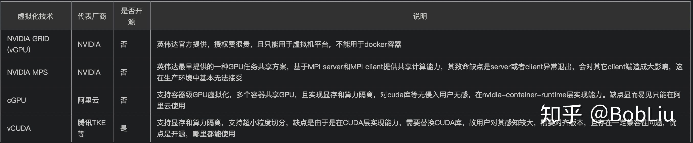
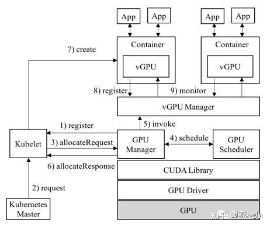

## vGPU

### vgpu容器虚拟化两个思路

1.将gpu纳入cgroup管理

2.基于GPU驱动封装实现，用户根据需要对驱动的某些关键借口（显存分配、cuda thread创建）进行封装劫持，在劫持过程中限制用户进程对计算资源的使用，此类方案缺点为兼容性依赖于厂商驱动

几种方案对比：https://zhuanlan.zhihu.com/p/268901942

### 浅析gpu通信技术

1. https://developer.aliyun.com/article/591403

2. http://blog.sina.com.cn/s/blog_a43b3cf2010157s2.html

   

